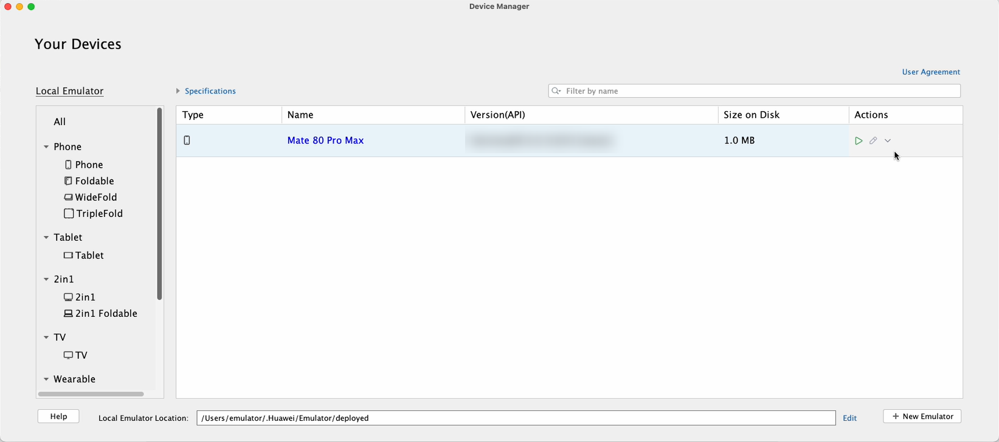
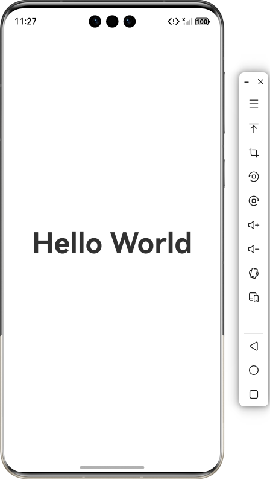
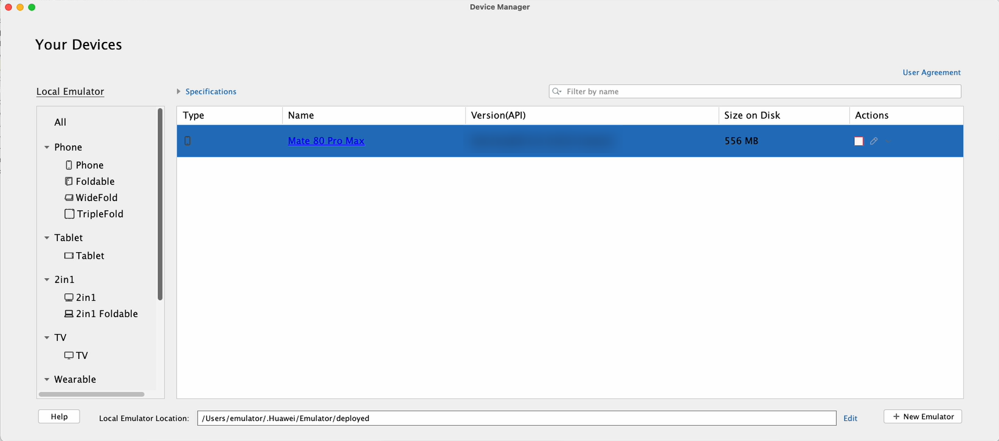

# 启动和关闭模拟器

更新时间：2026-04-20 06:32:02

来源：https://developer.huawei.com/consumer/cn/doc/harmonyos-guides/ide-emulator-start-and-close

在设备管理器页面，单击

即可启动模拟器。模拟器启动时会默认携带之前运行时的用户数据，包括用户上传的文件，安装的应用等。如果是新创建的模拟器，则不会携带用户数据。如果想清除之前运行时的用户数据，点击**Actions > **

** > Wipe User Data**。

 

 从DevEco Studio 6.1.0 Beta1版本开始，如果创建模拟器时选择热启动，则启动模拟器时会加载上次关闭时保存的快照，启动后会恢复至上次关闭时的状态。热启动后，多屏状态会恢复为单屏状态，折叠屏模拟器会恢复成默认展开状态。

如果热启动后出现异常，可点击**Actions > **

** > Wipe User Data**清除用户数据后重新启动。

 例如推包运行后关闭模拟器，再次启动时会显示在上次运行的界面。

 

在模拟器运行期间，可以点击**Actions > **

** > Show on Disk**显示模拟器在本地生成的用户数据。点击**Actions > **

** > Generate logs**可以生成模拟器自启动到此刻的所有日志信息。想要关闭运行中的模拟器，可以在设备管理器页面点击

，或者点击模拟器工具栏上的关闭按钮

。

 

模拟器关闭后，点击**Actions > **

** > Delete**可以删除模拟器，并清除模拟器的用户数据和配置信息。
