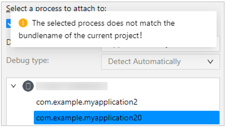
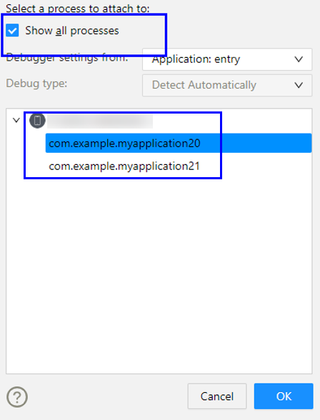
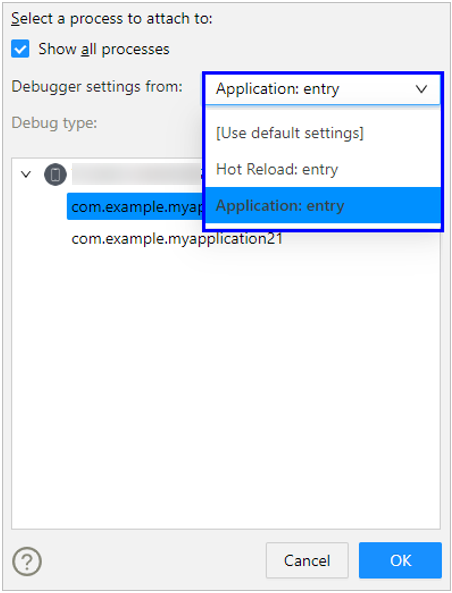
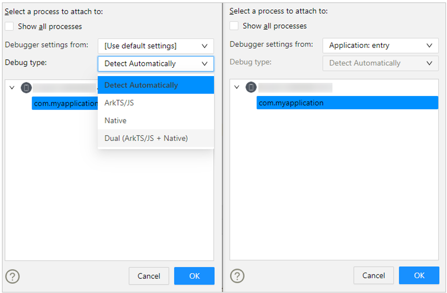
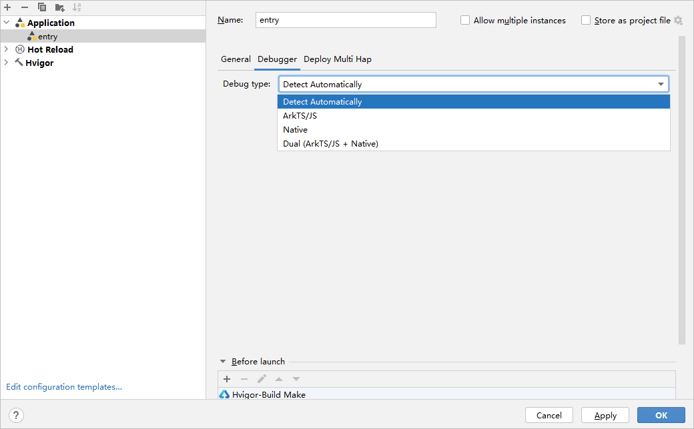
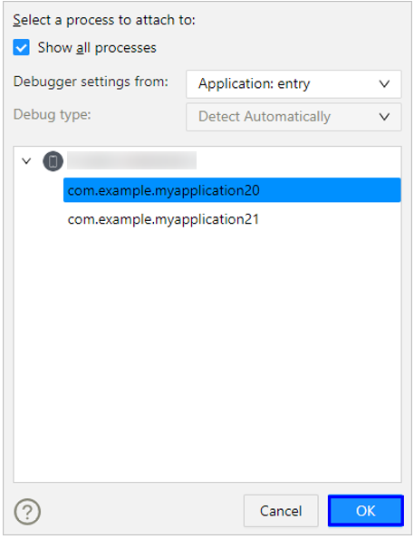

# attach启动调试

更新时间：2026-03-11 08:49:31

来源：https://developer.huawei.com/consumer/cn/doc/harmonyos-guides/ide-debug-arkts-attach

开发者也可以通过将调试程序attach到已运行的应用进行调试。

 Attach Debugger和Debug的区别在于，Attach Debugger to Process可以先运行应用/元服务，然后再启动调试，或者直接启动设备上已安装的应用/元服务进行调试；而Debug是直接运行应用/元服务后立即启动调试。

## 前提条件

当前设备上被attach的应用代码和本地代码一致，且已提前进行构建生成必要的sourceMap文件。

## 使用约束

attach不支持的场景： 本地无源码。bundleName不匹配，将出现提示“The selected process does not match the bundlename of the current project!”，但不阻塞调试过程。

## 操作步骤

在工具栏中，选择调试的设备，并单击**Attach Debugger to Process**

启动调试。

选择要调试的应用进程，若应用bundleName与当前工程不一致，则需勾选Show all process。

> [!NOTE]
> 正常情况下，attach调试仅支持debug签名的应用，从DevEco Studio 6.0.2 Beta1版本开始，PC/2in1上的应用，如果使用了release签名并且配置了ohos.permission.kernel.ALLOW_DEBUG权限，也支持被attach调试。

选择需要使用的调试配置，或者使用默认配置。

选择需要调试的Debug type，若选择已创建的Run/Debug configuration进行attach调试，此时Debug type不可改变，只可在Run/Debug configuration界面修改。

点击**OK**开始attach调试。

