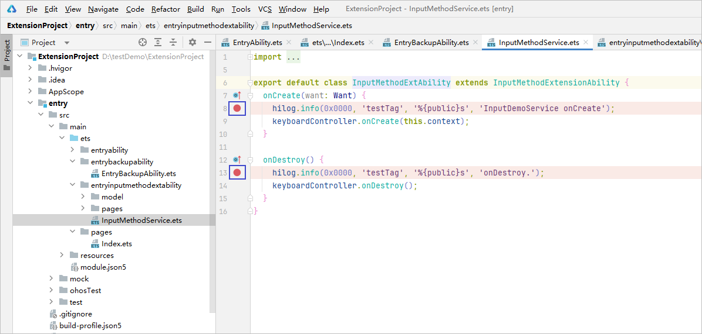
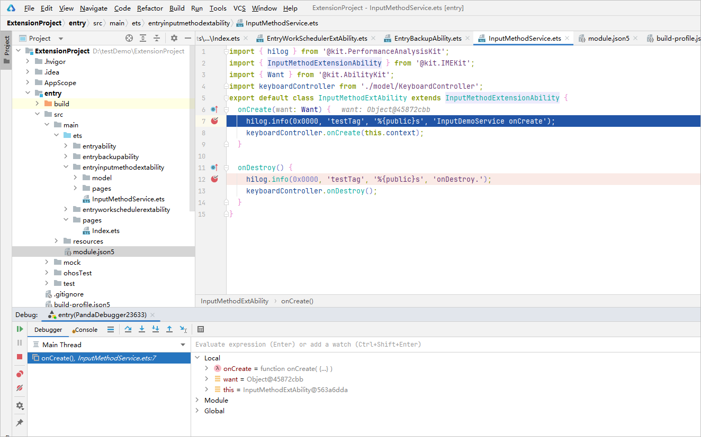
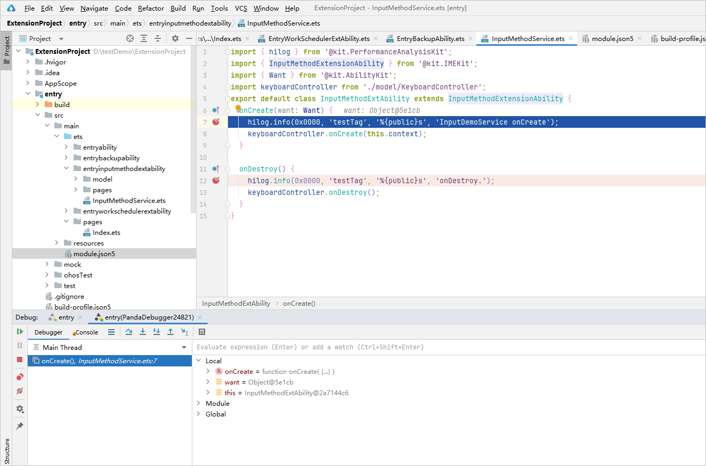

# extension调试

更新时间：2026-01-15 06:51:04

来源：https://developer.huawei.com/consumer/cn/doc/harmonyos-guides/ide-debug-arkts-extension

开发者可通过两种方式对[Extension Ability](https://developer.huawei.com/consumer/cn/doc/harmonyos-guides/extensionability-overview)生命周期函数进行调试。

- 应用安装到设备上后，通过等待调试方式进行调试。
- 修改运行调试配置项，指定当前运行或调试的Ability为Extension Ability。

## 等待调试方式

参考[等待调试](https://developer.huawei.com/consumer/cn/doc/harmonyos-guides/ide-debug-arkts-attach-to-process)对当前调试工程进行调试。

在Extension Ability生命周期内设置断点。

等待Extension Ability生命周期函数代码调用从而命中断点。

## 修改运行配置方式

在运行调试窗口，运行配置项**Launch Options**选择**Specified Ability**。

选择需要进行调试的Extension Ability。

点击**OK**保存配置后，点击调试按钮

，启动调试即可命中 Extension Ability 中的生命周期函数断点。

