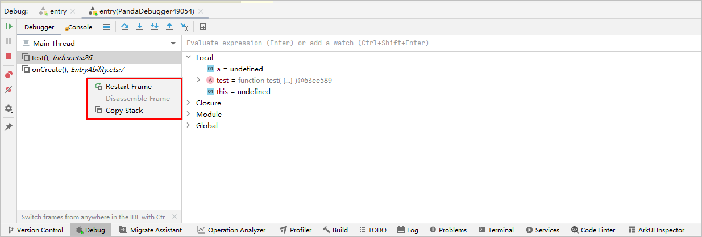

# 反向调试

更新时间：2026-03-06 01:36:30

来源：https://developer.huawei.com/consumer/cn/doc/harmonyos-guides/ide-debug-arkts-reverse

针对ArkTS代码开发场景，DevEco Studio在提供基础调试能力的基础上，同时提供反向调试能力，供开发者进行调用栈回退。

 程序中断时，在调用栈窗口右键单击，选择**Restart Frame**，可以回退到上一个调用栈。

 
