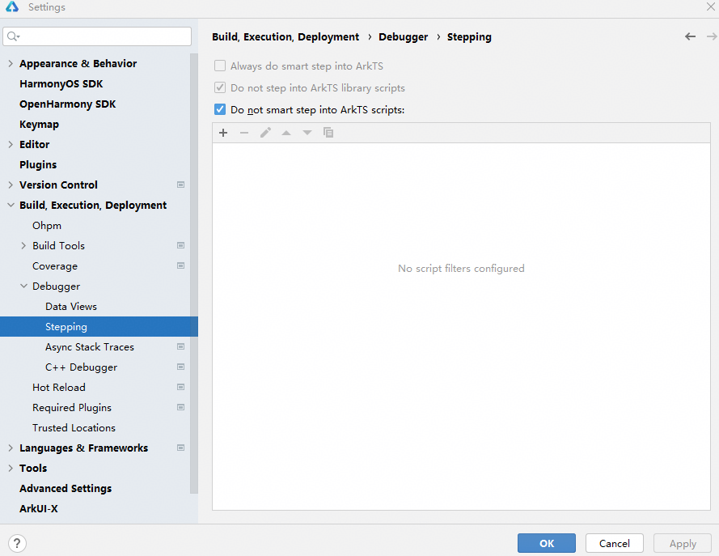
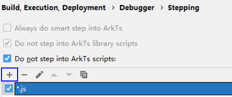

# 智能步入

更新时间：2026-04-20 06:32:02

来源：https://developer.huawei.com/consumer/cn/doc/harmonyos-guides/ide-debug-arkts-smart-step-into

当编辑器上一行存在多个函数嵌套或调用时，开发者可以通过Smart Step Into的能力来步入到想要调试的函数内，如果在调试时想跳过某些文件，也可以自定义需要跳过的文件列表。
 

#### 智能步入
1. 启动调试，如果断点所在的一行内存在多个方法调用，可以通过点击调试窗口的

按钮或快捷键Shift + F7高亮展示可进入函数。

  

2. 点击其中一个函数即可步入。

  

  

 
 

#### 过滤脚本文件
1. 点击**File > Settings**（macOS为**DevEco Studio > Preferences/Settings**）** > ****Build, Execution, Deployment > Debugger > Stepping**，勾选**Do not step into ArkTS scripts**， 可在调试时禁止智能步入某些脚本。使用工具栏按钮管理要跳过的脚本列表。

  

2. 单击 **+ **按钮可添加新的脚本过滤器。在打开的对话框中，输入要跳过的文件名称或使用通配符。例如，如果要始终跳过 JavaScript文件，请输入 *.js。

  

