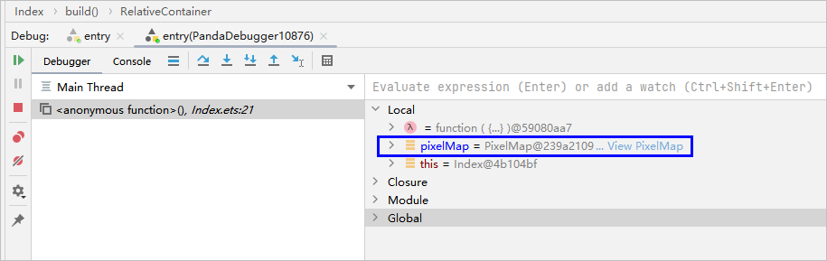

# 检查变量

更新时间：2026-01-15 06:51:04

来源：https://developer.huawei.com/consumer/cn/doc/harmonyos-guides/ide-debug-arkts-variables

当应用停止在某个断点处时，您可以在"Debugger"窗口中查看当前的变量信息。在"Frame"窗格中选择某个帧之后，可以在"Variable"窗格中检查变量，或对变量进行计算。
 
如需向"Watches"列表中添加变量或表达式，请按以下步骤操作：在"Watches"窗口中输入表达式，然后点击Add to Watches图标

。
 
如需从"Watches"列表中移除某一项，点击鼠标右键，选择**Remove Watches**。
 

 
从DevEco Studio 6.0.2 Beta1版本开始，支持预览pixelMap类型的变量。点击pixelMap变量右侧的**View PixelMap**，即可预览pixelMap。
 

 
预览效果如下：
 

