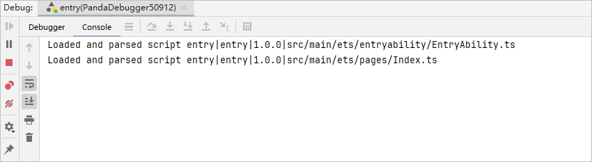

# 等待调试

更新时间：2026-01-15 06:51:04

来源：https://developer.huawei.com/consumer/cn/doc/harmonyos-guides/ide-debug-arkts-attach-to-process

开发者可以通过将某个应用设置为“等待调试模式”，然后当开发者需要对应用进行调试时，拉起应用即可快速进入调试。
 
> [!NOTE]
> 应用设置为“等待调试模式”后，此时如果启动普通的debug调试，将会取消当前的等待调试模式。 设置“等待调试模式”前，需要将应用安装到设备上。

 

#### 操作步骤
1. 在设备选择框中选择调试的设备，并单击Run > Attach to Process by Name。

  

2. 选择需要设置为“等待调试模式”的应用（默认为当前工程），选择需要进行调试的调试类型。然后单击**Attach**，即可将该应用设置为“等待调试模式”。

  

  此时会在DevEco Studio底部显示一个等待进度条，在应用被拉起之前，将一直处于等待状态。可通过进度条右侧的取消按钮进行取消。

  

3. 拉起设备端应用，此时将会进入调试。

  

