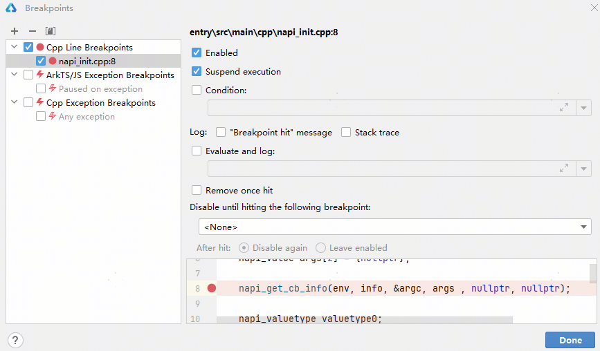
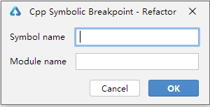
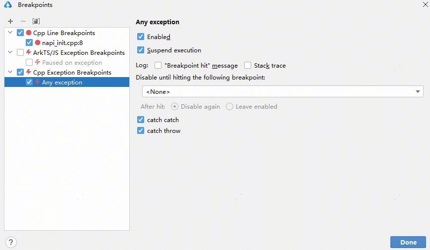
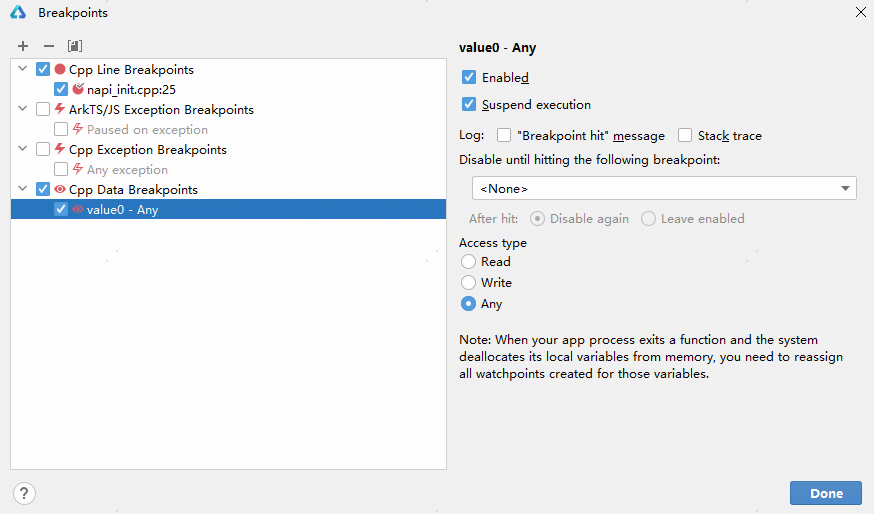

# 使用断点

更新时间：2026-03-09 07:00:31

来源：https://developer.huawei.com/consumer/cn/doc/harmonyos-guides/ide-debug-native-breakpoint

点击**View Breakpoints** 图标

可以打开断点管理界面，您可以在断点管理界面查看或更改您的断点。
 
- 勾选 Enable ，使能该断点。
- 勾选 Suspend execution ，使程序运行到断点时中断。

 

 

##### 条件断点

在某个断点的配置中，勾选 Condition ，并设置表达式作为条件，使程序运行到断点且满足设置的条件时才会中断进程。
 
 

##### 日志断点

在某个断点的配置中，勾选以下类型的log，可以使进程运行到断点时在 console 窗口打印相应 log。
 
- 勾选“Breakpoint hit”message，程序运行到断点时，打印“Breakpoint reached”。
- 勾选 Stack trace，程序运行到断点时，打印当前线程的堆栈。
- 勾选 Evaluate and log，并添加表达式，程序运行到断点时，打印表达式的值。

 
> [!NOTE]
> 未勾选 Enable 的断点不会打印日志，未勾选 Suspend execution 的断点会打印日志，不满足所设置的 Condition 的断点不会打印日志。

 
 

 

##### 临时断点

在某个断点的配置中，勾选 Remove once hit，该断点只生效一次，生效后该断点会被删除。
 
 

##### 函数断点

也叫方法断点或符号断点，使用函数名设置断点，当程序运行到对应函数时，中断进程。
 
在断点管理界面中点击“+”->“Cpp Symbolic Breakpoints”，在弹出窗口中填写函数名和模块名（模块名可缺省），添加函数断点。
 

 
 

##### 异常断点

异常断点可以使程序运行到抛异常或捕获异常的代码处停住。
 
> [!NOTE]
> 其他系统异常，如 SIGSEGV 等信号异常会默认捕获并中断进程。

 
在断点管理界面中点选 “Cpp Exception Breakpoints” 下的 “Any exception”，勾选 Enable 使能异常断点。
 

 
 

##### 数据断点

支持三种类型的数据断点，即变量被读、被写、被读写时中断进程。
 
在变量列表中对某一个变量右键，在菜单中选择添加数据断点。
 

 
在断点管理界面进行查看和修改。
 

 
> [!NOTE]
> 数据断点支持的类型受硬件限制，支持设置数据断点的变量类型 size 不能超过硬件支持的范围； 受硬件限制，最多同时设置 2 个数据断点； 对局部变量设置的数据断点，需要在离开作用域时手动删除，否则会由于变量地址被重用导致进程中断。
