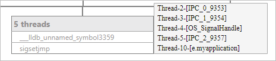

# 堆栈可视化

更新时间：2026-04-20 06:32:02

来源：https://developer.huawei.com/consumer/cn/doc/harmonyos-guides/ide-debug-native-parallel-stacks

在native调试窗口中，点击**Layout Settings**

，勾选**Parallel Stacks**，打开并行栈视图。
 

 
在程序停下时，并行栈视图可以同时展示多个线程的调用栈信息，合并重复调用栈，帮助您更好地理解程序的并发执行情况，以及发现潜在的多线程问题。
 

 

##### 调用栈跳转

您可以在视图上对某一个调用栈双击来跳转到对应堆栈，Frames页签中会随之跳转，此时可以查看该堆栈的变量等信息。
 
 

##### 线程信息查看

在多个线程合并的位置处悬停鼠标，可以显示这些线程的具体信息。
 

