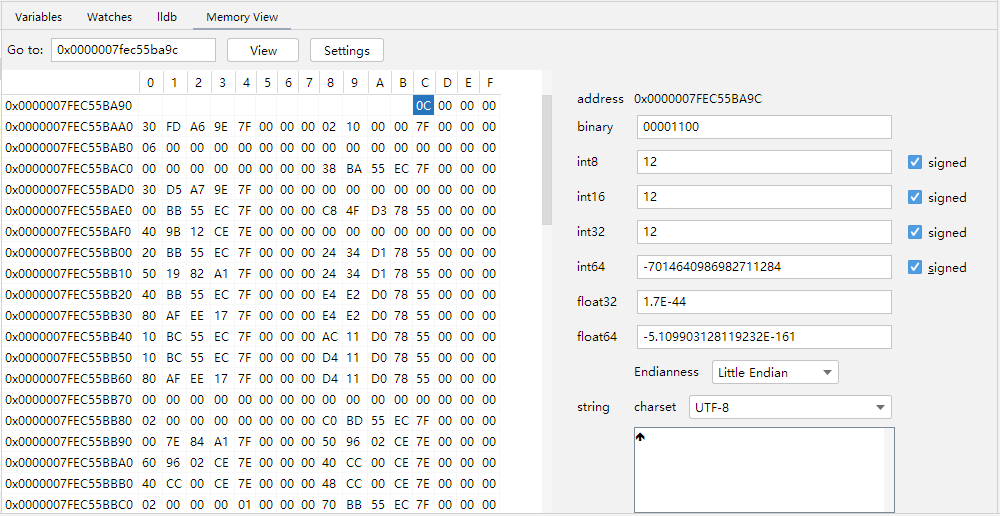
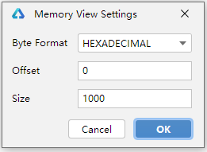
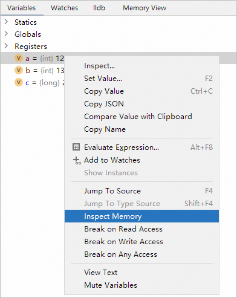

# 查看内存信息

更新时间：2026-01-15 06:51:04

来源：https://developer.huawei.com/consumer/cn/doc/harmonyos-guides/ide-debug-native-memory-view

在 native 调试窗口中，点击“Layout Settings”，勾选 Memory View ，打开内存查看窗口。

## 查看指定地址内存

在内存视图中，填写地址，点击“View”按钮，查看对应地址处的内存。

点击“Settings”按钮，设置进制、偏移量和内存数量。

## 内存转换

通过点击某一个内存格子，右侧会自动将内存内容转换成各种类型的值。您也可以按住并拖动，从而选中多个内存格，以显示这部分内存的 ASCII 码转换结果。

## 查看变量内存

在“Variables”变量列表中的某一个变量处右键，在弹出菜单中选择“Inspect Memory”，自动跳转到内存视图展示变量存储地址处的内存。

## 内存修改

您可以在内存格上双击，键入您想要修改的内存来修改对应地址处的内存值；您也可以在右侧的数据转换结果框中输入数据，从而修改该数据对应类型的长度的内存值。
