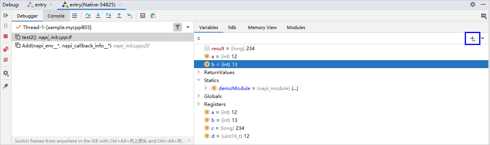
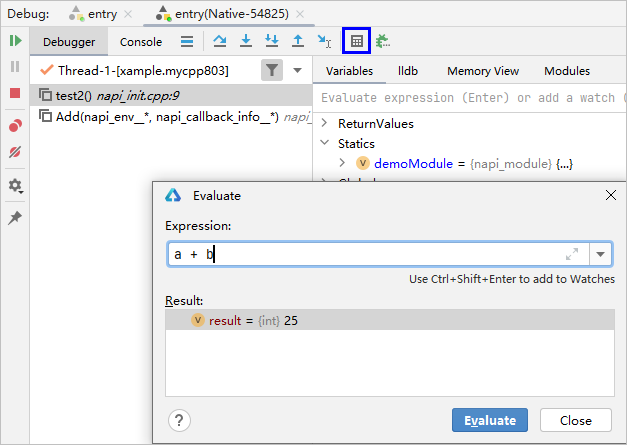
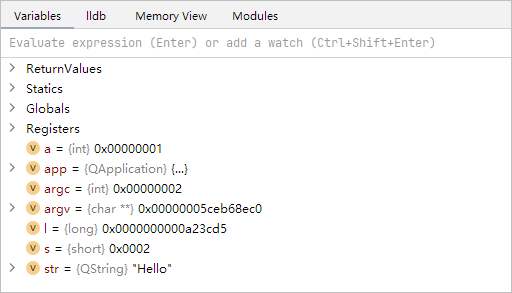
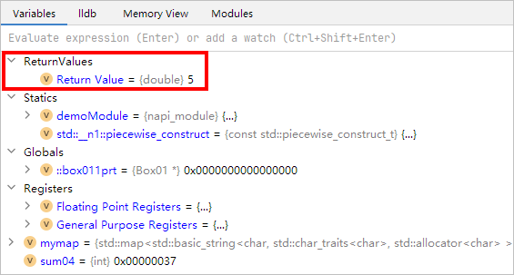

# 检查变量

更新时间：2026-01-15 06:51:04

来源：https://developer.huawei.com/consumer/cn/doc/harmonyos-guides/ide-debug-native-variables

调试时，在“Variables”页面查看变量，支持查看全局/静态变量、寄存器变量和局部变量。
 

##### 查看全局/静态变量

点击“Edit Configurations...”打开调试配置，在 native 调试配置界面中勾选“Show static/global variables in the Variables Pane”，调试过程中变量列表会展示全局/静态变量。
 
 

##### Simplify STL

在菜单栏点击“File > Settings（macOS为DevEco Studio > Preferences/Settings） > Build, Execution, Deployment > Debugger > C++ Debugger”，通过勾选“Display STL variables as visualization in the Variables Pane”在变量列表中展示简化后的 STL 变量值，或去掉勾选以展示其原始结构。
 
 

##### 变量监视

在"Watches"列表中输入表达式，然后点击Add to Watches 图标

，或在某个变量右键菜单中的“Add to Watches”添加监视的表达式，在每次程序停住之后会计算表达式的值。
 

 
 

##### 表达式求值

通过点击“Evaluate Expression...”按钮，或Watches 页面中的输入行中，输入表达式进行计算。
 

 
 

##### 查看十六进制视图

在“Variables”页面点击鼠标右键，弹出框中选择“Show As Hex Values”，此时页面中的整型变量会以十六进制进行展示。
 

 
 

##### 查看函数返回值

当使用“Step Out”从一个函数内步出后，变量列表中的“ReturnValues”会展示所步出函数的返回值。
 

 
> [!NOTE]
> 无法查看长度超过64位的数据结构。 无法查看引用类型返回值。 Step Out返回的位置存在断点时，无法查看函数返回值。

 
 

##### 其他说明

对于特定类型的变量，还支持查看bitmap预览、查看较长的字符串等功能。
 
- ...View Bitmap：支持在调试时查看bitmap预览。

 
- ...View：支持展开查看较长的字符串。

 

