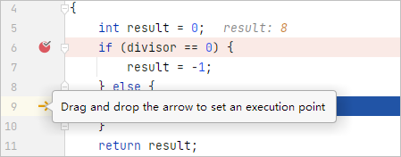
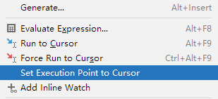

# 设置执行点

更新时间：2026-01-15 06:51:04

来源：https://developer.huawei.com/consumer/cn/doc/harmonyos-guides/ide-debug-native-execution-point

开发者可以通过“设置执行点”在调试会话期间跳转到编辑器中的任意代码行，并在对应位置设置执行点，跳过当前位置到目标位置之间的所有代码。
 
此操作适用于线性和非线性执行路径，用于中断和跳过循环，或者在if-else子句表达式或switch-case语句中选择另一个分支。例如，如果要检查另一个分支而不重新启动调试会话，可使用该功能。
 

##### 操作步骤
1. 将当前执行指针（代表当前运行位置的橙色箭头）拖动到所需的代码行。

  

2. 在需要设置执行点的行，点击鼠标右键，在弹出菜单中选择“Set Execution Point to Cursor”。

  

 
 
> [!NOTE]
> 使用“设置执行点”时，仅修改了程序计数器的值，未修改其他寄存器的值，这可能会导致不可预知的错误，例如： 如果跳过初始化变量的那一行，应用将从堆栈/寄存器中获取值，这可能会导致段错误。 如果可执行代码被编译器优化，可能会得到一个不可预知的结果，或者无法移动执行点。 此外，还有一些其他不符合预期的问题，例如变量值错乱、堆栈信息异常等。
