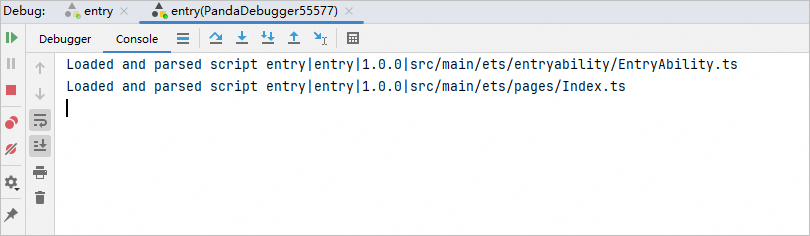
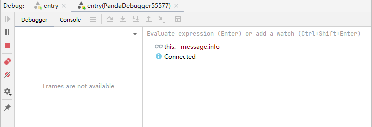
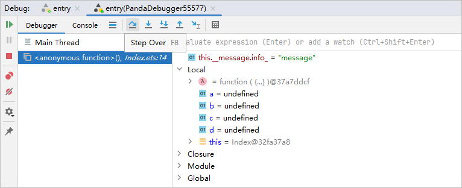

# 使用调试器

更新时间：2026-01-15 06:51:04

来源：https://developer.huawei.com/consumer/cn/doc/harmonyos-guides/ide-debug-arkts-debugger

Debug界面有三个tab页，分别是“entry”、“entry(PandaDebugger)”和“entry(Native)”。
 
通常第一个tab页“entry”用于展示推包安装过程。
 

 
第二个tab页“entry(PandaDebugger)”和第三个tab页“entry(Native)”是调试器，用于调试Debugger功能，其中“entry(Native)”仅在涉及Native调试时才会拉起。调试器包含两个窗格，**[Debugger](#section1437520119316)**和**[Console](#section327153017314)**。
 

 

##### Debugger窗格

Debugger显示两个独立的窗格：
 
- 左侧区域是Frames，当应用调试到某个断点时，Frames区会显示当前代码所引用的代码位置。
- 右侧区域是Variables，用于展示当前变量。

 

 
Debugger窗格有多个按钮： 
| 按钮 | 名称 | 快捷键 | 功能 |
| --- | --- | --- | --- |
|  | Resume Program | F9（macOS为Option+Command+R） | 当程序执行到断点时停止执行，单击此按钮程序继续执行。 |
|  | Step Over | F8（macOS为F8） | 在单步调试时，直接前进到下一行（如果在函数中存在子函数时，不会进入子函数内单步执行，而是将整个子函数当作一步执行）。 |
|  | Step Into | F7（macOS为F7） | 在单步调试时，遇到子函数后，进入子函数并继续单步执行。 |
|  | Force Step Into | Alt+Shift+F7（macOS为Option+Shift+F7） | 在单步调试时，强制进入方法。 |
|  | Step Out | Shift+F8（macOS为Shift+F8） | 在单步调试执行到子函数内时，单击Step Out会执行完子函数剩余部分，并跳出返回到上一层函数。 |
|  | Stop | Ctrl+F2（macOS为Command+F2） | 停止调试任务。 |
|  | Run To Cursor | Alt+F9（macOS为Option+F9） | 断点执行到鼠标停留处。 |
|  | JSVM Debug Port | 无 | 转发JSVM调试的端口，转发后可以在浏览器的DevTools工具上进行JSVM-API调试。 
> [!TIP]
> 仅Native调试器中支持该按钮。
|
 
 
 
 

##### Resume Program

点击Resume Program图标

，如果存在断点时，命中下一个断点，并展示对应的Frames和Variables信息；如果不存在断点，设备上的应用正常运行，Frames和Variables信息会消失。
 

 
 

##### Pause Program

点击Pause Program图标

，当有对应源代码时，应用会暂停。
 
 

##### Step Over

点击Step Over

，当前代码执行到下一行代码。
 

 
 

##### Step Into

点击Step Into

，当前代码进入到方法内部。
 

 
例如代码进入add方法的定义处。
 

 

 
 

##### Step Out

点击Step Out

，代码会从方法内部回到调用处。
 

 
 

##### Run to Cursor

点击Run to Cursor

，代码停留在鼠标停留处。
 

 
 

##### JSVM Debug Port

点击JSVM Debug Port

，弹出输入转发端口的面板，输入端口并点击**OK**后会开始转发，转发成功后会有弹窗提示，打开对应的URL即可对JS代码进行调试。关于如何调试C++拉起的JS代码，请查阅[JSVM-API调试&定位](https://developer.huawei.com/consumer/cn/doc/harmonyos-guides/jsvm-debugger-cpuprofiler-heapsnapshot)。
 
该功能从DevEco Studio 5.1.0 Release版本开始支持。
 

 
 

##### Console窗格

Console窗格用于展示已加载的ets/js。
 

