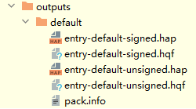
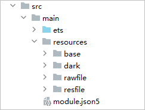
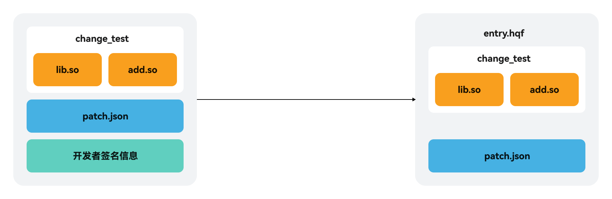

# 增量调试

更新时间：2026-04-20 06:32:02

来源：https://developer.huawei.com/consumer/cn/doc/harmonyos-guides/ide-incremental-debugging

对于大型应用来说，每次修改代码后需要重新构建、推包、安装，整个流程耗时较长。针对该场景，在DevEco Studio和命令行场景中分别提供增量运行调试功能，支持开发者在真机上调试应用时，修改代码后，会识别出代码差异，构建增量包，增量运行调试时只推送增量包，减少大型应用调试推包时间。

> [!NOTE]
> C++代码增量调试支持API Version 11及以上版本Stage模型的工程；ArkTS代码增量调试仅支持API Version 12及以上版本Stage模型工程的资源文件修改。


#### 使用DevEco Studio增量调试


#### 调试C++代码
1. 在工具栏中，选择调试的设备，并单击**Run**

或**Debug** 

启动工程。
2. 在修改完代码后，点击**Apply Changes**

推送增量包安装至设备。

  点击Apply Changes按钮后，DevEco Studio启动构建的增量构建任务，构建出增量包hqf。增量包构建完成后，将推送安装至设备。

  


  
> [!NOTE]
> 当前增量运行Apply Changes功能，不支持新建和删除代码文件，不支持修改装饰器相关的代码，不支持在代码中使用import新增引用文件。


#### 调试rawfile/resfile资源

从DevEco Studio 5.1.0 Release版本开始支持增量调试rawfile资源。
1. 在工具栏中，选择调试的设备，并单击**Run**

或**Debug** 

启动工程。
2. 在工程的资源resources文件目录下的resfile或rawfile目录下，新增或者修改资源文件。

  



  
> [!NOTE]
> 当前对rawfile/resfile资源的增量调试，仅支持代码中直接调用的资源文件。

3. 点击**Apply Changes**

推送增量包安装至设备。

  点击Apply Changes按钮后，DevEco Studio启动构建的增量构建任务，构建出增量包hqf。增量包构建完成后，将推送安装至设备。


#### 使用命令行增量调试


#### 通过hvigorw构建hqf包
1. 检查待运行模块和依赖模块下是否存在build/config/buildConfig.json文件，如果不存在，先通过DevEco Studio全量运行工程，生成该文件。

  
> [!NOTE]
> 如果已执行步骤1，则步骤2和3无需再执行。

2. 根据运行所需的模块，及模块的product、target，编写命令行执行HAP/HSP编译任务，如entry模块依赖HSP模块library：

  
```bash
hvigorw --mode module -p module=entry@default,library@default -p product=default assembleHap assembleHsp --info --no-daemon
```
关于命令行的使用指导请参考[hvigorw](https://developer.huawei.com/consumer/cn/doc/harmonyos-guides/ide-hvigor-commandline)。
3. 执行hdc命令安装HAP、HSP，关于hdc工具的使用指导请参考[hdc](https://developer.huawei.com/consumer/cn/doc/harmonyos-guides/hdc)。

  
```bash
$ hdc shell mkdir data/local/tmp/99c24fdc44694c05be12491d0a48e139
$ hdc file send library-default-signed.hsp "data/local/tmp/99c24fdc44694c05be12491d0a48e139"
$ hdc file send entry-default-signed.hap "data/local/tmp/99c24fdc44694c05be12491d0a48e139"
$ hdc shell bm install -p "data/local/tmp/99c24fdc44694c05be12491d0a48e139"
$ hdc shell rm -rf data/local/tmp/99c24fdc44694c05be12491d0a48e139
$ hdc shell aa start -a {abilityName} -b {bundleName}
```

 - abilityName：应用的ability名称。

4. bundleName：应用包名。

5. 如果修改了HAP/HSP模块的rawfile或resfile目录下的资源文件，则需要在对应模块的build/default/intermediates/patch/default目录下新建changedFileList.json并写入修改的文件；如果修改了HAR模块的资源文件，则需要在依赖该HAR的模块下写入修改的文件，示例如下。

  
```json
{
  <span style="color: rgb(135,16,148);">"resources"</span>: {
    <span style="color: rgb(135,16,148);">"resFile"</span>: [
      {
        <span style="color: rgb(135,16,148);">"filePath"</span>: <span style="color: rgb(6,125,23);">"</span><span style="color: rgb(0,55,166);">D:\\MyApplication\\</span><span style="color: rgb(6,125,23);">entry</span><span style="color: rgb(0,55,166);">\\</span><span style="color: rgb(6,125,23);">src</span><span style="color: rgb(0,55,166);">\\</span><span style="color: rgb(6,125,23);">main</span><span style="color: rgb(0,55,166);">\\</span><span style="color: rgb(6,125,23);">resources</span><span style="color: rgb(0,55,166);">\\</span><span style="color: rgb(6,125,23);">resfile</span><span style="color: rgb(0,55,166);">\\</span><span style="color: rgb(6,125,23);">test.txt"</span>,
        <span style="color: rgb(135,16,148);">"resourcePath"</span>: <span style="color: rgb(6,125,23);">"D:\\MyApplication</span><span style="color: rgb(0,55,166);">\\</span><span style="color: rgb(6,125,23);">entry</span><span style="color: rgb(0,55,166);">\\</span><span style="color: rgb(6,125,23);">src</span><span style="color: rgb(0,55,166);">\\</span><span style="color: rgb(6,125,23);">main</span><span style="color: rgb(0,55,166);">\\</span><span style="color: rgb(6,125,23);">resources"</span>
      }
    ],
    <span style="color: rgb(135,16,148);">"rawFile"</span>: [
      {
        <span style="color: rgb(135,16,148);">"filePath"</span>: <span style="color: rgb(6,125,23);">"D:\\MyApplication</span><span style="color: rgb(0,55,166);">\\</span><span style="color: rgb(6,125,23);">entry</span><span style="color: rgb(0,55,166);">\\</span><span style="color: rgb(6,125,23);">src</span><span style="color: rgb(0,55,166);">\\</span><span style="color: rgb(6,125,23);">main</span><span style="color: rgb(0,55,166);">\\</span><span style="color: rgb(6,125,23);">resources</span><span style="color: rgb(0,55,166);">\\</span><span style="color: rgb(6,125,23);">rawfile</span><span style="color: rgb(0,55,166);">\\</span><span style="color: rgb(6,125,23);">test.txt"</span>,
        <span style="color: rgb(135,16,148);">"resourcePath"</span>: <span style="color: rgb(6,125,23);">"D:\\MyApplication</span><span style="color: rgb(0,55,166);">\\</span><span style="color: rgb(6,125,23);">entry</span><span style="color: rgb(0,55,166);">\\</span><span style="color: rgb(6,125,23);">src</span><span style="color: rgb(0,55,166);">\\</span><span style="color: rgb(6,125,23);">main</span><span style="color: rgb(0,55,166);">\\</span><span style="color: rgb(6,125,23);">resources"</span>
      }
    ]
  }
}
```


6. 修改C++代码后，执行hqf打包命令，执行完成后可在entry和library模块的输出目录build/default/outputs/default中，找到对应的产物entry-default-signed.hqf和library-default-signed.hqf。

  
```bash
hvigorw --mode module -p module=entry@default,library@default -p product=default assembleDevHqf --info --no-daemon
```


7. 执行hdc命令安装hqf。

  
```bash
$ hdc shell mkdir data/local/tmp/3b7d97cdf4de41c4aecc465ff5069708
$ hdc file send library-default-signed.hqf "data/local/tmp/3b7d97cdf4de41c4aecc465ff5069708"
$ hdc file send entry-default-signed.hqf "data/local/tmp/3b7d97cdf4de41c4aecc465ff5069708"
$ hdc shell bm quickfix -a -f "data/local/tmp/3b7d97cdf4de41c4aecc465ff5069708" -d -o
```


  

  #### 通过SDK工具构建hqf包

  


1. 全量编译应用并安装到设备。

  
```bash
hdc bm install {hap_path} // 安装包在电脑上，使用该命令，hap_path是安装包路径
hdc shell bm install -p {hap_path}  // 安装包在设备上，使用该命令
```


2. 开发者通过独立的构建流程，识别出希望构建增量hqf包的so，根据ABI编译环境（可查看build-profile.json5的[abiFilters](https://developer.huawei.com/consumer/cn/doc/harmonyos-guides/ide-hvigor-cpp#section0721057575)字段），汇总到某一目录下，例如汇总在change_test目录下，编译环境是arm64-v8a，示例如下。

  


3. （可选）进行资源文件修改。如果修改了HAP/HSP模块的rawfile或resfile目录下的资源文件，则需要在对应模块的build/default/intermediates/patch/default目录下新建changedFileList.json并写入修改的文件；如果修改了HAR模块的资源文件，则需要在依赖该HAR的模块下写入修改的文件，示例如下。

  
```json
{
  <span style="color: rgb(255,0,170);">"resources"</span>: {
    <span style="color: rgb(255,0,170);">"resFile"</span>: [
      {
        <span style="color: rgb(255,0,170);">"filePath"</span>: <span style="color: rgb(80,160,79);">"</span><span style="color: rgb(0,0,255);">D:\\MyApplication\\</span><span style="color: rgb(80,160,79);">entry</span><span style="color: rgb(0,0,255);">\\</span><span style="color: rgb(80,160,79);">src</span><span style="color: rgb(0,0,255);">\\</span><span style="color: rgb(80,160,79);">main</span><span style="color: rgb(0,0,255);">\\</span><span style="color: rgb(80,160,79);">resources</span><span style="color: rgb(0,0,255);">\\</span><span style="color: rgb(80,160,79);">resfile</span><span style="color: rgb(0,0,255);">\\</span><span style="color: rgb(80,160,79);">test.txt"</span>,
        <span style="color: rgb(255,0,170);">"resourcePath"</span>: <span style="color: rgb(80,160,79);">"D:\\MyApplication</span><span style="color: rgb(0,0,255);">\\</span><span style="color: rgb(80,160,79);">entry</span><span style="color: rgb(0,0,255);">\\</span><span style="color: rgb(80,160,79);">src</span><span style="color: rgb(0,0,255);">\\</span><span style="color: rgb(80,160,79);">main</span><span style="color: rgb(0,0,255);">\\</span><span style="color: rgb(80,160,79);">resources"</span>
      }
    ],
    <span style="color: rgb(255,0,170);">"rawFile"</span>: [
      {
        <span style="color: rgb(255,0,170);">"filePath"</span>: <span style="color: rgb(80,160,79);">"D:\\MyApplication</span><span style="color: rgb(0,0,255);">\\</span><span style="color: rgb(80,160,79);">entry</span><span style="color: rgb(0,0,255);">\\</span><span style="color: rgb(80,160,79);">src</span><span style="color: rgb(0,0,255);">\\</span><span style="color: rgb(80,160,79);">main</span><span style="color: rgb(0,0,255);">\\</span><span style="color: rgb(80,160,79);">resources</span><span style="color: rgb(0,0,255);">\\</span><span style="color: rgb(80,160,79);">rawfile</span><span style="color: rgb(0,0,255);">\\</span><span style="color: rgb(80,160,79);">test.txt"</span>,
        <span style="color: rgb(255,0,170);">"resourcePath"</span>: <span style="color: rgb(80,160,79);">"D:\\MyApplication</span><span style="color: rgb(0,0,255);">\\</span><span style="color: rgb(80,160,79);">entry</span><span style="color: rgb(0,0,255);">\\</span><span style="color: rgb(80,160,79);">src</span><span style="color: rgb(0,0,255);">\\</span><span style="color: rgb(80,160,79);">main</span><span style="color: rgb(0,0,255);">\\</span><span style="color: rgb(80,160,79);">resources"</span>
      }
    ]
  }
}
```


4. 提前准备与已安装应用一致的签名文件。

  可以从工程的build-profile.json5文件中获取到对应的签名文件。

5. 准备patch.json文件，示例如下。

  
```json
{
    "app" : {
        "bundleName" : "com.ohos.quickfix",
        "versionCode" : 1000000, // 应用版本号
        "versionName" : "1.0.0",
        "patchVersionCode" : 1000000, // 补丁版本号，在每次进行增量调试前，将版本号+1，确保此次增量调试补丁包版本号大于上次增量调试补丁包版本号
        "patchVersionName" : "1000000"  // 与补丁版本号保持一致
    },
    "module" : {
        "name" : "entry",
        "type" : "patch",
        "deviceTypes" : [
            "phone",
            "tablet"
        ],
        "originalModuleHash" : "" // 待修复HAP包的sha256值，置空即可
    }
}
```


6. 在hqf[打包工具](https://developer.huawei.com/consumer/cn/doc/harmonyos-guides/packing-tool#hqf打包指令)目录下（默认在DevEco Studio安装目录\sdk\default\openharmony\toolchains\lib下），执行命令打包，示例如下。

  
```json
java -jar app_packing_tool.jar --mode hqf --json-path D:\<span style="color: rgb(6,125,23);">MyApplication</span><span style="color: rgb(0,55,166);">\</span><span style="color: rgb(6,125,23);">entry</span>\patch.json --lib-path D:\<span style="color: rgb(6,125,23);">MyApplication</span><span style="color: rgb(0,55,166);">\</span><span style="color: rgb(6,125,23);">entry</span>\change_test --resources-path D:\<span style="color: rgb(6,125,23);">MyApplication</span><span style="color: rgb(0,55,166);">\</span><span style="color: rgb(6,125,23);">entry</span><span style="color: rgb(0,55,166);">\</span><span style="color: rgb(6,125,23);">src</span><span style="color: rgb(0,55,166);">\</span><span style="color: rgb(6,125,23);">main</span>\resources --out-path entry-default-unsigned.hqf --force true
```
关于该命令中需要修改的参数说明如下，其余参数不需要修改：

  
**json-path**：指定增量包信息patch.json路径，必选，参考[步骤5](#li13802124619204)。

7. **lib-path**：指定希望构建打包的so路径，参考[步骤2](#li13802194642015)，注意路径不能带上ABI编译环境。

8. **resources-path**：指定希望构建打包的resources资源目录，包含rawfile和resfile目录。

9. **out-path**：指定输出hqf包路径。

10. 在签名工具目录下（默认在DevEco Studio安装目录\sdk\default\openharmony\toolchains\lib下），进行签名，示例如下。

  
```bash
java -jar hap-sign-tool.jar sign-app -keyAlias "OpenHarmony Application Release" -signAlg "SHA256withECDSA" -mode "localSign" -appCertFile "OpenHarmonyApplication.cer" -profileFile "ohos_provision_release.p7b" -inFile "entry-default-unsigned.hqf" -keystoreFile "OpenHarmony.p12" -outFile "entry-default-signed.hqf" -keyPwd "123456Abc" -keystorePwd "123456Abc"
```
关于该命令中需要修改的参数说明如下，其余参数不需要修改：

  
**keyAlias**：密钥别名。

11. **appCertFile**：申请的调试证书文件，格式为.cer。

12. **profileFile**：申请的调试Profile文件，格式为.p7b。

13. **inFile**：通过打包工具生成的未携带签名信息的hqf。

14. **keystoreFile**：密钥库文件，格式为.p12。

15. **outFile**：经过签名后生成的携带签名信息的hqf。

16. **keyPwd**：密钥密码。

17. **keystorePwd**：密钥库密码。

18. 安装增量hqf包。

  
```bash
$ hdc shell mkdir data/local/tmp/3b7d97cdf4de41c4aecc465ff5069708
$ hdc file send entry-default-signed.hqf "data/local/tmp/3b7d97cdf4de41c4aecc465ff5069708"
$ hdc shell bm quickfix -a -f "data/local/tmp/3b7d97cdf4de41c4aecc465ff5069708" -d -o
```


  

  #### 常见问题

  

  #### 在其他的开发工具中修改打包so库文件，无法使用DevEco Studio的增量调试功能

  **问题现象**

  如果开发者在其他的开发工具中修改打包so库文件，在使用DevEco Studio 4.1 Canary2版本的增量调试功能时，出现无法使用增量调试功能的现象。

  **解决措施**

  导致这个问题的原因是在DevEco Studio 4.1 Canary2版本上，对于超过16KB的Native文件，在命中其中的断点后，LLDB调试器会默认持有文件句柄，导致调试过程中无法修改保存该文件。

  开发者可通过以下两种方式处理：

  
方式一：使用以下LLDB命令关闭LLDB调试器源码缓存机制。执行如下命令后，LLDB调试器将不再持有文件句柄。       
```bash
settings set use-source-cache false
```

 - 方式二：建议开发者升级至DevEco Studio 5.1.0 Beta1版本。
