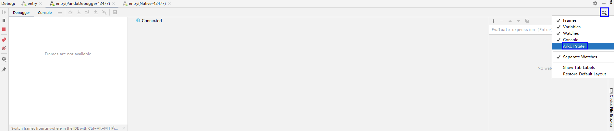

# 查看ArkUI状态变量

更新时间：2026-06-10 12:49:31

来源：https://developer.huawei.com/consumer/cn/doc/harmonyos-guides/ide-arkui-state

从DevEco Studio 6.0.2 Beta1版本开始，支持在调试时查看ArkUI状态变量的实时变化情况。
 
在调试窗口中，点击**Layout Settings**

，勾选**ArkUI State**，打开ArkUI状态变量面板。
 

 
状态变量面板分为总览（Summary）和当前值（Current Value）两个子面板：
 
- 总览面板显示了当前应用运行时，状态变量更新的总体情况，包含了状态变量的名称、更新次数、装饰器类型、所属组件、所属类、当前值。

- 当前值面板记录了状态变量实时变化的数据，包含了状态变量的更新时间、名称、所属组件、所属类、装饰器类型、当前值、影响的组件数量。

当点击右侧的箭头时，新弹出的面板将显示当前选中状态变量影响的组件列表，包含影响组件的组件名、组件ID、是否为自定义组件。

  

 
> [!NOTE]
> 打开状态变量面板后才会开始监听状态变量的更新，因此，无法查看面板打开前状态变量的更新情况。 同一次调试过程中，关闭状态变量面板不会清空之前的数据，当前值面板最多展示1000条数据，超过限制后，仅展示最新的1000条数据。
