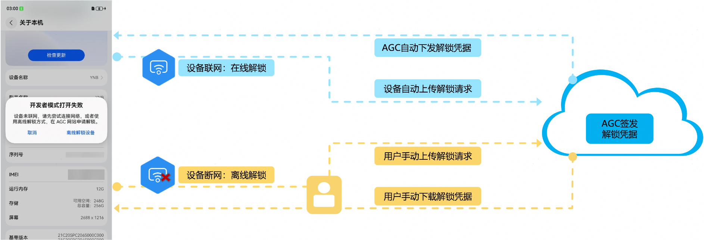
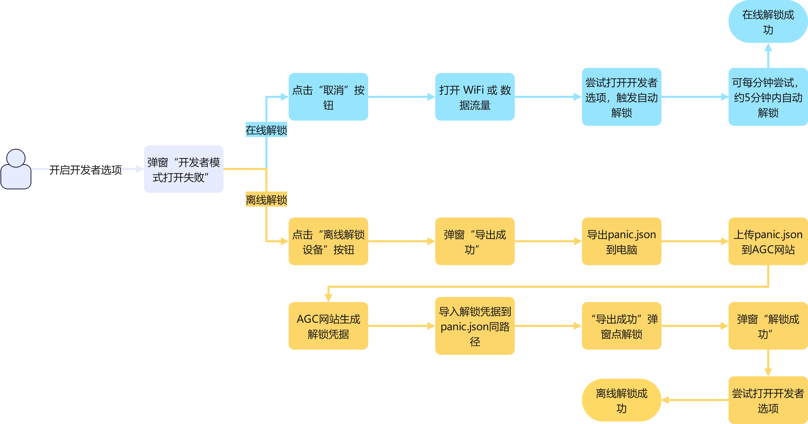
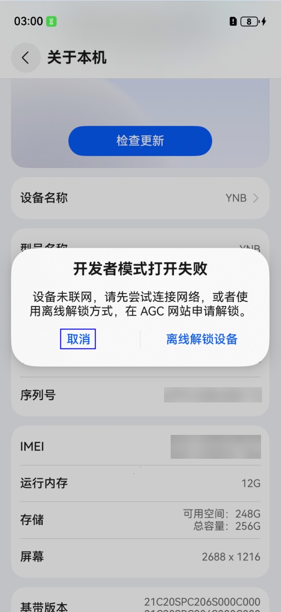
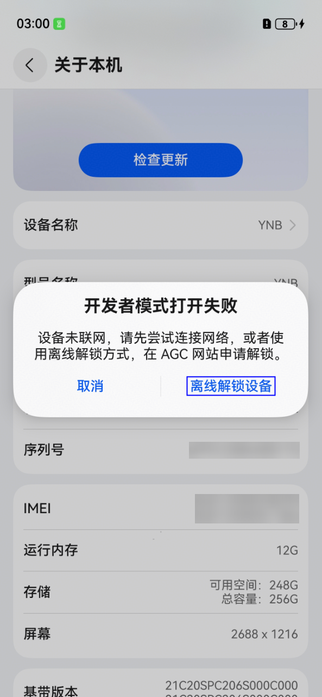
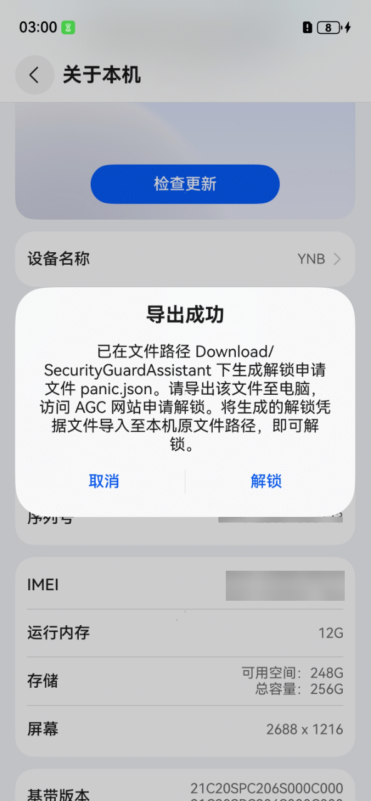
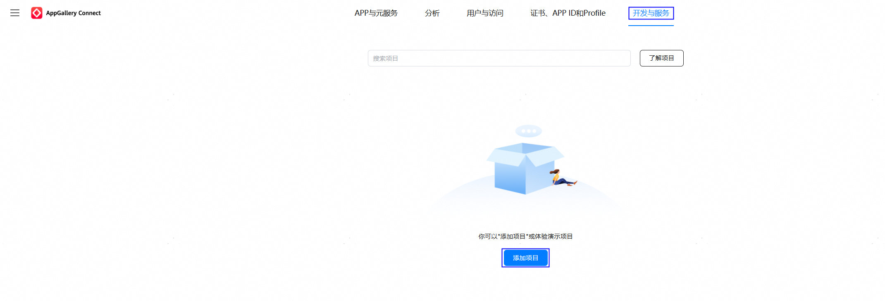
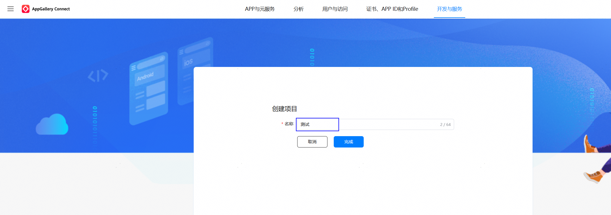
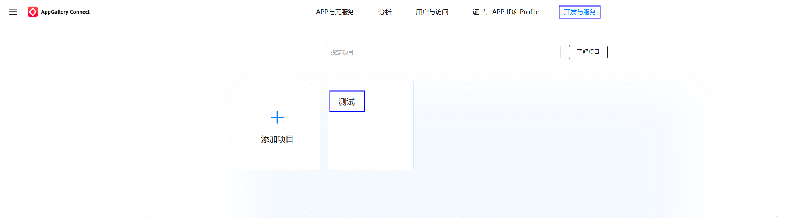
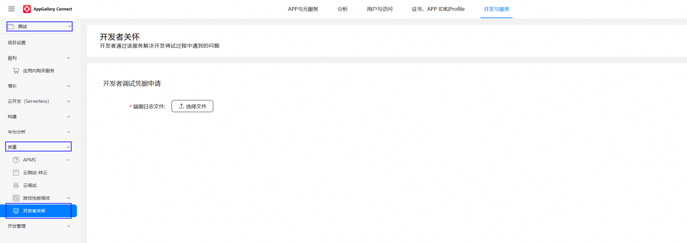
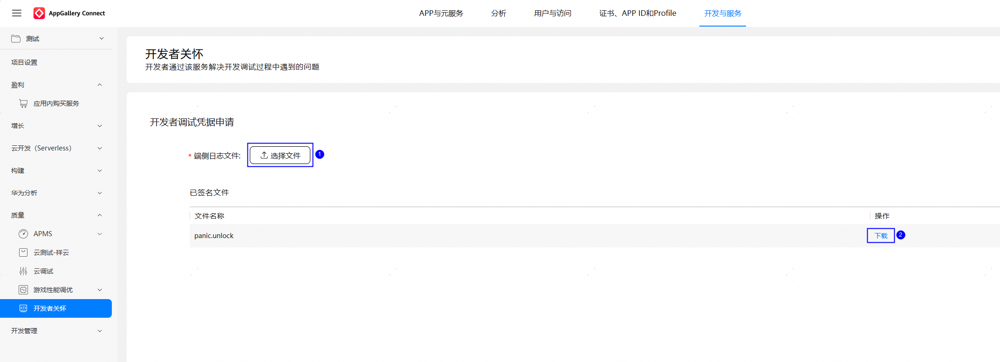

# 开发者关怀

更新时间：2026-04-20 06:32:02

来源：https://developer.huawei.com/consumer/cn/doc/harmonyos-guides/developer-care

从HarmonyOS 6.1开始，支持开发者关怀功能。开发者关怀致力于为您提供安全友好的开发体验，解决您在设备调试过程中因系统安全保护机制而遇到的不便。例如：当您的设备多次出现系统异常重启后，出于安全考虑，系统将关闭并锁定开发者选项。若您的设备出现开发者选项开启失败的情况，可借助“开发者关怀”功能解决您的问题。

## 运行机制

考虑到您的设备可能处于不同的网络环境，我们提供了在线解锁与离线解锁2种方法，二者最大的区别在于您的设备是否能联网，以及解锁过程中是否需要您的协助。联网情况下，设备将自动上传解锁请求给AGC（AppGallery Connect，华为应用市场），并根据AGC下发的解锁凭据自动解锁设备的开发者选项；未联网情况下，上传解锁请求和下载解锁凭据将需要您的协助，具体如下图所示：

## 使用流程

本章节介绍解除开发者选项锁定的2种方法及其具体操作流程。 **开发者选项在线解锁** 使用在线解锁功能，您可以在出现“开发者模式打开失败”弹窗情况时，点击“取消”，打开WiFi或数据流量，设备联网后再次尝试打开开发者选项将触发设备进入自动解锁流程，5分钟内设备可自动解锁，届时再尝试打开开发者选项即可成功。 **开发者选项离线解锁** 使用离线解锁功能，您可以在出现“开发者模式打开失败”弹窗情况时，点击“离线解锁设备”，设备将生成离线解锁申请文件 。您将解锁申请文件导出到电脑，并访问AGC网站申请解锁，会拿到AGC网站生成的解锁凭据。最后，您把解锁凭据导入到设备中（与离线解锁申请文件同路径），再次进入“导出成功”弹窗界面，点击“解锁”按钮，即可打开开发者选项。  **图1 **解锁操作流程示意图

## 在线解锁

开启开发者选项失败，且您的设备具备联网条件。 您尝试打开开发者选项，设备弹窗提示“开发者模式打开失败”。 设备联网。点击“取消”按钮，打开设备WiFi或数据流量，确保设备可联网。

触发在线解锁。您再次尝试打开开发者选项，触发在线自动解锁，在“开发者模式打开失败”弹窗界面点“取消”退出。 解锁成功。由于网络和AGC云处理等原因，在线解锁可能存在一些延迟，您可每分钟尝试打开开发者选项，一般设备在触发在线解锁后5分钟内，可自动解锁。

## 离线解锁

开启开发者选项失败，且您的设备不具备联网条件。 您尝试打开开发者选项，设备弹窗提示“开发者模式打开失败”。 触发离线解锁，导出解锁申请文件到电脑。点击“离线解锁设备”按钮，触发离线解锁，在弹窗“导出成功”后，设备会在Download/SecurityGuardAssistant路径生成解锁申请文件panic.json，导出此文件到电脑。

访问AGC网站，申请解锁凭据。在电脑端访问AGC网站【开发与服务】->【质量】->【开发者关怀】页面，上传解锁申请文件panic.json，获取解锁凭据文件。 AGC网址：[AppGallery Connect](https://developer.huawei.com/consumer/cn/service/josp/agc/index.html#/myProject/461323198430420904/97458334310914890?extrainfo=)，登录您的华为开发者账户，进入后选择或者创建一个项目。登录AGC网站后，选择【开发与服务】页面，如果您之前没有创建过项目，请点击【添加项目】，输入项目名称后点击【完成】。

登录AGC网站后，选择【开发与服务】页面，如果您之前创建过项目，选择已存在的项目即可。

在【开发与服务-项目】页面，【质量】栏目下即可看到【开发者关怀】菜单，具体如下图所示。

进入开发者关怀界面，上传解锁申请文件后，页面会生成1个解锁凭据文件panic.unlock，请下载该文件到电脑，具体如下图所示。

导入解锁凭据到设备并尝试开启开发者选项。把解锁凭据导入到设备中（与离线解锁申请文件同路径Download/SecurityGuardAssistant），再次尝试打开开发者选项。 解锁成功。您点击“解锁”按钮后，弹出“解锁成功”提示，即可打开开发者选项。

## 常见问题

## 在线解锁如果一直失败，如何处理

在线解锁依赖设备的网络环境和AGC云的处理响应，可能存在失败的情况，如果多次尝试在线解锁失败，建议您稍后重试或者使用离线解锁的方式进行处理。
