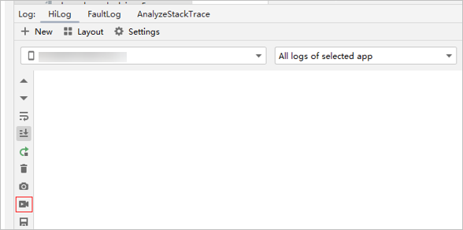
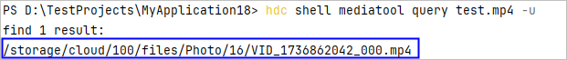
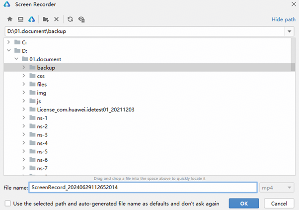
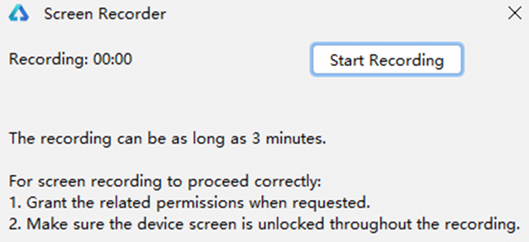
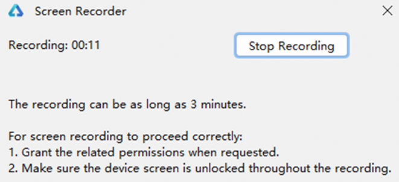
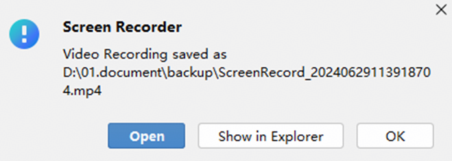
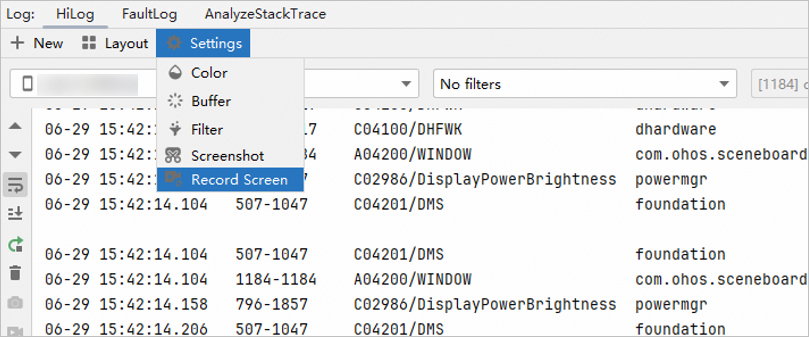
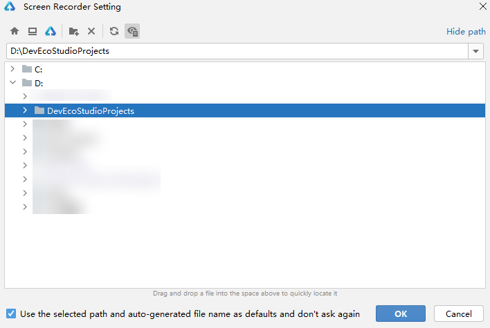
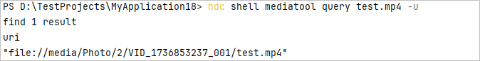
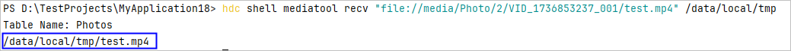

# 录屏

更新时间：2026-04-20 06:32:02

来源：https://developer.huawei.com/consumer/cn/doc/harmonyos-guides/ide-screen-recording

在应用开发过程中，可以使用录屏功能录制应用的运行状态，并通过录屏文件向他人展示正在开发的应用的各种功能效果。
 

##### 使用约束

- 如果设置了锁屏密码，录屏开始前请解锁设备屏幕，锁屏状态下录屏应用无法正常拉起。
- 如果设置了锁屏密码，录屏时请保持设备的屏幕解锁状态，若录屏过程中锁屏将导致录屏应用退出。
- 模拟器不支持录屏。

 
 

##### 通过DevEco Studio录屏
1. 连接真机设备，并在其中运行应用。
2. 在DevEco Studio底部切换到**Log**页签。
3. 点击左侧工具栏中

，即可开始录屏。

  


4. 录屏时，需要先选择录屏文件的保存路径，开发者可使用默认路径或[设置自定义路径](#section89111791511)。

  


5. 路径选择完毕后，点击**Start Recording**开始录屏。

  


6. 录制完操作流程之后，点击**Stop Recording**结束录屏。

  


7. 结束录屏后，录屏文件将会保存到之前选择的路径下，可以选择调用系统播放器播放视频文件或打开文件所在的文件夹。

  


 
 

##### 设置录屏自定义路径
1. 点击DevEco Studio底部**Log**页签，选择**HiLog > ****Settings**** > ****Record Screen**选项。

  


2. 在弹出的界面选择自定义路径，当设置好路径并勾选“Use the selected path and auto-generated file name as defaults and don't ask again”选项后，录屏时将自动使用此时设置的路径以及以录屏时的时间戳构造的文件名作为录屏文件的保存地址及文件名。

  


 
 

##### 通过命令行方式录屏

hdc是可以用于调试的命令行工具，通过该工具可以实现录屏功能。更多关于命令行工具hdc的说明请参见[hdc工具使用指导](https://developer.huawei.com/consumer/cn/doc/harmonyos-guides/hdc)。
 1. 启动录屏。

  
```bash
hdc shell aa start -b com.huawei.hmos.screenrecorder -a com.huawei.hmos.screenrecorder.ServiceExtAbility --ps "CustomizedFileName" "test.mp4"   // 指定录屏文件名称为test.mp4
```

2. 停止录屏。

  
```bash
hdc shell aa start -b com.huawei.hmos.screenrecorder -a com.huawei.hmos.screenrecorder.ServiceExtAbility
```

3. 获取录屏文件位置，记录为{RecordFile}。

  
```bash
hdc shell mediatool query test.mp4 -u
```
 
如果查询的结果中包含uri字段，则返回值第三行对应的录屏文件路径不允许直接下载。



  需要再执行如下命令，指定该uri，将录屏文件复制到有下载权限的路径中（如/data/local/tmp）。

  
```bash
hdc shell mediatool recv "file://media/Photo/2/VID_1736853237_001/test.mp4" /data/local/tmp
```
 命令返回值第二行即为录屏文件路径{RecordFile}。

  


4. 如果查询结果不包含uri字段，则返回值第二行即为录屏文件路径{RecordFile}。


5. 指定上一个步骤中获取到的录屏文件路径{RecordFile}，下载录屏文件到本地。

  
```bash
hdc file recv {RecordFile} d:\test.mp4
```
