# 自定义运行/调试配置

更新时间：2026-04-20 06:32:02

来源：https://developer.huawei.com/consumer/cn/doc/harmonyos-guides/ide-run-debug-configurations

## 配置应用可调试

应用是否支持调试，根据app.json5的debug字段和build-profile.json5的debuggable字段综合判断，app.json5的优先级高于build-profile.json5。 在app.json5中配置debug字段： true：应用支持调试。 false：应用不支持调试。 如果没有配置debug字段，则根据build-profile.json5的debuggable字段判断应用是否支持调试。 true：应用支持调试。当[编译模式](https://developer.huawei.com/consumer/cn/doc/harmonyos-guides/ide-hvigor-compilation-options-customizing-guide#section192461528194916)不是release时，debuggable的缺省值是true，即支持调试。 false：应用不支持调试。当编译模式为release时，debuggable的缺省值是false，即不支持调试。

## 设置调试代码类型

点击**Run > Edit Configurations > Debugger**，选择相应模块，设置Debug type即可。
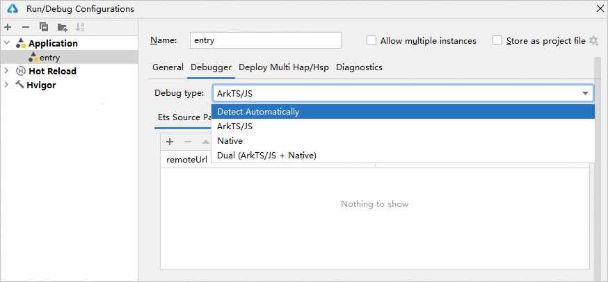
工程调试类型默认为**Detect Automatically**，关于各调试类型的说明如下表所示：
| 调试类型 | 调试代码 |
| --- | --- |
| Detect Automatically | 新建工程默认调试器选项。根据工程模块及其依赖的模块涉及的编程语言，自动启动对应的调试器。 |
| ArkTS/JS | 调试ArkTS代码            调试JS代码 |
| Native | 仅调试C/C++代码 |
| Dual(ArkTS/JS + Native) | 调试C/C++工程的ArkTS/JS和C/C++代码 |

## 设置HAP安装方式

在调试阶段，HAP在设备上的安装方式有2种，可以根据实际需要进行设置。 安装方式一：先卸载应用/元服务后，再重新安装，该方式会清除设备上应用/元服务所有的缓存数据。 从DevEco Studio 4.1 Canary2版本开始，支持当代码无变化时，不进行推包安装。即根据模块有无变化来判断是否重新推送安装模块包，在运行调试时仅将有变化的模块及依赖它的模块重新推送安装至设备上。如entry依赖了HSP模块，当HSP模块有变化，运行调试时将同时推送安装HSP模块和entry模块。 安装方式二：采用覆盖安装方式，不卸载应用/元服务，该方式会保留应用/元服务的缓存数据。 设置方法如下： 单击**Run > Edit Configurations**，设置指定模块的HAP安装方式，勾选**Keep Application Data**，则表示采用覆盖安装方式，保留应用/元服务缓存数据。
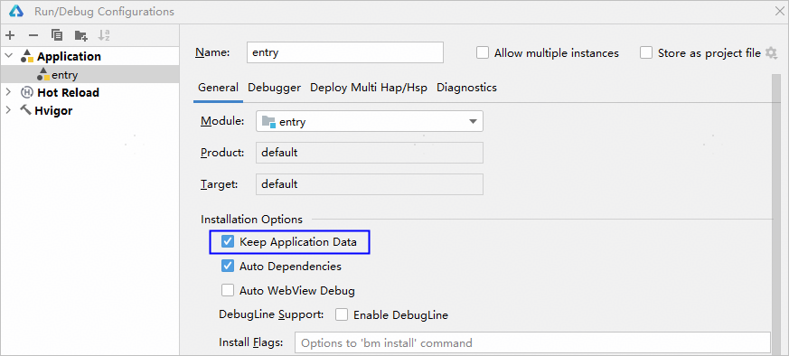

## 配置自定义调试参数

如果未进行自定义，将按默认配置安装和运行应用。如果开发者需要对应用安装、运行等流程增加参数配置，可在“Installation Options”和“Launch Options”下进行配置。
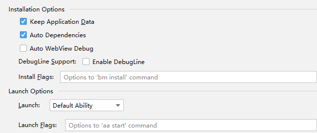
Installation Options DebugLine Support：勾选Enable DebugLine表示在build产物中系统组件增加debugline属性，用于开启[ArkUI Inspector源码跳转](https://developer.huawei.com/consumer/cn/doc/harmonyos-guides/ide-arkui-inspector#section1226015494335)功能。 Install Flags：输入bm install命令相关的选项，请参见[bm install 参数](https://developer.huawei.com/consumer/cn/doc/harmonyos-guides/bm-tool#安装命令install)。如可以设置“-w 360”，表示将超时等待时间设置为360秒。 Launch Options Launch：指定在安装应用后启动的Ability。
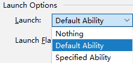
Nothing：只安装不启动任何Ability。 Default Ability：默认的EntryAbility。 Stage模型：module.json5文件中配置了“skills”属性的第一个ability；若无配置“skills”属性的ability，则取“mainElement”指定的ability（该ability需存在于“abilities”数组内）；若“mainElement”未指定，则取“abilities”数组内的第一个ability。
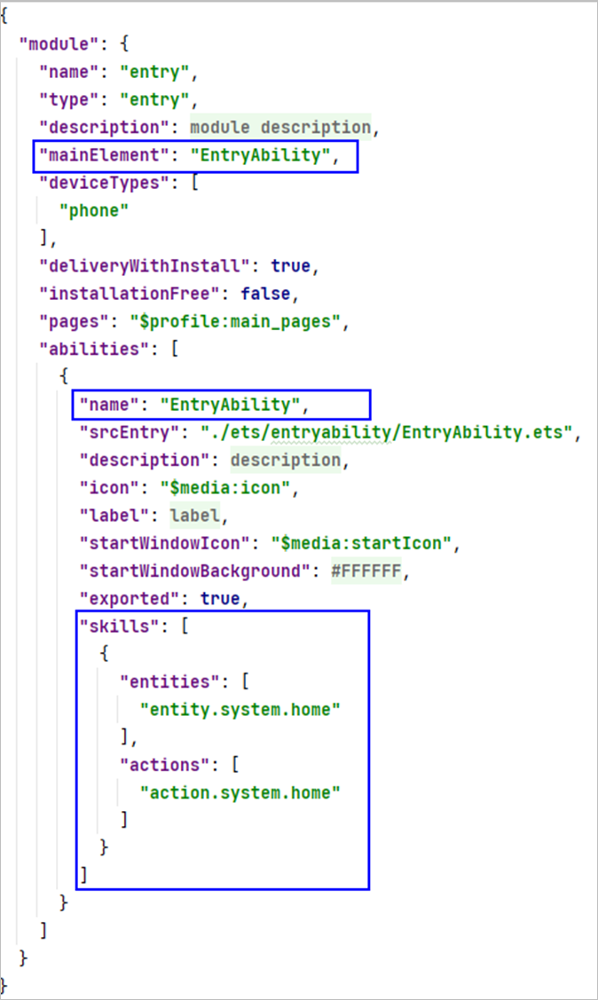
FA模型：config.json文件中配置了“skills”属性的第一个ability；若无配置“skills”属性的ability，则取“mainAbility”指定的ability（该ability需存在于“abilities”数组内）；若“mainAbility”未指定，则取“abilities”数组内的第一个ability。 Specified Ability：工程中的UIAbility或ExtensionAbility。 您可以在工程中添加UIAbility或ExtensionAbility，详细请查看[UIAbility开发指导](https://developer.huawei.com/consumer/cn/doc/harmonyos-guides/uiability)或[ExtensionAbility开发指导](https://developer.huawei.com/consumer/cn/doc/harmonyos-guides/extensionability-overview)。
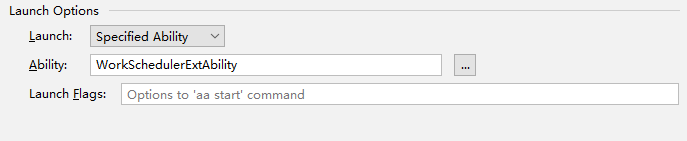
Launch Flags：输入aa start命令相关的选项，请参见[aa start 参数](https://developer.huawei.com/consumer/cn/doc/harmonyos-guides/aa-tool)。

## 配置环境变量

如果开发者需要配置和管理应用开发环境，以及控制应用程序的行为，可在**Environment Variables**下配置环境变量。
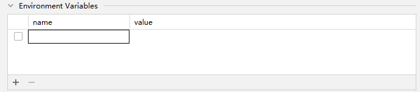
点击

按钮，新增一行配置项。当前支持以下配置项： ASAN_OPTIONS：在运行时配置ASan的行为，包括设置检测级别、输出格式、内存错误报告的详细程度等，具体可配置的value请参见[配置参数](https://developer.huawei.com/consumer/cn/doc/best-practices/bpta-stability-asan-detection#section1496994494018)。若开发者未配置log_exe_name、abort_on_error，DevEco Studio将自动填充。ASAN_OPTIONS是应用级别的，只在entry和feature模块中配置生效，HAR/HSP模块配置不生效。
> [!NOTE]
> 当配置Environment Variables后，“Keep Application Data”覆盖安装不生效。

环境变量配置完成后，需确保环境变量已勾选，勾选后点击**Apply**才可生效。
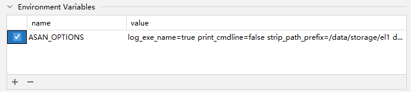

## 自动映射WebView调试链接

当应用中含有需要调试的WebView组件页面时，可以通过浏览器的DevTools工具进行页面调试，具体可参考[使用DevTools工具调试前端页面](https://developer.huawei.com/consumer/cn/doc/harmonyos-guides/web-debugging-with-devtools)。调试WebView组件需要执行转发端口等繁琐的命令行操作，因此可以在DevEco Studio中勾选**Auto WebView Debug**，该操作会在应用启动后两分钟内自动监听可调试的WebView进程并完成端口转发。 该功能从DevEco Studio 5.0.5 Release版本开始支持。 设置方法如下： 单击**Run**** > ****Edit Configurations**，在**General**中，勾选**Auto WebView Debug**。
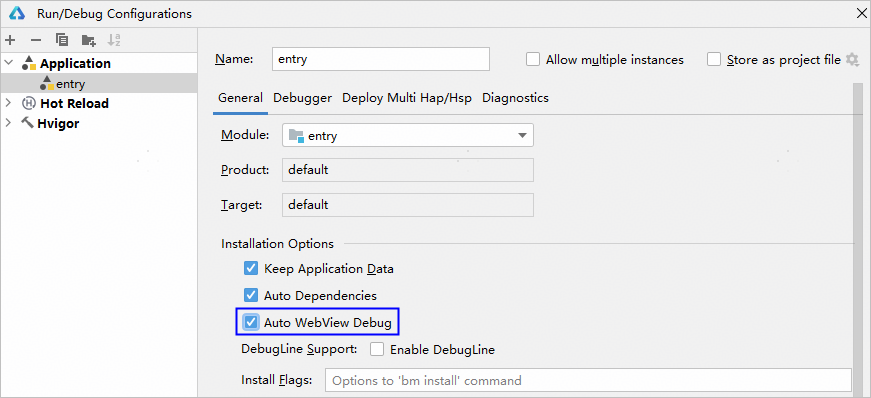
开启后，当检测到设备上有可调试的WebView组件进程时，会在Run面板中打印转发成功的端口，通过浏览器的DevTools工具连接该端口即可进行WebView调试。
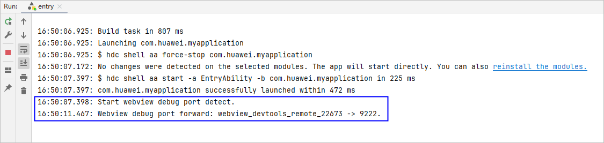

## 多模块调试

## 安装多个模块

如果一个工程中同一个设备存在多个模块（如存在entry和feature模块），且存在模块间的调用时，在调试阶段需要同时安装多个模块的Hap包到设备中。此时，需要在**Deploy Multi Hap****/Hsp**中选择多个模块，启动调试时，DevEco Studio会将所有的模块都安装到设备上。 设置方法如下： 单击**Run > Edit Configurations**，在**Deploy Multi Hap****/Hsp**中，勾选**Deploy Multi Hap/Hsp Packages**，选择多个模块。
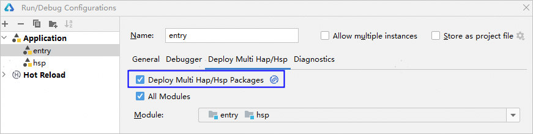

## 自动安装依赖

如果一个工程中entry/feature/HSP模块直接依赖其他HAR/HSP模块（如entry模块依赖HSP模块）及间接依赖其他模块（如entry模块依赖HAR模块，HAR又依赖HSP模块）时，在调试阶段需要同时安装模块包及其所有依赖模块的包到设备中。此时，可以设置**Auto Dependencies**，启动调试时会自动将所有依赖的模块都安装到设备上。 设置方法如下： 单击**Run > Edit Configurations**，在**General**中，勾选**Auto Dependencies。**
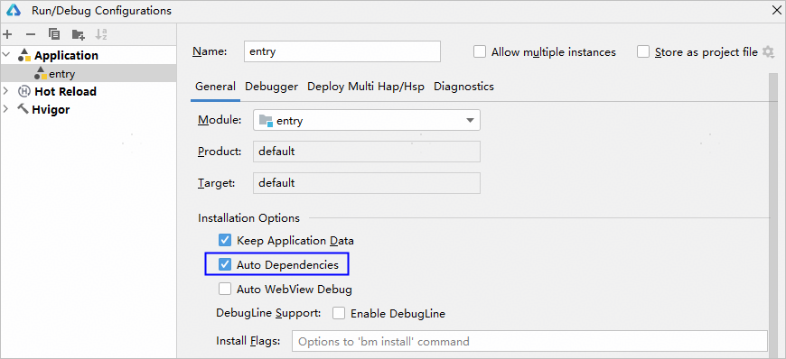
在Before launch窗格中，您可以点击

添加应用启动前的任务。
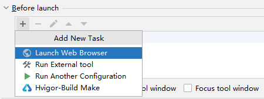
也可以点击

移除任务。
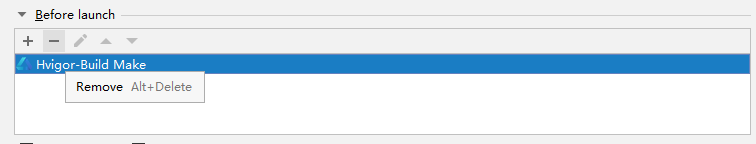
在勾选**Auto Dependencies**后，可以同时勾选**Deploy Multi Hap/Hsp Packages**，从而达到推送所有包的效果。

## 多设备运行

从DevEco Studio 6.0.2 Beta1版本开始，支持同时在多个设备上运行应用，包括真机和已启动的模拟器。 在设备选择框中，点击**Select Multiple Devices**，弹出多设备选择框。
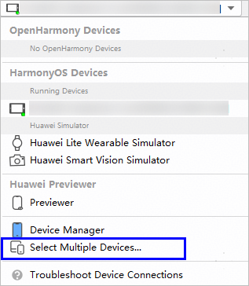
选择需要推包运行的设备。
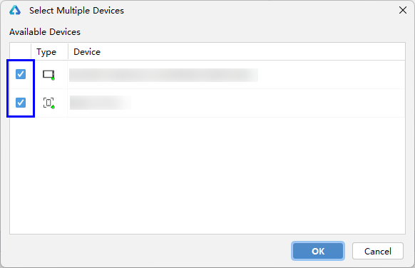
设备栏会出现Multiple Devices(N)，表示选中N个设备，点击运行按钮即可同时在选中设备上运行应用。

