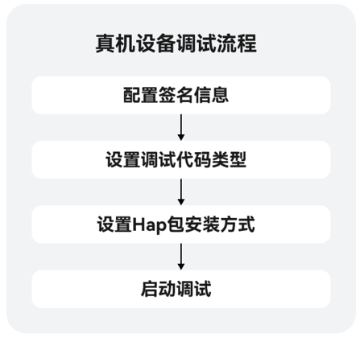

# 调试概述

更新时间：2026-01-15 06:51:04

来源：https://developer.huawei.com/consumer/cn/doc/harmonyos-guides/ide-debug-device

DevEco Studio提供了丰富的HarmonyOS应用/元服务调试能力，支持JS、ArkTS、C/C++单语言调试和ArkTS/JS+C/C++跨语言调试能力，并且支持三方库源码调试，帮助开发者更方便、高效地调试应用/元服务。
 
HarmonyOS应用/元服务调试支持使用真机设备、模拟器、预览器调试。接下来以使用真机设备为例进行说明，详细的调试流程如下图所示。关于模拟器和预览器的调试请参考[使用模拟器运行应用](https://developer.huawei.com/consumer/cn/doc/harmonyos-guides/ide-run-emulator)和[使用预览器调试应用](https://developer.huawei.com/consumer/cn/doc/harmonyos-guides/ide-previewer-debug)。
 

 1. [配置签名信息](https://developer.huawei.com/consumer/cn/doc/harmonyos-guides/ide-signing)：使用真机设备进行调试前需要对HAP进行签名。
2. [设置调试代码类型](https://developer.huawei.com/consumer/cn/doc/harmonyos-guides/ide-run-debug-configurations#section1170735241213)：调试类型默认为Detect Automatically**。**
3. [设置HAP安装方式](https://developer.huawei.com/consumer/cn/doc/harmonyos-guides/ide-run-debug-configurations#section531811771410)：选择先卸载应用/元服务后再重新安装或覆盖安装。
4. [启动调试](https://developer.huawei.com/consumer/cn/doc/harmonyos-guides/ide-debug-arkts-debug)：启动debug调试或attach调试。
