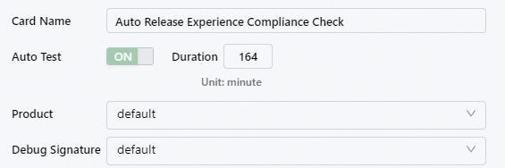
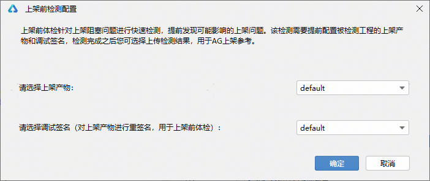
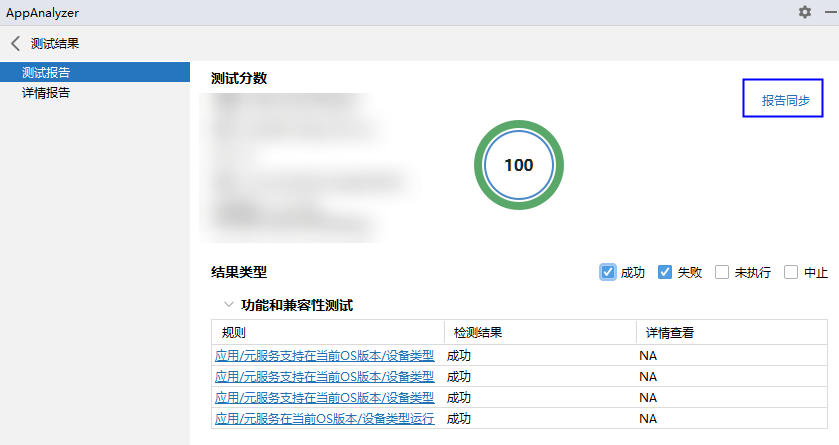

# 上架前体检

更新时间：2026-04-30 02:42:31

来源：https://developer.huawei.com/consumer/cn/doc/harmonyos-guides/ide-app-analyzer-before-appgallery

从DevEco Studio 6.0.0 Beta1版本开始，AppAnalyzer新增上架前体检，针对上架阻塞问题进行快速检测，提前发现可能影响上架的问题，检测完成之后可以选择上传检测结果，用于应用市场上架参考，提升上架效率。
 

#### 前置操作
1. 通过以下任意一种方式，打开AppAnalyzer。
单击菜单栏**Tools > ****AppAnalyzer**，打开AppAnalyzer页面。
2. 在编辑窗口右侧的工具栏，点击**AppAnalyzer**或

，打开AppAnalyzer页面。
3. 确保[DevEco Studio与真机设备已连接](https://developer.huawei.com/consumer/cn/doc/harmonyos-guides/ide-run-device)，并对应用进行[签名](https://developer.huawei.com/consumer/cn/doc/harmonyos-guides/ide-signing)。
4. 如果使用DevEco Studio 6.0.1版本，未配置Python环境时，请根据界面提示，下载Python及三方库。或者点击AppAnalyzer底部**Python 配置**按钮进行配置。
 
 

#### 进行体检

 

#### DevEco Studio 6.0.1 Beta1及以上版本
1. 在**AppAnalyzer**页面，选择**上架前体检**，点击预置的体检卡片，在弹框中选择待上架的产物和调试签名。

2. 该体检模式无法自定义测试方式和体检规则，默认勾选所有规则，这些规则是[规则体检](https://developer.huawei.com/consumer/cn/doc/harmonyos-guides/ide-app-analyzer-all-rules)的子集。单击底部的**开始体检**按钮，等待AppAnalyzer完成构建、签名、安装等操作。
3. 安装完成后，根据提示登录账号，开始进行测试。在测试过程中，请保持连接的设备为解锁亮屏状态。
4. 测试完成后，查看测试报告如下。
如果测试分数是100分，可点击右上角**Sync To AG**按钮，弹出弹框，确认后点击**OK**，上传本次的检测报告，用于应用市场上架参考。上传报告后，无法再次上传报告。
> [!NOTE]
> 如需上传报告，请在体检结束后上传， 历史报告 中无法上传报告。

  

5. 如果测试分数不是100分，无法上传报告，可根据详情报告中的信息，对问题进行分析优化，详情报告的具体内容可参考[规则体检](https://developer.huawei.com/consumer/cn/doc/harmonyos-guides/ide-app-analyzer-rules#li22241112508)。
 
 

#### DevEco Studio 6.0.1 Beta1以下版本
1. 在**AppAnalyzer**页面，选择**上架前体检**，弹出上架前检测配置的弹框，选择待上架的产物和调试签名。

2. 该体检模式无法自定义测试方式、模块和体检规则，默认勾选所有规则，这些规则是[规则体检](https://developer.huawei.com/consumer/cn/doc/harmonyos-guides/ide-app-analyzer-all-rules)的子集。单击底部的**开始**按钮，等待AppAnalyzer完成构建、签名、安装等操作。
3. 安装完成后，根据提示登录账号，开始进行测试。在测试过程中，请保持连接的设备为解锁亮屏状态。
4. 测试完成后点击**结束**按钮停止测试任务，等待数据解析完成后，查看测试结果如下。
如果测试分数是100分，可点击右上角**报告同步**按钮，弹出弹框，确认后点击**OK**，上传本次的检测报告，用于应用市场上架参考。上传报告后，无法再次上传报告。
> [!NOTE]
> 如需上传报告，请在体检结束后上传， 历史报告 中无法上传报告。

  

5. 如果测试分数不是100分，无法上传报告，可根据详情报告中的信息，对问题进行分析优化，详情报告的具体内容可参考[规则体检](https://developer.huawei.com/consumer/cn/doc/harmonyos-guides/ide-app-analyzer-rules#li131614342254)。
