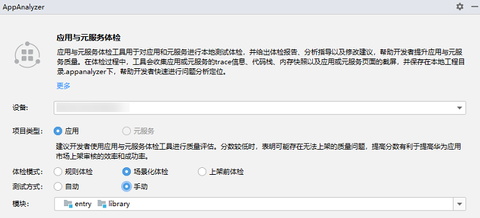
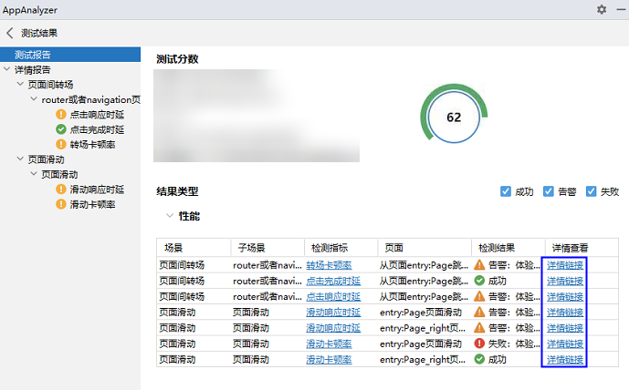
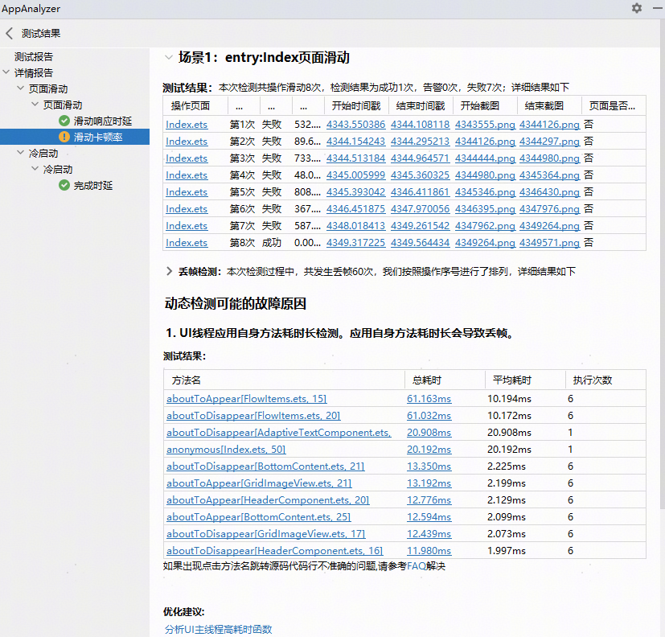

# 场景化体检

更新时间：2026-04-30 02:42:31

来源：https://developer.huawei.com/consumer/cn/doc/harmonyos-guides/ide-app-analyzer-scenes

场景化体检支持页面滑动、页面间转场、冷启动等多种测试场景，开发者可以基于实际的应用场景进行测试。

#### 前置操作
1. 通过以下任意一种方式，打开AppAnalyzer。       
 - 单击菜单栏**Tools > ****AppAnalyzer**，打开AppAnalyzer页面。

2. 在编辑窗口右侧的工具栏，点击**AppAnalyzer**或

，打开AppAnalyzer页面。

3. 连接设备或启动模拟器，并对应用进行[签名](https://developer.huawei.com/consumer/cn/doc/harmonyos-guides/ide-signing)。       
真机：参考[使用本地真机运行应用](https://developer.huawei.com/consumer/cn/doc/harmonyos-guides/ide-run-device)连接真机。

4. 模拟器：在AppAnalyzer首页创建或启动模拟器，具体请参考[管理模拟器](https://developer.huawei.com/consumer/cn/doc/harmonyos-guides/ide-emulator-management)。

5. 如果使用DevEco Studio 6.0.1版本，未配置Python环境时，请根据界面提示，下载Python及三方库。或者点击AppAnalyzer底部**Python 配置**按钮进行配置。

6. 如果使用DevEco Studio 6.0.0 Beta2之前的版本，需要先编译生成HAP或HSP。使用Beta2及以上的版本，无需提前编译。

  

  #### 进行体检

  

  #### DevEco Studio 6.0.1 Beta1及以上版本

1. 点击右上角

图标选择Product、Target和构建模式，点击**Apply**后，在AppAnalyzer的首页中可查看对应的编译产物和构建模式。关于Product、Target、构建模式的介绍请参考[配置多目标产物](https://developer.huawei.com/consumer/cn/doc/harmonyos-guides/ide-customized-multi-targets-and-products-guides)和[指定构建模式](https://developer.huawei.com/consumer/cn/doc/harmonyos-guides/ide-hvigor-compilation-options-customizing-guide#section192461528194916)。       

2. 在**AppAnalyzer**页面，选择**场景化体检**，选择预置的体检卡片，或根据需要自定义卡片。       
点击预置的体检卡片开始体检，如需查看卡片包含的体检场景，请点击卡片右上角的

按钮，不同场景对应的检测指标请参考[体检场景](#section578981218613)。

3. 如果需要自定义体检场景，点击**+**，选择自动/手动测试和体检场景，部分场景可修改单次录制时长/测试总时长，请根据界面提示进行修改。

4. 开始体检后，请等待AppAnalyzer完成构建、签名、安装等操作。如果本次体检依赖Python三方库并且本地未安装，AppAnalyzer会同步下载安装三方库。在测试过程中，请保持连接的设备为解锁亮屏状态。       
如果是自动测试，根据界面提示，登录应用账号后点击继续按钮

，继续测试；或者无需登录账号，直接点击

按钮继续测试。

5. 如果是手动测试，根据界面提示，点击开始按钮

开始录制，并手动遍历应用/元服务的功能。如果在录制时间范围内未遍历完成，可继续点击

按钮，进行多次遍历，遍历完成后点击结束按钮

。

6. 查看测试报告，包含以下内容。       
**源文件、调优文件（包含trace文件和调用栈文件）或snapshot文件、时间戳等**：点击源文件可跳转到问题源码，点击调优文件或snapshot文件支持直接拉起性能分析工具Profiler并导入性能检测的问题数据进行调优分析，点击时间戳可以打开Profiler并定位到问题发生的时间范围。

7. **分析文档**：点击链接可跳转至官网文档，参考文档对检测出来的问题进行分析。

8. **优化建议**：针对可能的故障原因，给出对应的最佳实践，点击链接可跳转至官网文档。

  

  #### DevEco Studio 6.0.1 Beta1以下版本

1. 如果使用DevEco Studio 6.0.0 Beta2及以上的版本，支持在体检过程中自动编译构建打包。点击右上角

图标选择Product、Target和构建模式，关于Product、Target、构建模式的介绍请参考[配置多目标产物](https://developer.huawei.com/consumer/cn/doc/harmonyos-guides/ide-customized-multi-targets-and-products-guides)和[指定构建模式](https://developer.huawei.com/consumer/cn/doc/harmonyos-guides/ide-hvigor-compilation-options-customizing-guide#section192461528194916)。

2. 在**AppAnalyzer**页面，选择**场景化体检**，选择**自动**或**手动**方式，**模块**选择框选择HarmonyOS应用/元服务工程模块。       
自动方式：体检时无需手动遍历，AppAnalyzer会自动检测。自动方式下还需要选择具体的运行时长。

3. 手动方式：体检时需要根据提示手动遍历HarmonyOS应用/元服务的功能。

4. 勾选体检场景，不同场景对应的检测指标请参考[体检场景](#section578981218613)，然后在**AppAnalyzer**页面底部单击**开始**按钮，开始测试。首次测试时，请根据AppAnalyzer的指引，下载Python及三方库，或者登录开发者账号并自动签名音频辅助检测APP。在测试过程中，请保持连接的设备为解锁亮屏状态。       
> [!NOTE]
> 请勿在测试完成前点击结束，如果提前结束测试会导致测试结果不准确。 支持Python 3.9~3.12版本，推荐使用Python 3.11.7版本。

5. 如果是手动方式，在安装应用/元服务完成后，需要根据提示手动遍历HarmonyOS应用/元服务的功能。手动遍历完成后点击**结束**按钮停止测试任务，等待数据解析完成后，查看测试结果如下。       
测试报告：检测结果的汇总信息，默认展示告警和失败的检测结果，点击**详情链接**可跳转到对应场景的详情报告。         

6. 详情报告：给出详细的测试结果、相关的定位文件和对应的优化建议。         
**开始/结束页面、时间戳、调优文件（包含trace文件和调用栈文件）或snapshot文件等**：点击开始/结束页面可跳转到问题源码，点击时间戳可以打开性能分析工具Profiler并定位到问题发生的时间范围，点击调优文件或snapshot文件支持直接拉起Profiler并导入性能检测的问题数据进行调优分析。

7. **分析文档**：点击链接可跳转至官网文档，参考文档对检测出来的问题进行分析。

8. **优化建议**：针对可能的故障原因，给出对应的最佳实践，点击链接可跳转至官网文档。

  

  #### 体检场景

  

  #### 性能

| 场景 | 子场景 | 检测指标/检测项 | 应用或元服务场景 | 自动或手动方式 |

| --- | --- | --- | --- | --- |

| 页面间转场 | router或者navigation页面跳转 | 点击响应时延 | 应用，元服务 | 自动，手动 |

| 页面间转场 | 点击完成时延 | router或者navigation页面跳转 | 应用，元服务 | 自动，手动 |

| 页面间转场 | 转场卡顿率 | router或者navigation页面跳转 | 应用，元服务 | 自动，手动 |

| 页面间转场 | 起播时延 | router或者navigation页面跳转 | 应用，元服务 | 自动，手动 |

| 页面滑动 | 页面滑动（仅支持List、Grid、WaterFlow这三个组件实现的页面滑动） | 滑动响应时延 | 应用，元服务 | 自动，手动 |

| 页面滑动 | 滑动卡顿率 | 页面滑动（仅支持List、Grid、WaterFlow这三个组件实现的页面滑动） | 应用，元服务 | 自动，手动 |

| 冷启动 | 冷启动 | 完成时延 | 应用，元服务 | 自动，手动 |

| 页面内转场 | swiper滑动转场 | 滑动响应时延 | 应用，元服务 | 自动，手动 |

| 页面内转场 | 滑动卡顿率 | swiper滑动转场 | 应用，元服务 | 自动，手动 |

| 页面内转场 | 起播时延 | swiper滑动转场 | 应用，元服务 | 自动，手动 |

| 页面内转场 | tabs点击转场 | 点击响应时延 | 应用，元服务 | 自动，手动 |

| 页面内转场 | 点击完成时延 | 应用，元服务 | 自动，手动 |

| 页面内转场 | 转场卡顿率 | 应用，元服务 | 自动，手动 |

| 页面内转场 | tabs滑动转场 | 滑动响应时延 | 应用，元服务 | 自动，手动 |

| 页面内转场 | 滑动卡顿率 | 应用，元服务 | 自动，手动 |

| 页面内转场 | 起播时延 | 应用，元服务 | 自动，手动 |

| 页面内转场 | swiper点击转场 （从DevEco Studio 6.0.2 Beta1版本开始支持） | 点击响应时延 | 应用，元服务 | 自动，手动 |

| 页面内转场 | 点击完成时延 | 应用，元服务 | 自动，手动 |

| 页面内转场 | 转场卡顿率 | 应用，元服务 | 自动，手动 |

| web场景 （从DevEco Studio 6.0.0 Beta2版本开始支持） | web页面跳转 | 点击响应时延 | 应用，元服务 | 自动，手动 |

| web场景 （从DevEco Studio 6.0.0 Beta2版本开始支持） | 点击完成时延 | web页面跳转 | 应用，元服务 | 自动，手动 |

| web场景 （从DevEco Studio 6.0.0 Beta2版本开始支持） | web页面滑动 | 滑动响应时延 | 应用，元服务 | 自动，手动 |

| web场景 （从DevEco Studio 6.0.0 Beta2版本开始支持） | 滑动卡顿率 | 应用，元服务 | 自动，手动 |

  

  #### 功能兼容性

| 场景 | 子场景 | 检测指标/检测项 | 应用或元服务场景 | 自动或手动方式 |

| --- | --- | --- | --- | --- |

| 音频播控服务 （从DevEco Studio 5.1.0 Release版本开始支持） | 播控中心音频控制场景 | 播控中心控制音频播放检测 | 应用 | 手动 |

| 音频播控服务 （从DevEco Studio 5.1.0 Release版本开始支持） | 播控中心控制音频暂停检测 | 播控中心音频控制场景 | 应用 | 手动 |

| 音频播控服务 （从DevEco Studio 5.1.0 Release版本开始支持） | 播控中心控制歌曲切换上一首检测 | 播控中心音频控制场景 | 应用 | 手动 |

| 音频播控服务 （从DevEco Studio 5.1.0 Release版本开始支持） | 播控中心控制歌曲切换下一首检测 | 播控中心音频控制场景 | 应用 | 手动 |

| 音频播控服务 （从DevEco Studio 5.1.0 Release版本开始支持） | 播控中心控制歌曲播放进度条拖动检测 | 播控中心音频控制场景 | 应用 | 手动 |

| 音频播控服务 （从DevEco Studio 5.1.0 Release版本开始支持） | 播控中心控制歌曲循环播放检测 | 播控中心音频控制场景 | 应用 | 手动 |

| 音频播控服务 （从DevEco Studio 5.1.0 Release版本开始支持） | 播控中心控制歌曲收藏检测 | 播控中心音频控制场景 | 应用 | 手动 |

| 音频焦点切换 （从DevEco Studio 5.1.0 Release版本开始支持） | 来电接听场景 | 音频焦点变化事件响应检测 | 应用 | 手动 |

| 音频焦点切换 （从DevEco Studio 5.1.0 Release版本开始支持） | VoIP通话场景 | 音频焦点变化事件响应检测 | 应用 | 手动 |

| 音频焦点切换 （从DevEco Studio 5.1.0 Release版本开始支持） | 闹钟场景 | 音频焦点变化事件响应检测 | 应用 | 手动 |

| 音频焦点切换 （从DevEco Studio 5.1.0 Release版本开始支持） | 导航场景 | 音频焦点变化事件响应检测 | 应用 | 手动 |

| 音频焦点切换 （从DevEco Studio 5.1.0 Release版本开始支持） | 语音助手播报场景 | 音频焦点变化事件响应检测 | 应用 | 手动 |

| 音频焦点切换 （从DevEco Studio 5.1.0 Release版本开始支持） | 静音播放场景 | 音频焦点变化事件响应检测 | 应用 | 手动 |

| 音频焦点切换 （从DevEco Studio 5.1.0 Release版本开始支持） | 非静音播放场景 | 音频焦点变化事件响应检测 | 应用 | 手动 |

| 音频焦点切换 （从DevEco Studio 5.1.0 Release版本开始支持） | 普通录音场景 | 音频焦点变化事件响应检测 | 应用 | 手动 |

| 音频设备控制 （从DevEco Studio 5.1.0 Release版本开始支持） | 耳机控制音频场景 | 耳机控制音频播放检测 | 应用 | 手动 |

| 音频设备控制 （从DevEco Studio 5.1.0 Release版本开始支持） | 耳机控制音频暂停检测 | 耳机控制音频场景 | 应用 | 手动 |

| 音频设备控制 （从DevEco Studio 5.1.0 Release版本开始支持） | 耳机控制歌曲切换上一首检测 | 耳机控制音频场景 | 应用 | 手动 |

| 音频设备控制 （从DevEco Studio 5.1.0 Release版本开始支持） | 耳机控制歌曲切换下一首检测 | 耳机控制音频场景 | 应用 | 手动 |

| 音频设备控制 （从DevEco Studio 5.1.0 Release版本开始支持） | 耳机断开场景 | 耳机断开事件响应检测 | 应用 | 手动 |

| 运行异常 （从DevEco Studio 6.1.0 Beta1版本开始支持） | 运行异常 | 运行无兼容性问题 | 应用，元服务 | 自动 |

| 运行异常 （从DevEco Studio 6.1.0 Beta1版本开始支持） | API兼容性问题 | 运行异常 | 应用，元服务 | 自动 |

  

  #### 多设备

  多设备测试支持以下设备：

  
API 20及以上的双折叠、三折叠手机和模拟器。
 - API 20及以上的Pura X Max手机和模拟器。

| 场景 | 检测指标/检测项 | 应用或元服务场景 | 自动或手动方式 |
| --- | --- | --- | --- |
| 折叠开合 （从DevEco Studio 6.0.2 Beta1版本开始支持） | 参考UX规则 | 应用，元服务 | 手动 |

#### 功耗

| 场景 | 子场景 | 检测指标/检测项 | 应用或元服务场景 | 自动或手动方式 |
| --- | --- | --- | --- | --- |
| 前台静置 （从DevEco Studio 6.1.0 Beta1版本开始支持） | 前台静置 | 前台不可见动效 | 应用 | 自动，手动 |
| 前台静置 （从DevEco Studio 6.1.0 Beta1版本开始支持） | UI空跑 | 前台静置 | 应用 | 自动，手动 |
| 前台静置 （从DevEco Studio 6.1.0 Beta1版本开始支持） | 未使用硬件合成 | 前台静置 | 应用 | 自动，手动 |
| 前台静置 （从DevEco Studio 6.1.0 Beta1版本开始支持） | CPU负载异常 | 前台静置 | 应用 | 自动，手动 |
