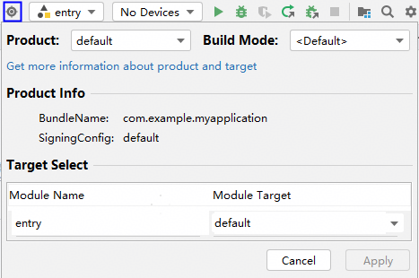
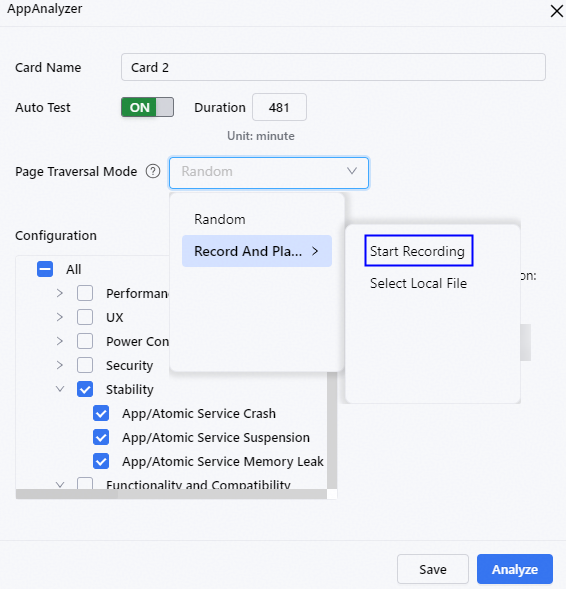
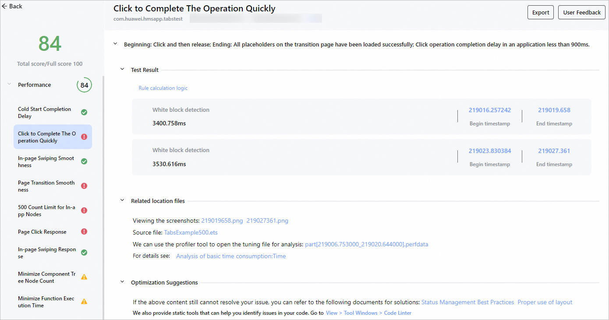
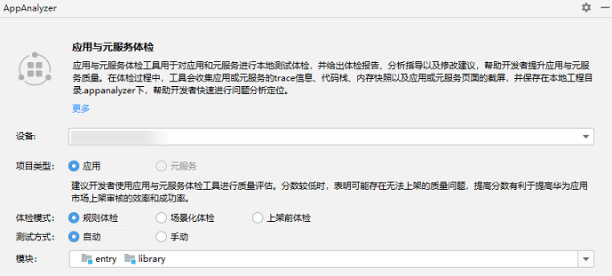
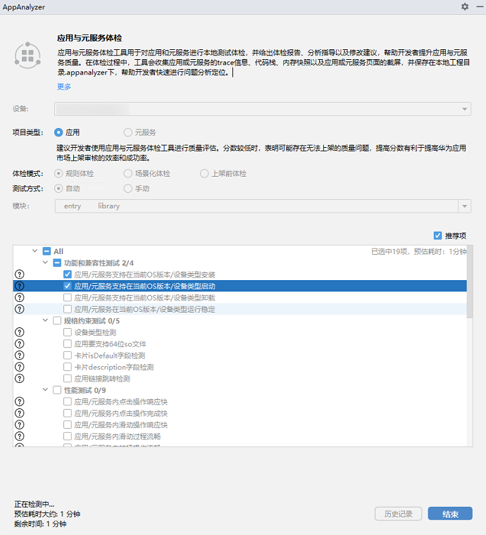
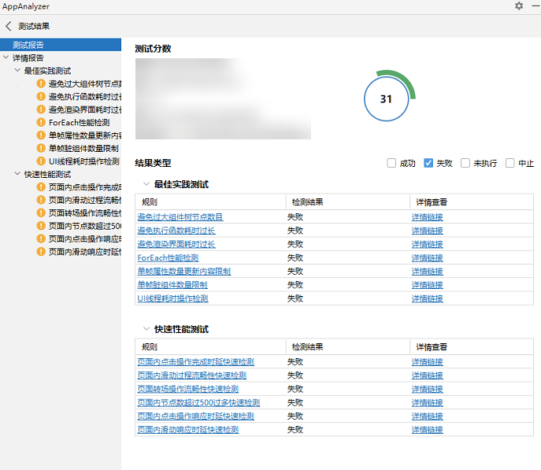
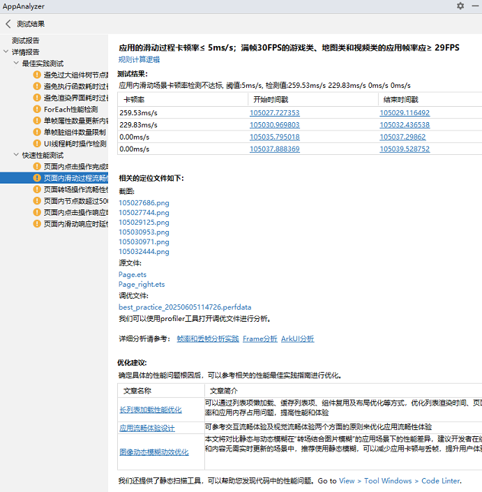

# 规则体检

更新时间：2026-04-30 02:42:31

来源：https://developer.huawei.com/consumer/cn/doc/harmonyos-guides/ide-app-analyzer-rules

规则体检支持兼容性、性能、功耗等多种测试类型，开发者可自主选择不同的规则进行测试。

## 前置操作

通过以下任意一种方式，打开AppAnalyzer。 单击菜单栏**Tools > ****AppAnalyzer**，打开AppAnalyzer页面。 在编辑窗口右侧的工具栏，点击**AppAnalyzer**或

，打开AppAnalyzer页面。 连接设备或启动模拟器，并对应用进行[签名](https://developer.huawei.com/consumer/cn/doc/harmonyos-guides/ide-signing)。 真机：参考[使用本地真机运行应用](https://developer.huawei.com/consumer/cn/doc/harmonyos-guides/ide-run-device)连接真机。 模拟器：在AppAnalyzer首页创建或启动模拟器，具体请参考[管理模拟器](https://developer.huawei.com/consumer/cn/doc/harmonyos-guides/ide-emulator-management)。 如果使用DevEco Studio 6.0.1版本，未配置Python环境时，请根据界面提示，下载Python及三方库。或者点击AppAnalyzer底部**Python 配置**按钮进行配置。 如果使用DevEco Studio 6.0.0 Beta2之前的版本，需要先编译生成HAP或HSP。使用Beta2及以上的版本，无需提前编译。

## 进行体检

## DevEco Studio 6.0.1 Beta1及以上版本

点击右上角

图标选择Product、Target和构建模式，点击**Apply**后，在AppAnalyzer的首页中可查看对应的编译产物和构建模式。关于Product、Target、构建模式的介绍请参考[配置多目标产物](https://developer.huawei.com/consumer/cn/doc/harmonyos-guides/ide-customized-multi-targets-and-products-guides)和[指定构建模式](https://developer.huawei.com/consumer/cn/doc/harmonyos-guides/ide-hvigor-compilation-options-customizing-guide#section192461528194916)。

在**AppAnalyzer**页面，选择**规则体检**，选择预置的体检卡片，或根据需要自定义卡片。 点击预置的体检卡片开始体检，如需查看卡片包含的体检规则，请点击卡片右上角的

按钮，规则详情请参考[规则总览](https://developer.huawei.com/consumer/cn/doc/harmonyos-guides/ide-app-analyzer-all-rules)。 如果需要自定义体检规则，点击**+**，选择自动/手动测试和体检规则，部分规则可修改单次录制时长，请根据界面提示进行修改。 如果仅选择稳定性规则，从DevEco Studio 6.0.2 Beta1版本开始，支持录制回放遍历模式，开发者先手动录制在设备上的操作，录制结束后AppAnalyzer会自动保存录制文件，选择录制文件开始体检后，AppAnalyzer会按照设置的回放时长，自动循环执行录制的操作，体检结束后可[查看报告](#li22241112508)。
> [!NOTE]
> 请确保录制过程可循环，例如从B页面开始录制，最后结束录制时要停留在B页面。

> [!NOTE]
> 以下体检规则不支持在编译模式为release下运行，请把编译模式切换到debug再重新检测：组件树节点数目过大、执行函数耗时过长、渲染界面耗时过长、ForEach中item数量过大。

开始体检后，请等待AppAnalyzer完成构建、签名、安装等操作。如果本次体检依赖Python三方库并且本地未安装，AppAnalyzer会同步下载安装三方库。在测试过程中，请保持连接的设备为解锁亮屏状态。 如果是自动测试，根据界面提示，登录应用账号后点击继续按钮

，继续测试；或者无需登录账号，直接点击

按钮继续测试。 如果是手动测试，根据界面提示，点击开始按钮

开始录制，并手动遍历应用/元服务的功能。如果在录制时间范围内未遍历完成，可继续点击

按钮，进行多次遍历，遍历完成后点击结束按钮

。 查看测试报告，包含以下内容。 **源文件、调优文件（包含trace文件和调用栈文件）或snapshot文件、时间戳等**：点击源文件可跳转到问题源码，点击调优文件或snapshot文件支持直接拉起性能分析工具Profiler并导入性能检测的问题数据进行调优分析，点击时间戳可以打开Profiler并定位到问题发生的时间范围。 **分析文档**：点击链接可跳转至官网文档，参考文档对检测出来的问题进行分析。 **优化建议**：针对检测出来的问题，给出对应的最佳实践，点击链接可跳转至官网文档。 从DevEco Studio 6.0.2 Beta1版本开始，如果在体检中遇到问题，可点击报告右上角的**User Feedback**向我们反馈。 从DevEco Studio 6.1.0 Release版本开始，支持导出报告，以实现报告的共享，具体可查看[导出报告](https://developer.huawei.com/consumer/cn/doc/harmonyos-guides/ide-app-analyzer-history-reports#section78017171818)。

## DevEco Studio 6.0.1 Beta1以下版本

如果使用DevEco Studio 6.0.0 Beta2及以上的版本，支持在体检过程中自动编译构建打包。点击右上角

图标选择Product、Target和构建模式，关于Product、Target、构建模式的介绍请参考[配置多目标产物](https://developer.huawei.com/consumer/cn/doc/harmonyos-guides/ide-customized-multi-targets-and-products-guides)和[指定构建模式](https://developer.huawei.com/consumer/cn/doc/harmonyos-guides/ide-hvigor-compilation-options-customizing-guide#section192461528194916)。 在**AppAnalyzer**页面，选择**规则体检**，选择自动或手动方式，**模块**选择框选择HarmonyOS应用/元服务工程模块。 自动方式：体检时无需手动遍历，AppAnalyzer会自动检测。 手动方式：体检时需要根据提示手动遍历HarmonyOS应用/元服务的功能。
> [!NOTE]
> 如果使用DevEco Studio 6.0.0 Beta2之前的版本，只有已经完成签名编译打包的模块才能被选中。 支持同时添加多个模块，要求所有模块的“bundleName”相同，且多个模块中只能包含一个entry。

选择待测试的规则，规则详情请参考[规则总览](https://developer.huawei.com/consumer/cn/doc/harmonyos-guides/ide-app-analyzer-all-rules)，然后在**AppAnalyzer**页面底部单击**开始**按钮，开始测试。部分测试规则依赖Python，请根据AppAnalyzer的指引，下载Python及三方库。在测试过程中，请保持连接的设备为解锁亮屏状态。
> [!NOTE]
> 请勿在测试完成前点击结束，如果提前结束测试会导致测试结果不准确。 支持Python 3.9~3.12版本，推荐使用Python 3.11.7版本。 部分规则体检会进行投屏，如果测试过程中同时使用其他投屏工具，如DevEco Testing，可能会对UX测试的投屏造成干扰。如果投屏中断或不同步，可点击左上角刷新按钮重新投屏。

如果是手动方式，在安装应用/元服务完成后，需要根据提示手动遍历HarmonyOS应用/元服务的功能。手动遍历完成后点击**结束**按钮停止测试任务，等待数据解析完成后，查看测试结果如下。 测试报告：检测结果的汇总信息，点击**详情链接**可跳转到对应的详情报告。

详情报告：只包含检测失败的规则，给出详细的测试结果、相关的定位文件和对应的优化建议。 **源文件、调优文件（包含trace文件和调用栈文件）或snapshot文件、时间戳等**：点击源文件可跳转到问题源码，点击调优文件或snapshot文件支持直接拉起性能分析工具Profiler并导入性能检测的问题数据进行调优分析，点击时间戳可以打开Profiler并定位到问题发生的时间范围。 **分析文档**：点击链接可跳转至官网文档，参考文档对检测出来的问题进行分析。 **优化建议**：点击链接可跳转至官网文档，参考文档对检测出来的问题进行优化。 **Code Linter**：在“最佳实践测试”项目中，可直接在拉起Code Linter的同时，传递有问题的代码文件名，自动执行代码检查。在“快速性能测试”和“性能测试”项目中，因无代码文件名等信息，部分检测规则不支持自动执行代码检查，仅支持拉起Code Linter。

