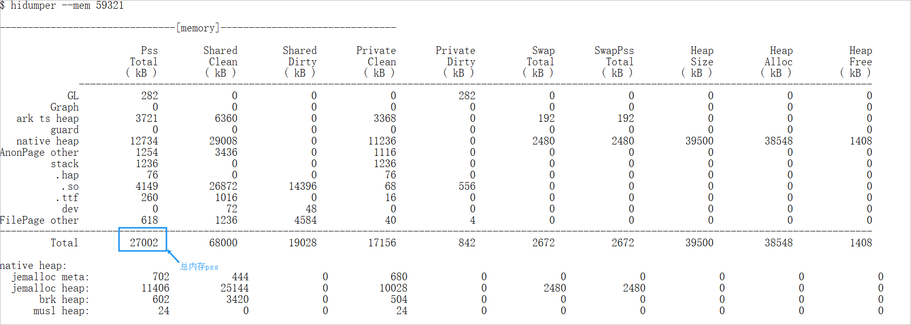

# 前台场景内存峰值占用

更新时间：2026-04-20 06:32:02

来源：https://developer.huawei.com/consumer/cn/doc/harmonyos-guides/ide-peak-foreground-memory-usage-0418

## 规则详情

应用/元服务前台场景峰值内存占用：应用在前台且亮屏使用规程的内存占用应≤ 1500MB。

## 检测逻辑

执行hdc shell。执行hidumper --mem 命令，获取如图Pss字段。

## 计算逻辑

执行多轮测试，取最大Pss值为占用峰值，内存占用小于1500M。
