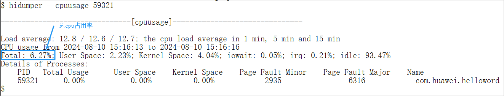

# 后台CPU占用峰值

更新时间：2026-04-20 06:32:02

来源：https://developer.huawei.com/consumer/cn/doc/harmonyos-guides/ide-peak-background-cpu-usage-0420

##### 规则详情

应用/元服务后台CPU占用峰值：应用/元服务切换到后台等待3min后，开始采集3min内CPU Load < 5%。
 
 

##### 检测逻辑
1. 执行hdc shell。
2. 执行hidumper --cpuusage &lt;进程pid&gt;命令，获取总的cpu使用率。
 

 
 

##### 计算逻辑

执行多轮测试，取最大值为cpu占用峰值，cpu占用率须小于5%。
