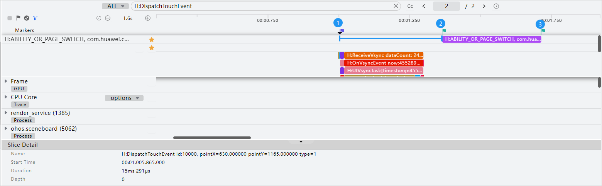

# 点击操作响应快

更新时间：2026-04-30 02:42:31

来源：https://developer.huawei.com/consumer/cn/doc/harmonyos-guides/ide-quick-response-for-click-0403

#### 规则详情

应用内点击操作响应时延应≤ 100ms；时间起点：点击离手；时间终点：界面发生变化。
 
 

#### 检测逻辑

- 开始时间：点击离手，如图标记1；关键字：H:DispatchTouchEvent，其中type=1。
- 结束时间：泳道开始时间，如图标记2。如图展示的是H:ABILITY_OR_PAGE_SWITCH泳道，其他转场泳道标记如下：

  H:APP_TRANSITION_FROM_OTHER_APP

  H:APP_TRANSITION_TO_OTHER_APP

  H:APP_SWIPER_NO_ANIMATION_SWITCH

  H:APP_TABS_NO_ANIMATION_SWITCH

  H:APP_TABS_FLING
- 备注：由于trace的响应时延小于用户实际感知的时延，所以目前点击类算法会补偿20ms。

 

 
 

#### 计算逻辑

时延=结束时间 - 开始时间，小于等于100ms。
