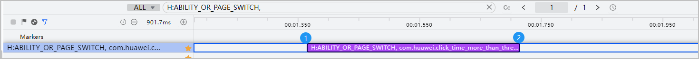
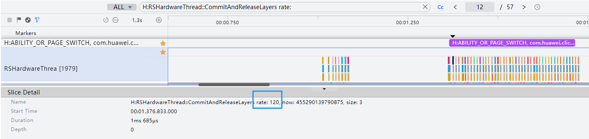

# 转场操作流畅

更新时间：2026-04-20 06:32:02

来源：https://developer.huawei.com/consumer/cn/doc/harmonyos-guides/ide-smooth-for-transition-0414

#### 规则详情

应用的应用内转场过程卡顿率≤ 0ms/s；滑动过程卡顿率：动效时间内累计丢帧时间/动效时长。
 
 

#### 检测逻辑

- 开始时间：以ABILITY_OR_PAGE_SWITCH转场泳道为例，泳道的起点（如图标记1）。
- 结束时间：以ABILITY_OR_PAGE_SWITCH转场泳道为例，泳道的终点（如图标记2）。其他转场泳道标记如下：

  H:APP_TRANSITION_FROM_OTHER_APP

  H:APP_TRANSITION_TO_OTHER_APP

  H:APP_SWIPER_NO_ANIMATION_SWITCH

  H:APP_TABS_NO_ANIMATION_SWITCH

  H:APP_TABS_FLING

 

 
- 总时长(s)：【最后一个“H:Waiting for Present Fence xxxx” 时间（如图标记2）】 - 【第一个“H:Waiting for Present Fence xxxx” 时间（如图标记1）】。

 
- 每帧时长(ms)：1000ms / 刷新率。
- 刷新率：在泳道范围内查找关键词H:RSHardwareThread::CommitAndReleaseLayers rate，如下图：

 
- 每帧渲染实际耗时(ms)：【下一个H:Waiting for Present Fence xxxx的起始时间】 - 【当前H:Waiting for Present Fence xxxx的起始时间】如下图 【标记2 - 标记1】。

 
- 每帧丢帧时间(ms)：max（【每帧渲染实际耗时(ms)】- 【每帧时长(ms)】 * 1.5, 0）；即每帧耗时大于标准耗时1.5倍时则判定为丢帧。

 
 

#### 计算逻辑

卡顿率=所有【每帧丢帧时间(ms)】/ 总时长(s)，卡顿率小于等于0ms/s。
