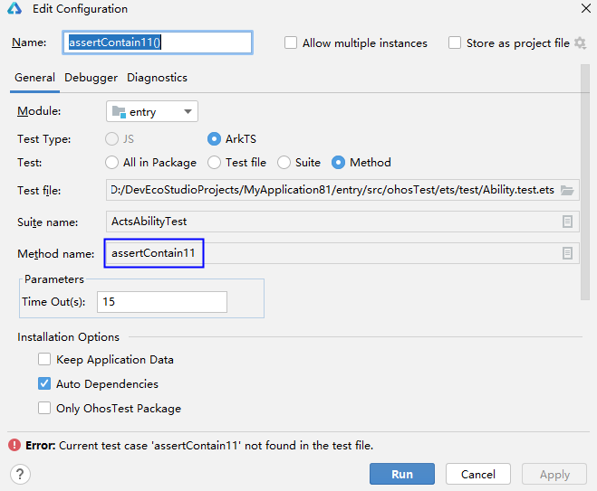
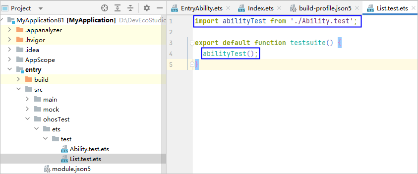

# 仪器测试错误码

更新时间：2026-06-24 07:08:31

来源：https://developer.huawei.com/consumer/cn/doc/harmonyos-guides/ide-instrument-test-errorcode

#### 00501001 测试套件名称含有变量

**错误信息**
 
XXX is a Variable. Please use string as a describe name.
 
**错误描述**
 
XXX是变量，请使用字符串作为测试套件名称。
 
**可能原因**
 
测试套件名称含有变量。
 
**处理步骤**
 
使用字符串作为测试套件名称。
 
 

#### 00501002 仪器测试用例名称存在非法字符

**错误信息**
 
XXX is an invalid it value. Enter a value that contains only digits, letters, underscores (_), and periods (.) or run from a higher level portal.
 
**错误描述**
 
仪器测试用例名称存在非法字符。用例名只能包括数字、字母、下划线或者点号，或从更高的运行入口执行。
 
**可能原因**
 
测试用例名称包括非法字符。
 
**处理步骤**
 
- 确保用例名只包括数字、字母、下划线或者点号。
- 如果测试用例名称包括非法字符，请运行测试套件、测试文件或测试目录。

 
 

#### 00501003 测试用例名称重复

**错误信息**
 
Testing failed due to the duplicate test case name XXX. The test case name must be unique in a test suite.
 
**错误描述**
 
测试用例名称重复。测试套件下的测试用例名称必须唯一。
 
**可能原因**
 
测试套件下存在重名的测试用例。
 
**处理步骤**
 
确保测试套件下的测试用例名称唯一。
 
 

#### 00501004 测试套件名称重复

**错误信息**
 
Testing failed due to the duplicate test suite name XXX. The test suite name must be unique in a test package.
 
**错误描述**
 
测试套件名称重复。测试目录下的测试套件名称必须唯一。
 
**可能原因**
 
测试目录下存在重名的测试套件。
 
**处理步骤**
 
确保测试目录下的测试套件名称唯一。
 
 

#### 00501005 仪器测试用例名称含有变量

**错误信息**
 
XXX is a Variable. Please use string as an It-name or execute from the higher running entrance.
 
**错误描述**
 
XXX是变量，请使用字符串作为测试用例名称，或从更高的运行入口执行。
 
**可能原因**
 
仪器测试用例名称含有变量。
 
**处理步骤**
 
- 使用字符串作为测试用例名称。
- 如果测试用例名称是变量，请运行测试套件、测试文件或测试目录。

 
 

#### 00501006 仪器测试用例名称含有变量

**错误信息**
 
XXX is a Variable. Please use string as an It-name.
 
**错误描述**
 
XXX是变量，请使用字符串作为测试用例名称。
 
**可能原因**
 
仪器测试用例名称含有变量。
 
**处理步骤**
 
- 使用字符串作为测试用例名称。
- 如果测试用例名称是变量，请运行测试套件、测试文件或测试目录。

 
 

#### 00501007 测试套件名称不合法

**错误信息**
 
XXX is an invalid describe value. The value entered must contain only digits, letters, underscores (_), and periods (.) and can only start with a letter.
 
**错误描述**
 
测试套件名称不合法。名称只能包括数字、字母、下划线和点，以字母开头。
 
**可能原因**
 
测试套件名称不合法。
 
**处理步骤**
 
确保测试套件名称只包括数字、字母、下划线和点，以字母开头。
 
 

#### 00502001 测试文件中找不到对应测试用例

**错误信息**
 
Current test case XXX not found in the test file.
 
**错误描述**
 
测试文件中找不到对应的测试用例。
 
**可能原因**
 
测试文件中找不到对应的测试用例。
 
**处理步骤**
 
- 选择要运行的测试用例，重新运行。
- 在运行配置窗口修改Method name。

 
 

#### 00502002 找不到测试用例

No Any Test Case Found In The XXX.
 
**错误描述**
 
找不到任何测试用例。
 
**可能原因**
 
测试文件中未定义测试用例。
 
**处理步骤**
 
确保测试文件中存在测试用例。
 
 

#### 00502003 测试文件不存在

**错误信息**
 
File does not exist: XXX.
 
**错误描述**
 
测试文件不存在。
 
**可能原因**
 
测试文件可能被删除或者移动。
 
**处理步骤**
 
选择实际存在的文件进行测试。
 
 

#### 00502004 当前文件的所有函数都没有在List.test.ets文件中注册

**错误信息**
 
The current file does not have any function registered in the list file.
 
**错误描述**
 
当前文件的所有函数都没有在List.test.ets文件中注册。
 
**可能原因**
 
当前文件的所有函数都没有在List.test.ets文件中注册。
 
**处理步骤**
 
在List.test.ets文件中注册函数，示例如下。
 

 
 

#### 00502005 测试包中的所有函数都没有在List.test.ets文件中注册

**错误信息**
 
The current package does not have any function registered in the list file.
 
**错误描述**
 
当前测试包中的所有函数都没有在List.test.ets文件中注册。
 
**可能原因**
 
当前测试包中的所有函数都没有在List.test.ets文件中注册。
 
**处理步骤**
 
在List.test.ets文件中注册函数，示例如下。
 

 
 

#### 00502006 函数没有在List.test.ets文件中注册

**错误信息**
 
The function where the suite XXX is located is not registered in the ''List.test.ets'' file!
 
**错误描述**
 
测试套件XXX所在的函数没有在List.test.ets文件中注册。
 
**可能原因**
 
函数没有在List.test.ets文件中注册。
 
**处理步骤**
 
在List.test.ets文件中注册函数，示例如下。
 

 
 

#### 00502007 测试文件中找不到测试套件

**错误信息**
 
Current suite XXX not found in the test file.
 
**错误描述**
 
测试文件中找不到测试套件。
 
**可能原因**
 
测试文件中不存在测试套件。
 
**处理步骤**
 
- 选择要运行的测试套件，重新运行。
- 在运行配置窗口修改Suite name。

 
 

#### 00503001 HAP包名无效

**错误信息**
 
Invalid HAP file name.
 
**错误描述**
 
HAP包名无效。
 
**可能原因**
 
HAP包名中存在非法字符。
 
**处理步骤**
 
确保HAP包名中仅包含数字、字母、下划线（_）、中划线（-）、点号（.）。
 
 

#### 00503002 hap包中找不到文件

**错误信息**
 
The XXX file in the hap file does not exist.
 
**错误描述**
 
hap包中找不到文件。
 
**可能原因**
 
hap包中对应文件不存在。
 
**处理步骤**
 
重新构建生成HAP包。
 
 

#### 00503003 文件为空

**错误信息**
 
The XXX file is empty.
 
**错误描述**
 
文件为空。
 
**可能原因**
 
hap包中的文件不存在或内容格式不正确。
 
**处理步骤**
 
重新构建生成hap包。
 
 

#### 00504001 未指定测试套件名称

**错误信息**
 
The 'Suite name' is not specified.
 
**错误描述**
 
未指定测试套件名称。
 
**可能原因**
 
运行配置中未选择测试套件。
 
**处理步骤**
 
选择一个测试套件。
 
 

#### 00504002 未指定测试包

**错误信息**
 
The 'Package' is not specified.
 
**错误描述**
 
未指定测试包。
 
**可能原因**
 
运行配置中未选择测试包。
 
**处理步骤**
 
选择一个测试包。
 
 

#### 00504003 未指定测试用例

**错误信息**
 
The 'Method name' is not specified.
 
**错误描述**
 
未指定测试用例。
 
**可能原因**
 
运行配置中未选择测试用例。
 
**处理步骤**
 
选择一个测试用例。
 
 

#### 00504004 未指定测试文件

**错误信息**
 
The 'File name' is not specified.
 
**错误描述**
 
未指定测试文件。
 
**可能原因**
 
运行配置中未选择测试文件。
 
**处理步骤**
 
选择一个测试文件。
 
 

#### 00505001 仪器测试运行失败

**错误信息**
 
Instrumentation run failed due to XXX.
 
**错误描述**
 
仪器测试运行失败。
 
**可能原因**
 
测试套件中存在Promise(async, await)。
 
**处理步骤**
 
测试套件中不允许使用Promise(async, await)。
 
 

#### 00506001 仪器测试返回数量和预期不一致

**错误信息**
 
XXX. Expected YYY tests, received ZZZ.
 
**错误描述**
 
仪器测试运行错误。
 
**可能原因**
 
仪器测试返回数量和预期不一致。
 
**处理步骤**
 
根据报错提示进行修改。
 
 

#### 00506002 没有测试结果

**错误信息**
 
No test results because XXX.
 
**错误描述**
 
没有测试结果。
 
**可能原因**
 
设备屏幕设置了密码并且未解锁。
 
**处理步骤**
 
解锁屏幕后重新测试。
 
 

#### 00506003 执行历史测试任务失败

**错误信息**
 
Build history project failed.
 
**错误描述**
 
执行历史测试任务失败。
 
**可能原因**
 
历史任务已失效，或执行环境已修改。
 
**处理步骤**
 
不要执行历史任务，重新构造测试任务。
 
 

#### 00508010 覆盖率报告生成失败

**错误信息**
 
Coverage report generation failed! Please attempt to clean project first.
 
**错误描述**
 
覆盖率报告生成失败。请先尝试清理项目。
 
**可能原因**
 
无法生成覆盖率报告。
 
**处理步骤**
 
点击菜单栏**Build > Clean Project**清理缓存后重试。
 
 

#### 00508013 应用启动超时

**错误信息**
 
App launch timed out. Make sure the screen is unlocked.
 
**错误描述**
 
应用启动超时，确保屏幕已解锁。
 
**可能原因**
 
屏幕被锁定。
 
**处理步骤**
 
解锁设备屏幕。
 
 

#### 00508014 预览器不支持此应用

**错误信息**
 
Previewer does not support this app.
 
**错误描述**
 
预览器不支持此应用。
 
**可能原因**
 
使用预览器进行仪器测试。
 
**处理步骤**
 
仪器测试不支持预览器，请选择真机设备或模拟器进行测试。
 
 

#### 00508015 测试文件没有以.test.ets结尾

**错误信息**
 
File XXX does not end with '.test.ets'.
 
**错误描述**
 
文件没有以.test.ets结尾。
 
**可能原因**
 
测试文件名称没有以.test.ets结尾。
 
**处理步骤**
 
修改测试文件后缀为.test.ets。
