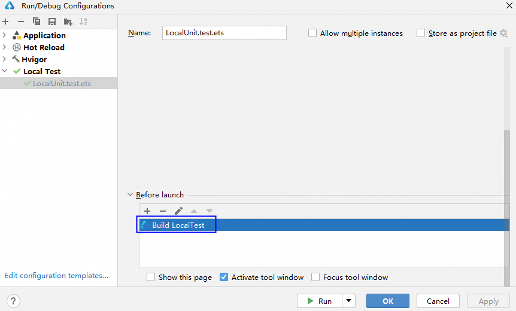

# 本地测试错误码

更新时间：2026-04-30 02:42:31

来源：https://developer.huawei.com/consumer/cn/doc/harmonyos-guides/ide-local-test-errorcode

##### 00521001 测试用例名称存在非法字符

**错误信息**

XXX is an invalid it value. Enter a value that contains only digits, letters, underscores (_), and periods (.) or run from a higher level portal.

**错误描述**

测试用例名称存在非法字符。用例名只能包括数字、字母、下划线或者点号，或从更高的运行入口执行。

**可能原因**

本地测试的测试用例名称存在非法字符。

**处理步骤**

 - 确保用例名只包括数字、字母、下划线或者点号。
 - 如果测试用例名称包括非法字符，请运行测试套件、测试文件或测试目录。

##### 00521002 测试套件名称存在非法字符

**错误信息**

XXX is an invalid describe value. The value entered must contain only digits, letters, underscores (_), and periods (.), and can only start with a letter.

**错误描述**

测试套件名称不合法。名称只能包括数字、字母、下划线和点，以字母开头。

**可能原因**

本地测试套件名称存在非法字符。

**处理步骤**

确保测试套件名称只包括数字、字母、下划线和点，以字母开头。

##### 00521003 本地测试套件名称含有变量

**错误信息**

XXX is a Variable. Please use string as a describe name.

**错误描述**

XXX是变量，请使用字符串作为测试套件名称。

**可能原因**

本地测试套件名称含有变量。

**处理步骤**

使用字符串作为测试套件名称。

##### 00521004 本地测试用例名称含有变量

**错误信息**

XXX is a Variable. Please use string as an It-name.

**错误描述**

XXX是变量，请使用字符串作为测试用例名称。

**可能原因**

本地测试用例名称含有变量。

**处理步骤**

 - 使用字符串作为测试用例名称。
 - 如果测试用例名称是变量，请运行测试套件、测试文件或测试目录。

##### 00521005 本地测试用例名称含有变量

**错误信息**

XXX is a Variable. Please use string as an It-name or execute from the higher running entrance.

**错误描述**

XXX是变量，请使用字符串作为测试用例名称，或从更高的运行入口执行。

**可能原因**

本地测试用例名称含有变量。

**处理步骤**

 - 使用字符串作为测试用例名称。
 - 如果测试用例名称是变量，请运行测试套件、测试文件或测试目录。

##### 00521006 测试用例名称重复

**错误信息**

Testing failed due to the duplicate test case name XXX. The test case name must be unique in a test suite.

**错误描述**

测试用例名称重复导致测试失败。

**可能原因**

一个测试套件下存在相同名称的测试用例。

**处理步骤**

检查测试用例名称，确保不重复。

##### 00521007 测试套件名称重复

**错误信息**

Testing failed due to the duplicate test suite name XXX. The test suite name must be unique in a test package.

**错误描述**

测试套件名称重复导致测试失败。

**可能原因**

一个测试包下存在相同名称的测试套件。

**处理步骤**

检查测试套件名称，确保不重复。

##### 00522001 函数未在List.test.ets文件中注册

**错误信息**

The function where the method XXX is located is not registered in the 'List.test.ets' file!

**错误描述**

方法XXX所在的函数未在List.test.ets文件中注册。

**可能原因**

函数未在List.test.ets文件中注册。

**处理步骤**

在List.test.ets文件中注册函数，示例如下。

##### 00522002 函数未在List.test.ets文件中注册

**错误信息**

The function where the suite XXX is located is not registered in the ''List.test.ets'' file!

**错误描述**

测试套件所在的函数未在List.test.ets文件中注册。

**可能原因**

函数未在List.test.ets文件中注册。

**处理步骤**

在List.test.ets文件中注册函数，示例如下。

##### 00522005 文件中所有函数都没有在List.test.ets文件中注册

**错误信息**

None of the functions in the file XXX have been registered in the 'List.test.ets' file!

**错误描述**

文件中所有的函数都没有在List.test.ets文件中注册。

**可能原因**

文件中所有函数都未注册。

**处理步骤**

在List.test.ets文件中注册函数，示例如下。

##### 00522006 测试文件中找不到测试用例

**错误信息**

Current test case XXX not found in the test file.

**错误描述**

测试文件中找不到测试用例。

**可能原因**

测试文件中找不到测试用例。

**处理步骤**

 - 选择要运行的测试用例，重新运行。
 - 在运行配置窗口修改Method name。       

##### 00522007 找不到任何测试用例

**错误信息**

No Any Test Case Found In The XXX.

**错误描述**

找不到任何测试用例。

**可能原因**

测试文件中未定义测试用例。

**处理步骤**

确保测试文件中存在测试用例。

##### 00523001 本地测试不支持C/C++方法

**错误信息**

Testing on C/C++ methods not supported.

**错误描述**

本地测试不支持C/C++方法。

**可能原因**

本地测试不支持C/C++方法。

**处理步骤**

使用仪器测试。

##### 00523002 SDK中缺少必要的组件

**错误信息**

Required components are missing in the HarmonyOS SDK. Reinstall DevEco Studio again.

**错误描述**

SDK中缺少必要的组件，请重装DevEco Studio。

**可能原因**

SDK中缺少必要的组件。

**处理步骤**

重新[安装DevEco Studio](https://developer.huawei.com/consumer/cn/download/deveco-studio)。

##### 00523003 找不到modules.abc文件

**错误信息**

Failed to start local test, please check the XXX path!

**错误描述**

找不到构建产物modules.abc，无法启动本地测试。

**可能原因**
1. 构建打包失败。
2. 运行配置取消了构建任务，本地没有modules.abc文件。

**处理步骤**
1. 点击菜单栏**Build > Clean Project**清理缓存，再重新执行测试。
2. 检查运行配置是否取消了构建任务，如果取消就重新添加构建任务。       

##### 00523004 内存不足

**错误信息**

Test failed due to lack of memory. Please clean up other heavy processes or restart the computer.

**错误描述**

内存不足导致测试失败，请清理其他程序或者重启电脑。

**可能原因**

内存不足。

**处理步骤**

清理内存，或者重启电脑。

##### 00523005 执行历史测试任务失败

**错误信息**

Build history project failed.

**错误描述**

执行历史测试任务失败。

**可能原因**

历史任务已失效，或执行环境已修改。

**处理步骤**

不要执行历史任务，重新构造测试任务。

##### 00526007 运行错误

**错误信息**

运行时报错，具体报错视情况而定。

**错误描述**

运行时报错。

**可能原因**

未知。

**处理步骤**

根据报错信息进行排查。

##### 00526008 运行配置模块为空

**错误信息**

No module found.

**错误描述**

当前运行/调试配置面板中的模块为空。

**可能原因**

工程同步失败。

**处理步骤**

重新同步下工程并确保同步成功。

##### 00526009 运行获取不到product

**错误信息**

The product can not be empty.

**错误描述**

运行时product不能为空。

**可能原因**

product配置不正确。

**处理步骤**

检查工程级build-profile.json5文件中对应模块的applyToProducts配置是否正确，详细配置可以参考[构建定义的目标产物](https://developer.huawei.com/consumer/cn/doc/harmonyos-guides/ide-customized-multi-targets-and-products-guides#section2554174114463)。

##### 00526010 运行时获取不到target

**错误信息**

The target can not be empty. Check the build-profile.json5 file of the project root directory and make sure the targets of the modules in configuration is set to specified product: default in applyToProducts.

**错误描述**

运行时target不能为空。

**可能原因**

当前模块配置的target不正确。

**处理步骤**

检查工程级build-profile.json5文件中对应模块的applyToProducts配置是否正确，详细配置可以参考[构建定义的目标产物](https://developer.huawei.com/consumer/cn/doc/harmonyos-guides/ide-customized-multi-targets-and-products-guides#section2554174114463)。
