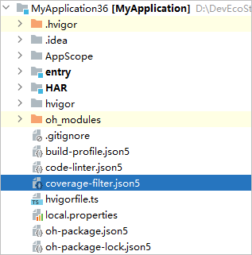
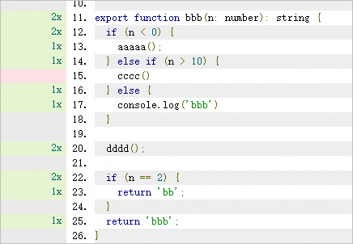
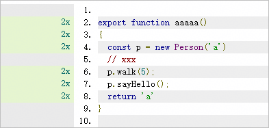
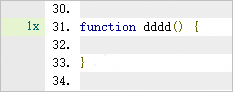

# 黑盒覆盖率测试

更新时间：2026-04-20 06:32:02

来源：https://developer.huawei.com/consumer/cn/doc/harmonyos-guides/ide-ui-test

DevEco Studio支持黑盒覆盖率测试，不需要开发测试用例，将编译插桩的HAP包推到设备上，然后对该应用/元服务模拟用户操作，测试完成后可生成覆盖率报告，当前仅支持Stage模型。
 

#### 使用约束

- DevEco Studio 6.0.1 Beta1版本前，仅支持对UIAbility进行覆盖率测试。
- 从DevEco Studio 6.0.1 Beta1版本开始，当继承的ExtensionAbility中存在onDump或onDestroy方法时，支持获取覆盖率数据。如果两个方法都不存在，则无法进行覆盖率测试。
- 覆盖率测试不支持开启混淆。

 
 

#### 前置操作

将设备与电脑进行连接，并对应用/元服务签名，具体请参考[使用本地真机运行应用](https://developer.huawei.com/consumer/cn/doc/harmonyos-guides/ide-run-device)和[应用/元服务签名](https://developer.huawei.com/consumer/cn/doc/harmonyos-guides/ide-signing)。
 
 

#### 配置覆盖率过滤文件

如果开发者希望只针对部分文件进行覆盖率测试，可在工程目录下创建coverage-filter.json5文件，在文件中配置参与或不参与覆盖率统计的文件/文件夹。DevEco Studio编译插桩时将按照coverage-filter.json5文件中的配置进行过滤。
 
该功能从DevEco Studio 5.1.0 Release版本开始支持。
 



 
coverage-filter.json5文件包含以下参数。
  
| 参数 | 是否必填 | 类型 | 说明 |
| --- | --- | --- | --- |
| include | 否 | 字符串数组 | 配置参与覆盖率统计的文件或文件夹路径，仅支持模块名开头的绝对路径，暂不支持通配符。include的优先级比exclude高。 |
| exclude | 否 | 字符串数组 | 配置不参与覆盖率统计的文件或文件夹路径，仅支持模块名开头的绝对路径，暂不支持通配符。 |
 
 
示例如下：
```ArkTS
{
  <span style="color: rgb(135,16,148);">"include"</span>:[    // 配置参与覆盖率统计的文件或文件夹路径，仅支持模块名开头的绝对路径，暂不支持通配符
    <span style="color: rgb(6,125,23);">"entry/src/main/ets/pages/aaa.ets"</span>
  ],
  <span style="color: rgb(135,16,148);">"exclude"</span>:[    // 配置不参与覆盖率统计的文件或文件夹路径，仅支持模块名开头的绝对路径，暂不支持通配符
    <span style="color: rgb(6,125,23);">"entry/src/main/ets/pages"</span>
  ]
}
```
 
 
> [!NOTE]
> 修改配置文件后不会触发增量编译，需要重新编译插桩再测试。

 
 

#### 执行覆盖率测试

 

#### 编译与安装

有两种方式进行编译与安装，DevEco Studio方式和命令行方式，具体步骤如下。
 
- **方式一：通过DevEco Studio进行编译与安装，从DevEco Studio 6.0.2 Beta1版本开始支持。**1. 点击菜单栏**Run** >** Edit Configurations**** > ****Diagnostics**，勾选**Black Coverage**，开启黑盒覆盖率测试。
> [!NOTE]
> 调试场景下，该配置不生效，运行的是未插桩的应用。 attach调试和等待调试场景下，该配置会导致断点不准确，建议取消该配置。


  



2. 点击工具栏

，DevEco Studio会启动编译插桩，并推包安装到设备上。
- **方式二：通过命令行进行编译与安装**1. 执行hvigor插桩编译命令，编译后在{projectPath}/{moduleName}/.test/default/intermediates/ohosTest路径下会生成init_coverage.json文件，供后续生成覆盖率报告使用。
```bash
hvigorw --mode module -p module={moduleName@targetName} -p product={productName} -p buildMode=test -p ohos-test-coverage=true -p coverage-mode=black assembleHap --parallel --incremental --daemon
```
 
moduleName：执行测试的模块。

2. targetName/productName：当前生效的target/product，可以通过点击DevEco Studio右上方

图标进行查看。

3. 如果设备上已存在待测试的应用，先卸载应用，不存在则跳过此步骤，关于hdc工具的使用指导请参考[hdc](https://developer.huawei.com/consumer/cn/doc/harmonyos-guides/hdc)。
```bash
hdc uninstall {bundleName}
```
 
bundleName：设备上已安装的应用包名。

4. 将插桩编译生成的HAP包安装到设备上，如果依赖HSP，需要同时安装HSP。
```bash
hdc install {SignedHapPath}
```
 
SignedHapPath：已签名的HAP包路径，默认在模块的build\{productName}\outputs\{targetName}目录下。

 
 

#### 进行测试

在设备上模拟用户操作，进行黑盒测试，测试完毕后，通过以下方式，生成覆盖率数据。
- 针对UIAbility和存在onDump方法的ExtensionAbility，执行命令生成覆盖率数据。UIAbility从DevEco Studio 5.1.0 Release版本开始支持，ExtensionAbility从DevEco Studio 6.0.1 Beta1版本开始支持。
```bash
hdc shell aa dump -c -l
```

- 针对UIAbility，退出应用，触发[onDestroy()回调](https://developer.huawei.com/consumer/cn/doc/harmonyos-guides/uiability-lifecycle#ondestroy)，生成覆盖率数据。
- 针对存在onDestroy方法的ExtensionAbility，Ability销毁时，触发onDestroy()回调，生成覆盖率数据。从DevEco Studio 6.0.1 Beta1版本开始支持。
- 针对UIAbility，支持通过[EventHub接口](https://developer.huawei.com/consumer/cn/doc/harmonyos-references/js-apis-inner-application-eventhub)通知UIAbility生成覆盖率数据。从DevEco Studio 6.0.2 Beta1版本开始支持。
```text
const context = this.getUIContext().getHostContext() as common.UIAbilityContext;
context.eventHub.emit('coverage');
```


 
> [!NOTE]
> 从API 13开始，如果用户使用最近任务列表一键清理来关闭应用，将不会执行onDestroy()回调，导致获取不到覆盖率数据。

 
 
 

#### 生成覆盖率报告
1. 从设备上取出覆盖率数据json文件存放到电脑本地，该命令会将cache目录下的所有文件都保存到LocalPath目录下。
```bash
// 如果是应用则执行该命令，其中LocalPath非必填，如果不填写，默认存放在当前执行命令的目录
hdc file recv data/app/el2/100/base/{bundleName}/haps/{moduleName}/cache {LocalPath}
// 如果是元服务则执行该命令，其中LocalPath必填
hdc file recv -b {bundleName} ls ./data/storage/el2/base/haps/{moduleName}/cache {LocalPath}
```
 
- LocalPath：数据在电脑本地存放的路径。

  
> [!NOTE]
> 在多模块相互跳转的场景下，只需要取最后退出的模块下生成的覆盖率数据json文件，但特殊场景下如多模块无跳转关系，则需要取每个独立模块下生成的覆盖率数据json文件。

- 生成覆盖率报告：
```json
hvigorw collectCoverage -p projectPath={projectPath} -p reportPath={reportPath} -p coverageFile={projectPath}/{moduleName}/.test/default/intermediates/ohosTest/init_coverage.json#{LocalPath/bjc_cov_yyyyMMdd_HHmmss_SSS.json}
```
 1. projectPath：工程路径。

2. reportPath：指定的覆盖率报告文件生成路径。

3. bjc_cov_yyyyMMdd_HHmmss_SSS.json：指定上一个步骤LocalPath目录下的一份最新的json文件，格式以bjc_cov开头，yyyyMMdd_HHmmss_SSS表示年月日_时分秒_毫秒。

  
> [!NOTE]
> 在多模块相互跳转的场景下，需要取各模块的init_coverage.json文件路径，与bjc_cov_yyyyMMdd_HHmmss_SSS.json文件通过#拼接生成coverageFile参数。

- 在本地找到报告文件路径并在浏览器中打开，查看代码覆盖率详情，关于覆盖率的计算方式请参考[查看覆盖率报告](#section10394362109)。



 
 

#### 查看覆盖率报告

执行覆盖率测试后，会生成两份报告，一份是html格式，用于可视化查看报告，一份是json格式，即coverageReport.json文件，记录了详细的覆盖率数据，文件中各字段的含义请参考[覆盖率coverageReport.json文件](#section175644610218)。
 
 

#### 覆盖率报告解读

测试覆盖率报告有三个测量维度，分别是：
 
- 函数覆盖率（Functions）：每个函数是否都已调用。
- 分支覆盖率（Branches）：每个流程控制的各个分支是否都已执行。

 
- 行覆盖率（Lines）：每个可执行代码行是否都已执行。

 


 
以下是关于三个测量维度的细节说明：
 
- **流程控制**常见的流程控制语句有if、while、do...while、switch、for等等，以及三目运算符（condition ? exprIfTrue : exprIfFalse），需要确保流程控制的每个边界情况（即分支）都被执行。
- **行（Lines of Source Code） vs 可执行代码行（Lines of Executable Code）**
“行覆盖率”中的行是指可执行代码行（Lines of Executable Code），而不是源文件中所有的行（含空行）（Lines of Source Code）。一般来说，包含语句的每一行都应被视为可执行行。
- 对于DevEco Studio的覆盖率测试引擎来说，只会统计方法内的语句，方法外的语句都不会被统计覆盖率。
方法内，如果某行存在可执行代码，则这一整行会被视为可执行代码行（+1）。
- 方法内，如果某行只包含标点符号**{**，会被视为可执行行（+1）。
- 方法内，如果某行只包含标点符号**}**、**}) **或** ****});** ，会被视为非可执行行（+0）。

 
> [!NOTE]
> 箭头函数在方法内时，可以正常统计覆盖率，如果作为参数声明，则无法统计该行覆盖率。

 
示例如下：
 
```text
import { window } from '@kit.ArkUI';  // +0  方法外不统计
let filePath :string;               // +0  方法外不统计
const fileName = 'a.txt';          // +0  方法外不统计
 
export function doTheThing ()  // +1
{                              // +1
  let s1: string;              // +1
  const str = 'aaa';           // +1
  console.log(str);            // +1
}                              // +0
 
export class Person {         // +0  方法外不统计
  name: string = ''           // +0  方法外不统计
  constructor (n:string) {    // +1 构造函数
    this.name = n;            // +1
  }                           // +0
 
  static sayHello () {        // +1  类静态方法
    console.log('hello');     // +1
  }                           // +0
 
  walk () {                   // +1  类实例方法
    for (                     // +1              
      let i=0;                // +1
      i < 10;                 // +1
      i++)                    // +1
    {                         // +1
    }                         // +0
  }                           // +0
}                             // +0

function func ():object {    // +1
  return Object({        // +1      一个语句被拆分为多行
    a: 1,                // +1
    b: 2,                // +1
  })                     // +0
}                        // +0
 
func();                  // +0  方法外不统计
 
function foo(n:number, m:number){}   // +1

function bar():number {              // +1
  return 1;                          // +1
}

foo(1, bar());                       // +0  方法外不统计
```
 
 - 测试覆盖率报告左侧的标识：
灰色：不统计覆盖率。
- 粉色：语句/函数未覆盖。
- 绿色：语句/函数覆盖。
- Nx：表示当前可执行代码行被执行了N次。


 - **通过注释语法忽略指定代码**代码中的某些分支可能很难、甚至无法测试，DevEco Studio提供了instrument ignore * 语法来进行忽略，使得某些代码不计入覆盖率。

  
> [!NOTE]
> 使用时需先清除缓存，点击菜单栏 Build -> Clean Project 。


  
**忽略文件：**在源文件中加入注释 // instrument ignore file或者 /* instrument ignore file */，加入注释后，该文件不再插桩，覆盖率报告也不会有该文件。
- **忽略代码块、class、function等：**在代码块前加入/* instrument ignore next */或者// instrument ignore next即可忽略。
- **忽略if/else分支：**在条件表达式前加上// instrument ignore if或者/* instrument ignore  if*/（忽略if），// instrument ignore else或者/* instrument ignore  else*/（忽略else）。

 
```text
import {testA} from './Index'
// instrument ignore file       忽略整个文件

// instrument ignore next       忽略代码块
export function sum(a:number,b:number){
  return a+b;
}
sum(1,2);
 
let a = 1;
// instrument ignore else       忽略else分支
if (a!=1) {
  // do something
  console.log('BBB');
}else {
  console.log('AAA');
}
 
// instrument ignore if         忽略if分支
if (a==1) {
  // do something
  console.log('BBB');
}else {
  console.log('AAA');
}
```
 
 
 

#### 覆盖率coverageReport.json文件

覆盖率coverageReport.json文件记录了详细的覆盖率数据，文件中各字段的含义如下。
 
在阅读本文前，请先查看[覆盖率报告解读](#section1485213972114)，了解行覆盖率、分支覆盖率和函数覆盖率的相关概念和统计方式。
 1. summary字段记录了本次测试的覆盖率，包括行覆盖率、函数覆盖率和分支覆盖率，示例如下。
```json
{
  "summary": {
    "lines": {         // 行数总览
      "total": 43,     // 可执行行代码行数
      "covered": 12,   // 覆盖数量
      "pct": 27.91     // 行覆盖率
    },
    "functions": {     // 函数总览
      "total": 17,     // 函数数量
      "covered": 4,    // 覆盖数量
      "pct": 23.53     // 函数覆盖率
    },
    "branches": {      // 分支总览
      "total": 2,      // 分支数量
      "covered": 0,    // 覆盖数量
      "pct": 0         // 分支覆盖率 
    }
  },
}
```

2. files是个数组，记录了所有文件的详细覆盖率数据，数组中的每个元素对应一个文件。

  以一个文件为例，各字段含义如下。
```ArkTS
{
  "files": [
    {
      "version": "bjc v1.0.0",   // 覆盖率算法版本
      "versionCode": 10000,      // 覆盖率算法版本代码
      "path": "D:/DevEcoStudioProjects/MyApplication36/application/src/main/ets/applicationability/ApplicationAbility.ets",  // 文件路径
      "hash": "6828362e96a78934b93db4b980fa5ad83af85a111bf187e74da89ae0c0ec613a",  // 文件内容hash值
      "lineCnt": 44,     // 当前文件总行数
      "count": 0,        // 执行次数
      "projectPath": "D:/DevEcoStudioProjects/MyApplication36",     // 工程路径
      "functions": [],   // <a href="#li12117420270">函数集合</a>
      "exeLine": {},     // <a href="#li394306142411">可执行代码行</a>
      "summary": {}      // <a href="#li1560041862419">单个文件的覆盖率详情</a>
    },
    ...
  ]
}
```

 
- **functions**functions是个数组，记录了文件中所有函数的详细覆盖率数据，数组中的每个元素对应一个函数。

  
```json
"functions": [
  {
    "name": "ApplicationAbility.onCreate",    // 函数名称，如果是匿名函数，name是anonymous_N
    "count": 0,         // 函数执行次数
    "regions": [],      // <a href="#li321242192714">对应代码区域</a>
    "branches": [],     // <a href="#li103591744151920">分支</a>
    "ignored": 0,       // 函数忽略次数
    "index": 0          // 函数在整个文件中的位置，从0开始排序
  },
  ...
]
```
 
**regions**regions是一个可执行行数组，数组可能有一个元素、两个元素或多个元素。

  第一个元素是该方法对应的代码区域，如果不止一个元素，后面的元素是方法内的可执行代码区域。元素中每个字段的含义如下。

  
```json
"regions": [
  {
    "startLoc": {   // 开始代码位置
      "line": 8,    // 起始行号
      "col": 3      // 起始列号
    },
    "endLoc": {     // 结束代码位置
      "line": 10,   // 结束行号
      "col": 4      // 结束列号
    },
    "count": 0,     // 执行次数
    "ignored": 0    // 忽略次数
  }
]
```
 
如果方法内没有任何实现，是个空方法，则regions数组只有一个元素，即方法对应的代码区域，示例如下。


  
```json
{
  "name": "dddd",
  "count": 1,
  "regions": [
    {
      "startLoc": {
        "line": 31,
        "col": 1
      },
      "endLoc": {
        "line": 33,
        "col": 2
      },
      "count": 1,
      "ignored": 0
    }
  ],
},
```

- 如果方法内只有一个代码区域，则regions数组有两个元素，示例如下。


  
```json
{
  "name": "aaaaa",
  "count": 2,
  "regions": [
    {    // 方法对应的代码区域
      "startLoc": {
        "line": 2,
        "col": 1
      },
      "endLoc": {
        "line": 9,
        "col": 2
      },
      "count": 2,
      "ignored": 0
    },
    {    // 可执行代码区域
      "startLoc": {
        "line": 4,
        "col": 3
      },
      "endLoc": {
        "line": 9,
        "col": 2
      },
      "count": 2,
      "ignored": 0
    }
  ],
}
```

- 如果方法内存在多个代码区域，则每新增一个代码区域，regions数组就增加一个元素，示例如下。


  
```json
{
  "name": "bbb",
  "count": 1,
  "regions": [
    {    // 方法对应的代码区域11-18行
      "startLoc": {
        "line": 11,
        "col": 1
      },
      "endLoc": {
        "line": 18,
        "col": 2
      },
      "count": 1,
      "ignored": 0
    },
    {    // 第一个可执行代码区域13-15行
      "startLoc": {
        "line": 13,
        "col": 13
      },
      "endLoc": {
        "line": 15,
        "col": 4
      },
      "count": 0,    // 由于flag是false，代码未执行
      "ignored": 0
    },
    {    // 第二个可执行代码区域15-17行
      "startLoc": {
        "line": 15,
        "col": 10
      },
      "endLoc": {
        "line": 17,
        "col": 4
      },
      "count": 1,    // 代码被执行
      "ignored": 0
    }
  ],
}
```


 - **branches**branches是个分支数组，会将if和switch case这种条件判断语句相关的代码块放入数组中，数组中每个元素的字段含义如下。

  
```json
"branches": [
  {
    "startLoc": {      // 开始代码位置
      "line": 46,      // 起始行号
      "col": 10        // 起始列号
    },
    "endLoc": {        // 结束代码位置
      "line": 46,      // 结束行号
      "col": 11        // 结束列号
    },
    "trueCount": 0,    // 该行满足条件的已执行次数，0表示未执行
    "falseCount": 1,   // 该行不满足条件的已执行次数，0表示未执行
    "group": [         // 分组，if语句不涉及分组，switch case涉及分组
      0,               // group:[0,1]，表示branches数组的0号和1号元素属于一个switch case
      1
    ],
    "ignored": 0       // 忽略次数
  }
]
```
 **示例一：**调用eeee(2)。

  


  
```json
{
  "name": "eeee",
  "count": 1,
  "regions": [
    ...
  ],
  "branches": [
    {
      "startLoc": {
        "line": 46,
        "col": 10
      },
      "endLoc": {
        "line": 46,
        "col": 11
      },
      "trueCount": 0,     // 该行条件未执行
      "falseCount": 1,    // 该行已执行，但不满足条件
      "group": [          // 0和1号元素属于1个switch case，2和3号元素属于另一个switch case
        0,
        1
      ],
      "ignored": 0
    },
    {
      "startLoc": {
        "line": 49,
        "col": 10
      },
      "endLoc": {
        "line": 49,
        "col": 11
      },
      "trueCount": 1,
      "falseCount": 0,
      "group": [
        0,
        1
      ],
      "ignored": 0
    },
    {
      "startLoc": {
        "line": 55,
        "col": 10
      },
      "endLoc": {
        "line": 55,
        "col": 13
      },
      "trueCount": 0,
      "falseCount": 1,
      "group": [
        2,
        3
      ],
      "ignored": 0
    },
    {
      "startLoc": {
        "line": 58,
        "col": 10
      },
      "endLoc": {
        "line": 58,
        "col": 13
      },
      "trueCount": 1,
      "falseCount": 0,
      "group": [
        2,
        3
      ],
      "ignored": 0
    }
  ],
}
```
 **示例二：**调用bbb(2)和bbb(-1)，该方法触发两次。

  


  branches的0号元素，对应12行，trueCount和falseCount都为1，表示该行触发了两次，一次满足条件，一次不满条件。

  
```json
{
  "name": "bbb",
  "count": 2,
  "regions": [
    ...
  ],
  "branches": [
    {
      "startLoc": {
        "line": 12,
        "col": 7
      },
      "endLoc": {
        "line": 12,
        "col": 12
      },
      "trueCount": 1,
      "falseCount": 1,
      "group": [],
      "ignored": 0
    },
    {
      "startLoc": {
        "line": 14,
        "col": 14
      },
      "endLoc": {
        "line": 14,
        "col": 20
      },
      "trueCount": 0,
      "falseCount": 1,
      "group": [],
      "ignored": 0
    },
    {
      "startLoc": {
        "line": 22,
        "col": 7
      },
      "endLoc": {
        "line": 22,
        "col": 13
      },
      "trueCount": 1,
      "falseCount": 1,
      "group": [],
      "ignored": 0
    }
  ]
}
```


 - **exeLine**exeLine记录了所有可执行行的行号，示例如下。

  


  生成的exeLine为：

  
```json
"exeLine": {
  "0": 2,
  "1": 3,
  "2": 4,
  "3": 6,
  "4": 7,
  "5": 8,
}
```

- **summary**summary记录了单个文件的覆盖率详情。

  
```json
"summary": {
  "lines": {           // 行数总览
    "total": 10,       // 可执行代码行数
    "covered": 5,      // 覆盖数量
    "pct": 50,         // 行覆盖率
    "executedLineCount": [     // 代码行执行次数，-1表示该行不被统计，0表示未执行，1-N表示执行1-N次
      -1,
      -1,
      -1,
      0,
      -1,
      1,
      0,
      2,
      2,
      -1,
      1,
      1,
      0,
      0,
      0,
      -1
    ]
  },
  "functions": {    // 函数总览
    "total": 6,     // 函数数量
    "covered": 5,   // 覆盖数量
    "pct": 83.33    // 函数覆盖率
  },
  "branches": {     // 分支总览
    "total": 2,     // 分支数量
    "covered": 1,   // 覆盖数量
    "pct": 50       // 分支覆盖率
  }
}
```
