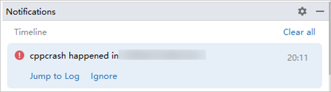
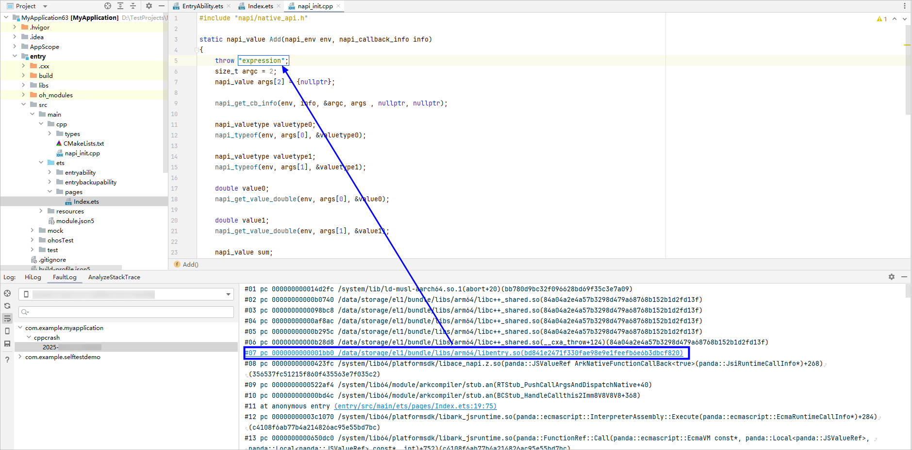
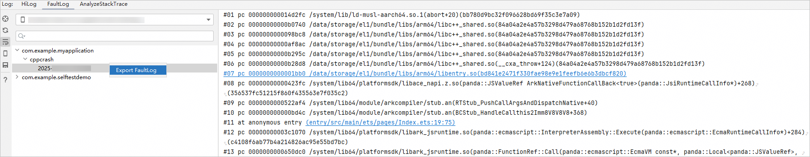
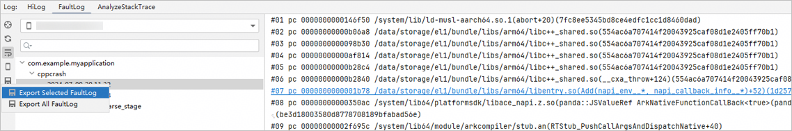

# FaultLog

更新时间：2026-04-30 02:42:31

来源：https://developer.huawei.com/consumer/cn/doc/harmonyos-guides/ide-fault-log

当应用运行发生错误导致应用进程终止时，应用将会抛出错误日志以通知应用崩溃的原因，开发者可通过查看错误日志分析应用崩溃的原因及引起崩溃的代码位置。
 
FaultLog由系统自动从设备进行收集，包括如下几类故障信息：
 
- [AppFreeze](https://developer.huawei.com/consumer/cn/doc/harmonyos-guides/ide-faultlog-appfreeze)
- CPP Crash
- JS Crash
- System Freeze
- [ASan](https://developer.huawei.com/consumer/cn/doc/harmonyos-guides/ide-asan)
- [HWASan](https://developer.huawei.com/consumer/cn/doc/harmonyos-guides/ide-hwasan)
- [TSan](https://developer.huawei.com/consumer/cn/doc/harmonyos-guides/ide-tsan)
- [UBSan](https://developer.huawei.com/consumer/cn/doc/harmonyos-guides/ide-ubsan)

 
> [!NOTE]
> 调试模式（debug和attach）下，DevEco Studio会屏蔽当前工程的App Freeze和System Freeze等超时检测，避免调试过程出现超时检测影响开发者调试。 当前支持屏蔽的App Freeze故障类型： THREAD_BLOCK_3S/THREAD_BLOCK_6S：应用主线程卡死检测，卡住3秒/6秒。 APP_INPUT_BLOCK：输入响应超时。 当前支持屏蔽的System Freeze故障类型： LIFECYCLE_TIMEOUT：app、ability生命周期切换超时。

 

##### 查看FaultLog日志

 

##### 查看设备历史抛出的FaultLog日志

打开FaultLog窗口，将显示当前选中设备抛出的所有FaultLog日志。
 
FaultLog故障信息左侧按照**应用/元服务包名 > 故障类型 > 故障时间**结构组成，选中具体的故障日期，则会在右侧展示详细的故障信息，并对部分关键信息进行高亮展示，便于开发者进行故障定位。
 

 
 

##### 查看设备实时抛出的FaultLog日志

当设备抛出FaultLog日志时，DevEco Studio将会弹出消息提示框，开发者点击**Jump to Log**即可跳转至FaultLog窗口查看日志信息。
 

 
 

##### 跳转至引起错误的代码行

若抛出的FaultLog中的堆栈信息中的链接或偏移地址指向的是当前工程中的某行代码，该段信息将会被转换为超链接形式，点击后可跳转至对应代码行。
 

 
 

##### 导出日志

开发者可将当前显示的日志信息保存到本地，以便后续的进一步分析。开发者可根据需要选择保存当前选中节点的日志或保存所有日志。
 
- 保存当前选中节点的日志：
在当前选中节点右键点击**Export FaultLog**。

- 点击Export FaultLog按钮

，弹出子选项后进一步点击**Export Selected FaultLog**。

 - 保存所有日志：点击Export FaultLog按钮

，弹出子选项后进一步点击**Export All FaultLog**。
