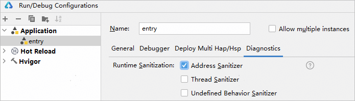
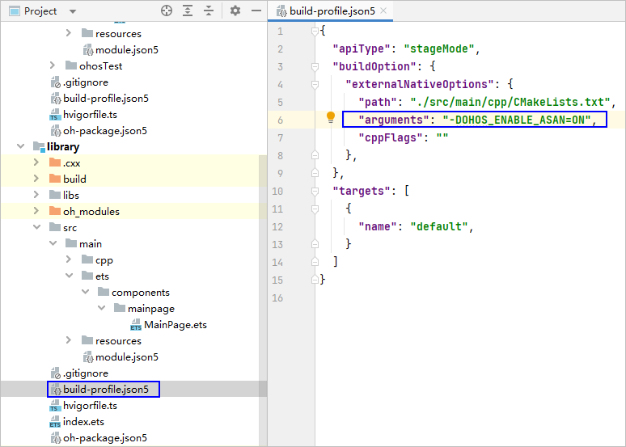
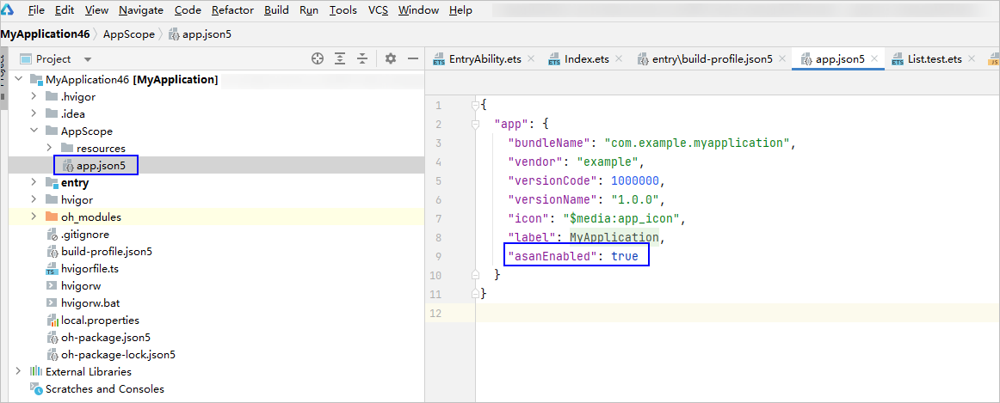

# 使用ASan检测内存错误

更新时间：2026-04-20 06:32:02

来源：https://developer.huawei.com/consumer/cn/doc/harmonyos-guides/ide-asan

为追求C/C++的极致性能，编译器和OS(Windows/Linux/Mac)运行框架不会对内存操作进行安全检测。针对该场景，DevEco Studio集成ASan（Address-Sanitizer）为开发者提供面向C/C++的地址越界检测能力，并通过FaultLog展示错误的堆栈详情及导致错误的代码行。关于ASan的检测原理请参考[ASan检测原理](https://developer.huawei.com/consumer/cn/doc/best-practices/bpta-stability-address-sanitizer-principle#section159561141247)。
 

#### 使用约束

- 如果应用内的任一模块开启ASan，那么entry模块需同时开启ASan。如果entry模块未开启ASan，该应用在启动时将闪退，出现CPP Crash报错。
- ASan、TSan、UBSan、HWASan不能同时开启，只能开启其中一个。

 
 

#### 开启ASan

可通过以下两种方式开启ASan。
 
 

#### 方式一
1. 点击**Run > Edit Configurations > ****Diagnostics**，勾选**Address Sanitizer**。

  


2. 如果有引用本地library，需在library模块的build-profile.json5文件中，配置arguments字段值为“-DOHOS_ENABLE_ASAN=ON”，表示以ASan模式编译so文件。

  


 
 

#### 方式二
1. 修改工程目录下AppScope/app.json5，添加ASan配置开关。

  
```json
"asanEnabled": true
```
 


2. 设置模块级构建ASan插桩。

  在需要开启ASan的模块中，通过添加构建参数开启ASan检测插桩，在对应模块的模块级build-profile.json5中添加命令参数：

  
```text
"arguments": "-DOHOS_ENABLE_ASAN=ON"
```
 


  
> [!NOTE]
> 该参数未配置不会报错，但是除包含malloc和free函数等少数内存错误外，出现其他需要插桩检测的内存错误时，ASan无法检测到错误。

 
 

#### 配置参数（可选）

ASAN_OPTIONS用于在运行时配置ASan的行为，包括设置检测级别、输出格式、内存错误报告的详细程度等。ASAN_OPTIONS支持在app.json5中配置，也支持在Run/Debug Configurations中配置。app.json5的优先级更高，即两种方式都配置后，以app.json5中的配置为准。关于ASAN_OPTIONS的配置方式和常用参数请参考[配置参数](https://developer.huawei.com/consumer/cn/doc/best-practices/bpta-stability-asan-detection#section1496994494018)。
 
 

#### 使用ASan
1. 运行或调试当前应用。
2. 当程序出现内存错误时，弹出ASan log信息，点击信息中的链接即可跳转至引起内存错误的代码处。日志中各字段的说明请参考[ASan日志规格](https://developer.huawei.com/consumer/cn/doc/harmonyos-guides/address-sanitizer-guidelines#asan日志规格)，异常检测类型请参考[ASan异常检测类型](https://developer.huawei.com/consumer/cn/doc/best-practices/bpta-stability-asan-detection#section12508111110451)。

  

