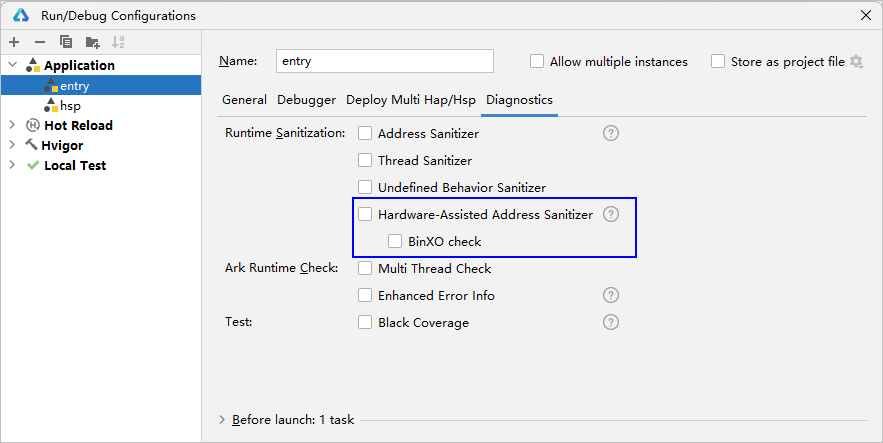
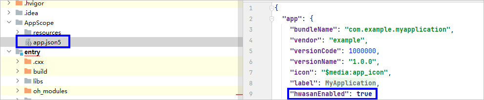
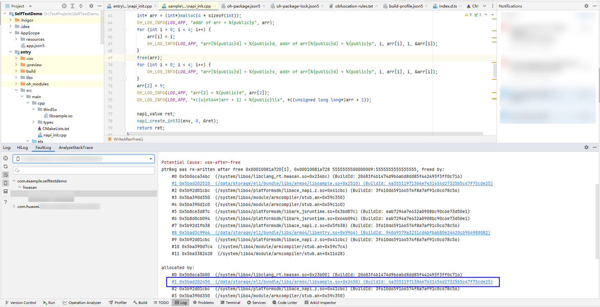
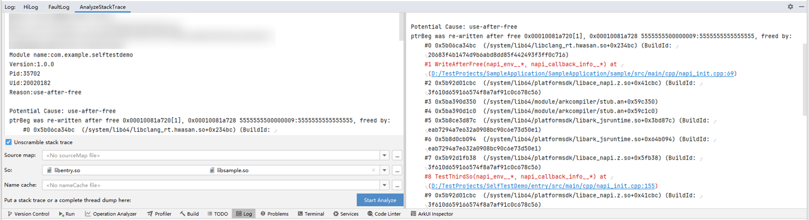

# 使用HWASan检测内存错误

更新时间：2026-04-20 06:32:02

来源：https://developer.huawei.com/consumer/cn/doc/harmonyos-guides/ide-hwasan

HWASan（Hardware-Assisted Address Sanitizer）是一款类似于[ASan](https://developer.huawei.com/consumer/cn/doc/harmonyos-guides/ide-asan)的内存错误检测工具。 与ASan相比，HWASan使用的内存减少很多，因而更适合用于整个系统的检测。关于HWASan的检测原理请参考[HWASan检测原理](https://developer.huawei.com/consumer/cn/doc/best-practices/bpta-stability-address-sanitizer-principle#section187526511146)。
 

##### 约束条件

- HWASan检测仅适用于AArch64架构的硬件。
- ASan、TSan、UBSan、HWASan不能同时开启，只能开启其中一个。

 
 

##### 开启HWASan

DevEco Studio 6.1.0 Beta1之前的版本，仅支持对C++源码开启HWASan。
 
从DevEco Studio 6.1.0 Beta1版本开始，同时支持对C++编译生成的无源码so文件进行二进制插桩，进而开启HWASan功能。
 
 

##### 方式一
1. 点击**Run > Edit Configurations > Diagnostics**，勾选**Hardware-Assisted Address Sanitizer**开启C++源码检测插桩。从DevEco Studio 6.1.0 Beta1版本开始，可以同时勾选**BinXO check**，开启无源码的so文件的HWASan检测插桩。

  


2. （可选）如果部分无源码so不需要进行HWASan检测插桩，可以在工程级或模块级build-profile.json5文件中，配置excludeSoFromBinXO字段，填写需要忽略的so列表，支持正则匹配。
```json
"buildOption": {
  "nativeLib": {
    "excludeSoFromBinXO": ["**/liblibrary.so"]
  }
}
```

 
 

##### 方式二
1. 修改工程目录下的AppScope/app.json5文件，添加HWASan配置开关。
```json
"hwasanEnabled": true
```
 


2. 在需要开启HWASan的模块级build-profile.json5中，添加构建参数开启HWASan检测插桩。
```json
// DevEco Studio 6.1.0 Beta1以下版本
"buildOption": {
  "externalNativeOptions": {
    "arguments": ["-DOHOS_ENABLE_HWASAN=ON"]
  }
// DevEco Studio 6.1.0 Beta1及以上版本，同时开启有源码和无源码的C++的HWASan检测插桩
"buildOption": {
  "externalNativeOptions": {
    "arguments": ["-DOHOS_ENABLE_HWASAN=ON", "-DOHOS_ENABLE_BINXO=ON"]
  }
```

3. 如果部分无源码so不需要进行HWASan检测插桩，可以在工程级或模块级build-profile.json5文件中，配置excludeSoFromBinXO字段，填写需要忽略的so列表，支持正则匹配。
```json
"buildOption": {
  "nativeLib": {
    "excludeSoFromBinXO": ["**/liblibrary.so"]
  }
}
```

 
 

##### 使用HWASan
1. 运行或调试当前应用。
2. 当程序出现内存错误时，弹出HWASan log信息，点击信息中的链接即可跳转至引起内存错误的代码处。日志中各字段的说明请参考[HWASan日志规格](https://developer.huawei.com/consumer/cn/doc/harmonyos-guides/address-sanitizer-guidelines#hwasan日志规格)，异常检测类型请参考[HWASan异常检测类型](https://developer.huawei.com/consumer/cn/doc/best-practices/bpta-stability-hwasan-detection#section207321025115510)。


3. 如果是release应用，本地无工程代码，可以使用AnalyzeStackTrace功能，提供要解析堆栈的so，解析结果为源码地址。

