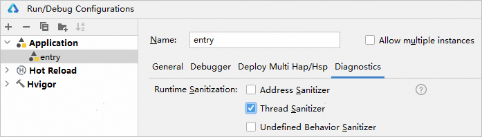
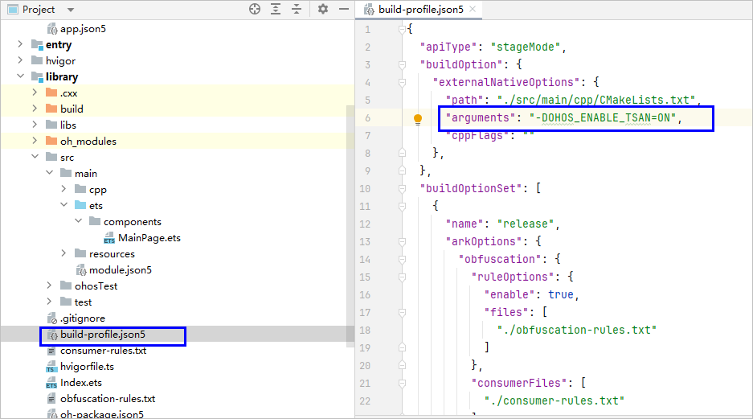
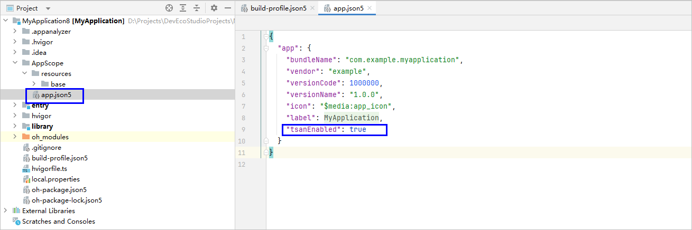
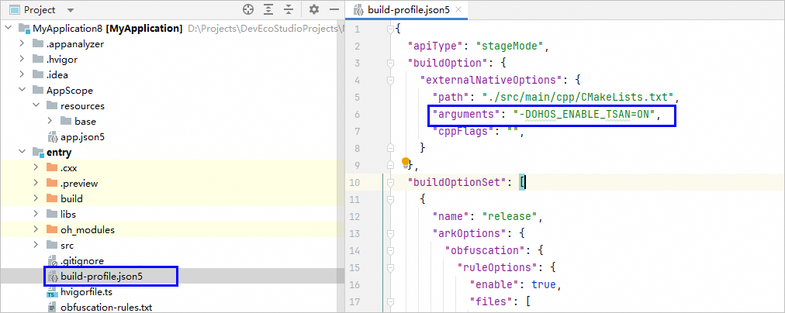
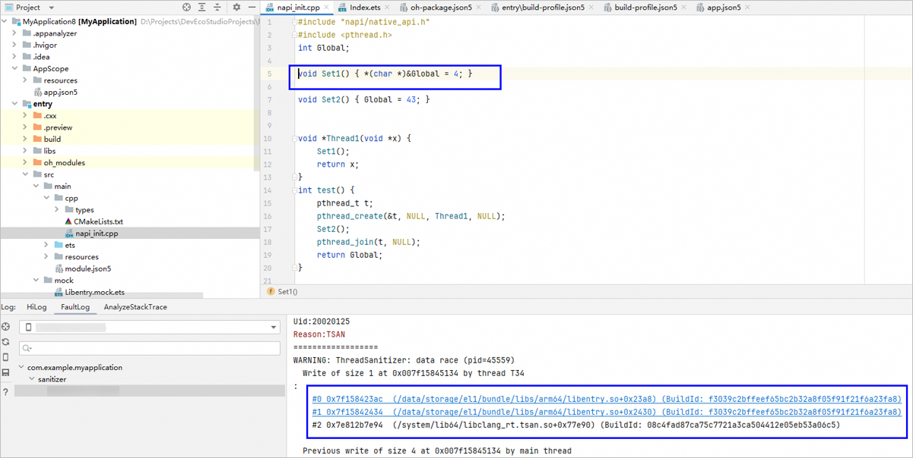
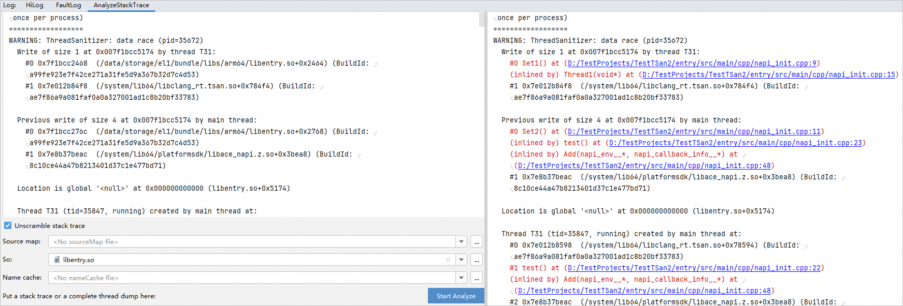

# 使用TSan检测线程错误

更新时间：2026-04-20 06:32:02

来源：https://developer.huawei.com/consumer/cn/doc/harmonyos-guides/ide-tsan

TSan（ThreadSanitizer）是一个检测数据竞争的工具。它包含一个编译器插桩模块和一个运行时库。TSan开启后，会使性能降低5到15倍，同时使内存占用率提高5到10倍。关于TSan的检测原理请参考[TSan](https://developer.huawei.com/consumer/cn/doc/best-practices/bpta-stability-tsan-detection)。


## 使用约束

ASan、TSan、UBSan、HWASan不能同时开启，只能开启其中一个。TSan开启后会申请大量虚拟内存，其他申请大虚拟内存的功能（如gpu图形渲染）可能会受影响。TSan不支持静态链接libc或libc++库。

## 开启TSan

可通过以下两种方式开启TSan。

## 方式一

点击**Run > Edit Configurations >** **Diagnostics**，勾选**Thread Sanitizer**。

如果有引用本地library，需在library模块的build-profile.json5文件中，配置arguments字段值为“-DOHOS_ENABLE_TSAN=ON”，表示以TSan模式编译so文件。


## 方式二

修改工程目录下AppScope/app.json5，添加TSan配置开关。
```text
"tsanEnabled": true
```


设置模块级构建TSan插桩。在需要开启TSan的模块中，通过添加构建参数开启TSan检测插桩，在对应模块的模块级build-profile.json5中添加命令参数：
```text
"arguments": "-DOHOS_ENABLE_TSAN=ON"
```

 

## 使用TSan

运行或调试当前应用。当程序出现线程错误时，弹出TSan log信息，点击信息中的链接即可跳转至引起线程错误的代码处。日志中的异常检测类型请参考[TSan异常检测类型](https://developer.huawei.com/consumer/cn/doc/best-practices/bpta-stability-tsan-detection#section1180812915516)。
> [!NOTE]
> 当前使用call_once接口会存在TSan误报的现象，开发者可以在调用该接口的函数前添加__attribute__((no_sanitize("thread")))来屏蔽该问题。


如果是release应用，本地无工程代码，可以使用AnalyzeStackTrace功能，提供要解析堆栈的so，解析结果为源码地址。

