# 异常堆栈解析原理

更新时间：2026-04-20 06:32:02

来源：https://developer.huawei.com/consumer/cn/doc/harmonyos-guides/ide-exception-stack-parsing-principle

**      


#### 构建产物介绍


#### ArkTS调试产物sourceMap

release模式编译产物，产物位置：{ProjectPath}/{ModuleName}/build/{product}/cache/default/default@CompileArkTS/esmodule/release/sourceMaps.map


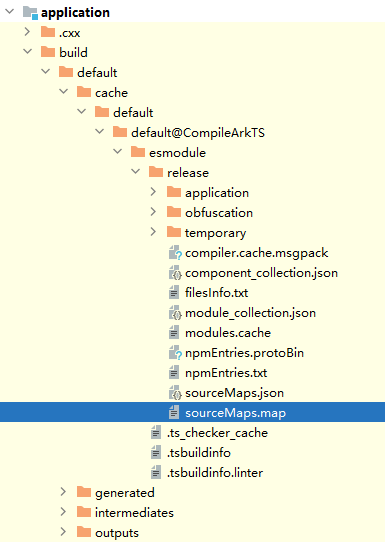


#### C++调试产物debug so

带debug信息的so数据，产物位置：{ProjectPath}/{ModuleName}/build/{product}/intermediates/libs

配置方式请参考[release编译带debug信息的so](#section5147812132)。


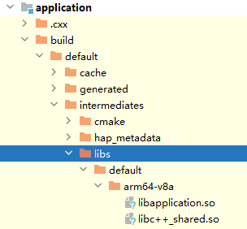


#### 代码混淆产物nameCache

反混淆映射表，release模式编译产物，产物位置：{ProjectPath}/{ModuleName}/build/{product}/cache/default/default@CompileArkTS/esmodule/release/obfuscation


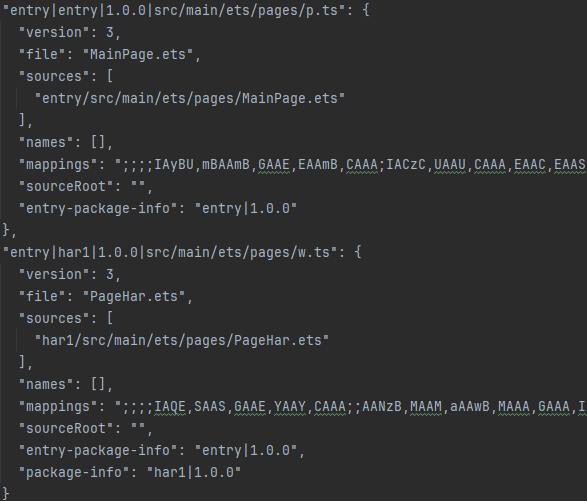


#### C++堆栈解析原理


#### 编译选项差异

 - Debug：不优化代码，附加调试信息。
 - Release：最大化优化代码，但不包含调试信息。
 - RelWithDebInfo：近似于Release模式，既进行了代码优化，同时保留部分调试信息。


#### release编译带debug信息的so

通常release的so中的符号表、调试信息会被移除。


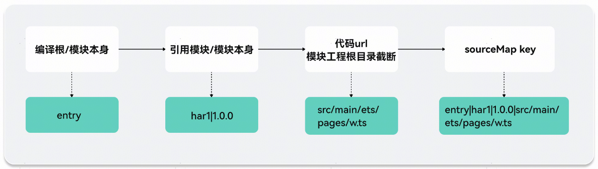


若需要保留so文件中的符号表、调试信息，需要在build-profile.json5的buildOption/externalNativeOptions中配置参数："arguments": "-DCMAKE_BUILD_TYPE=RelWithDebInfo"。

```json
{
  <span style="color: rgb(135,16,148);">"apiType"</span>: <span style="color: rgb(6,125,23);">"stageMode"</span>,
  <span style="color: rgb(135,16,148);">"buildOption"</span>: {
    <span style="color: rgb(135,16,148);">"externalNativeOptions"</span>: {
      <span style="color: rgb(135,16,148);">"path"</span>: <span style="color: rgb(6,125,23);">"./src/main/cpp/CMakeLists.txt"</span>,
      <span style="color: rgb(135,16,148);">"arguments"</span>: <span style="color: rgb(6,125,23);">"-DCMAKE_BUILD_TYPE=RelWithDebInfo"</span>,
      <span style="color: rgb(135,16,148);">"cppFlags"</span>: <span style="color: rgb(6,125,23);">""</span>,
    }
  },
  <span style="color: rgb(135,16,148);">...</span>
}
```

编译后会生成2份so产物：

 - libs：带debug信息的so。
 - stripped_native_libs：移除调试信息等冗余数据后的so。


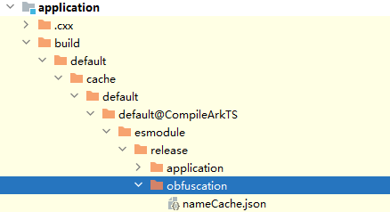


#### C++堆栈解析流程

llvm-addr2line（[获取llvm-addr2line工具](#li11164144153)）是将函数地址解析成文件名或行号的工具。

给出一个可执行文件中的地址或一个可重定位对象中的偏移部分的地址，使用调试信息来找出与之相关的文件名和行号。

常用参数：

| 参数 | 用途 |
| --- | --- |
| -a | 以十六进制形式显示地址 |
| -C | 将符号名解码为用户级别的名字 |
| -e | 设置需要转换地址的可执行文件名 |
| -f | 显示文件名、行号和函数名信息 |
| -F | 显示函数名及文件行号 |
| -j | 读取指定部分的偏移量，而不是绝对地址 |
| -p | 每个地址信息单独占一行 |


参考示例：

查看文件名、行号和函数名相关信息：

```bash
llvm-addr2line -f -e File.so
```

查找指定的地址所对应的代码位置：

```bash
llvm-addr2line 0x00000000004005e7 -e test -f -C -s
```

例如：

```bash
llvm-addr2line -e libapplication.so 00003714 -f -C
```


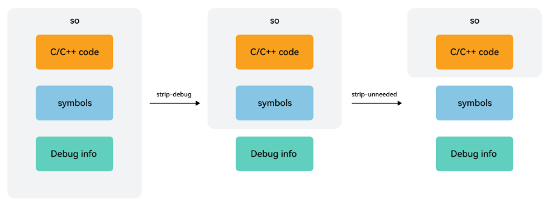


ASan堆栈解析：


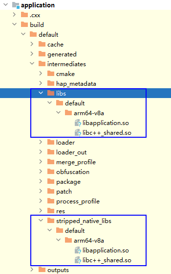


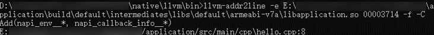


#### 常见问题

 - 什么是UUID？       每一个可执行程序都有一个build UUID来唯一标识。Crash日志包含发生crash的这个应用（app）的build UUID以及crash发生时应用加载的所有库文件的build UUID。
 - 如何获取llvm-addr2line工具？       在DevEco Studio安装目录/deveco-studio/sdk/default/openharmony/native/llvm/bin下即可找到llvm-addr2line.exe。


#### ArkTS堆栈解析原理


#### sourceMap格式

图1 **源码      **
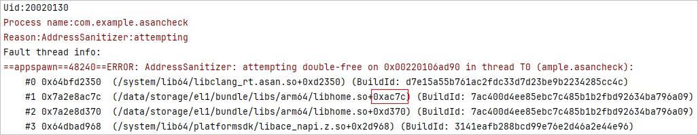


图2 **编译后产物      **
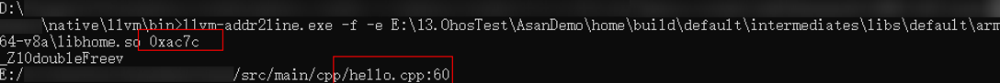


**实际代码行映射关系：**

70->29

71->30

72->31

73->32

**sourceMap结构：**


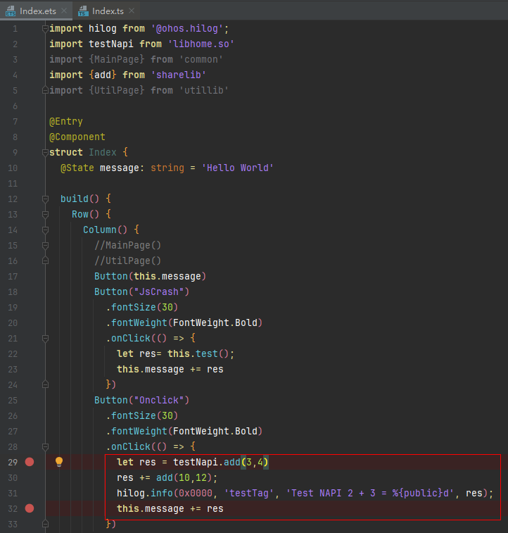


单个module构建产物sourceMaps.map为merge文件，实际包含该模块的所有文件的映射关系；每个json中key以编译构建产物的唯一路径作为主键，运行程序的abc中保留了对应的key信息，当运行时异常代码归属到该文件时输出信息为该key，sources为实际源码文件信息，用于异常堆栈还原源码；mappings为编码后的行列号映射表，每个文件有独立的映射关系。

 - key：参考[sourceMap解析流程](#section983741193211)。
 - version：目前source map标准的版本为3。
 - file：生成的文件名。
 - sources：源文件地址列表。
 - names：转换前的所有变量名和属性名。
 - mappings：记录位置信息的字符串。
 - sourceRoot：源文件目录地址，可以用于重新定位服务器上的源文件。
 - entry-package-info："entry|1.0.0" 对应模块本身的oh-package.json中的name及version，用于关联反混淆nameCache资源版本。
 - package-info: "har1|1.0.0" 对应非模块本身的oh-package.json中的name及version，即dependencies引用的代码，可用于引用三方库二次解析sourceMap。


#### sourceMap解析流程

下图是sourceMap中每个json的key的结构化处理过程，以“entry|har1|1.0.0|src/main/ets/pages/w.ts”为例，各字段含义如下。

以“|”为分隔符，entry是本模块oh-package.json5中的name，har1|1.0.0是依赖的har1包的oh-package.json5中的name和version（如果没有依赖包，则是本模块oh-package.json5中的name和version），src/main/ets/pages/w.ts是引用的源码文件路径。

图3 **sourceMap中的key结构化处理      

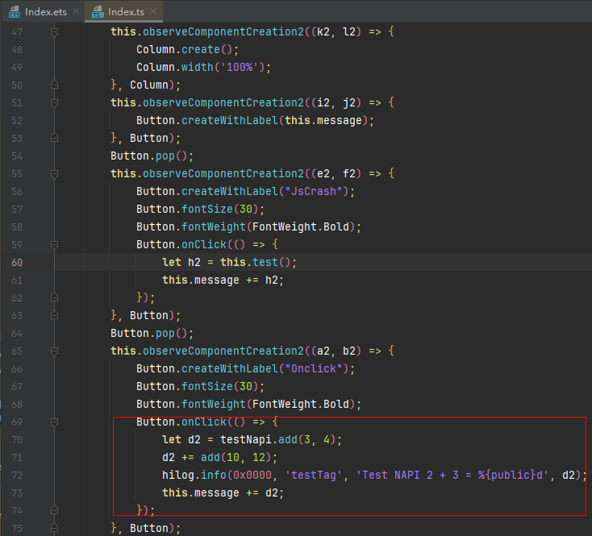


#### 反混淆解析原理

代码混淆配置请参考[代码混淆](https://developer.huawei.com/consumer/cn/doc/harmonyos-guides/ide-build-obfuscation)。


#### 代码混淆产物介绍


混淆映射表：$ProjectPath\$ModuleName\build\$product\cache\default\default@CompileArkTS\esmodule\release\obfuscation\nameCache.json

```ArkTS
{
  "home/src/main/ets/homeability/HomeAbility.ets": {
    "IdentifierCache": {
      "#AbilityConstant": "AbilityConstant",
      "#hilog": "hilog",
      "#UIAbility": "UIAbility",
      "#Want": "Want",
      "#window": "window",
      "HomeAbility#onWindowStageCreate#__function": "i"
    },
    "MemberMethodCache": {
      "onCreate:10:16": "onCreate",
      "onDestroy:18:20": "onDestroy",
      "onWindowStageCreate:22:33": "onWindowStageCreate",
      "onWindowStageDestroy:35:38": "onWindowStageDestroy",
      "onForeground:40:43": "onForeground",
      "onBackground:45:48": "onBackground"
    },
    "obfName": "home/src/main/ets/homeability/HomeAbility.ets"
  },
  "compileSdkVersion": "5.0.0.25",
  "entryPackageInfo": "home|1.0.0",
  "PropertyCache": {
    "integratedHsp": "i",
    "asanClick": "j",
    "Index_Params": "m",
    "testNapi": "o",
    "Index": "t",
    "testObfuscation": "g2"
  }
}
```

 - **originalfieldname**：该字段为每个文件的原始文件路径及名称，例如以上的"home/src/main/ets/homeability/HomeAbility.ets"。


 - **ObfName**：key为固定字段，value为每个文件混淆后的名称，与**originalfieldname**配对。      
```json
"obfName": "home/src/main/ets/pages/a.ts"
```

 - **IdentifierCache**：该字段对应的值为该文件下的变量名混淆前后的映射关系。      变量名分为两类：普通变量、类方法变量。

  普通变量映射关系的格式如下：

  
```text
originalvariablename :  obfuscatedvariablename
```

originalvariablename 表示原始的变量名称。


 - obfuscatedvariablename 表示混淆后的变量名称。


类方法变量映射关系的格式如下：

```text
/*--------------------------key----------------------------------  :  -----------value----------*/
originalmethodname: originalmethodstartline: originalmethodendline :  obfuscatedmethodname
```

 - originalmethodname 表示原始的方法名称。
 - [:originalmethodstartline:originalmethodendline] 表示原始的方法起始行数与结束行数，左右都是闭区间。
 - obfuscatedmethodname 表示混淆后的方法名称。

     - **MemberMethodCache**：该字段对应的值为该文件下的成员方法名混淆前后的映射关系。      开启属性混淆时，成员方法映射关系的格式如下：

  
```text
/*--------------------------key---------------------------------  :  -----------value----------*/
originalmethodname:originalmethodstartline:originalmethodendline  :  obfuscatedmethodname
```
未开启属性混淆时，成员方法映射关系的格式如下：

  
```text
/*--------------------------key-------------------------------------  :  -----------value----------*/
originalmethodname : originalmethodstartline : originalmethodendline  :  originalmethodname
```

originalmethodname 表示原始的成员方法名称。
 - [:originalmethodstartline :originalmethodendline] 表示原始的成员方法起始行数与结束行数，左右都是闭区间。
 - obfuscatedmethodname 表示混淆后的成员方法名称。

     - **PropertyCache**：该字段对应的值为全局所有属性名混淆前后的映射关系，只有在开启属性混淆时才会有值。      属性名映射关系格式如下：

  
```text
/*--------key-------  :  -----------value----------*/ 
originalpropertyname  :  obfuscatedmethodname
```

originalpropertyname 表示原始的属性名称。
 - obfuscatedmethodname 表示混淆后的属性名称。


#### 代码混淆解析


异常堆栈如下：

```text
Pid:58348
Uid:20020156
Reason:RangeError
Error name:RangeError
Error message:The number cannot be converted to a BigInt because it is not an integer
Stacktrace:
Cannot get SourceMap info, dump raw stack:
    at g2 (home|home|1.0.0|src/main/ets/pages/a.ts:6:6)
    at getVersion (home|home|1.0.0|src/main/ets/pages/a.ts:2:2)
    at anonymous (home|home|1.0.0|src/main/ets/pages/Index.ts:61:61)
```


1. 经过sourceMap映射转码堆栈如下：      
```ArkTS
at g2 (home/src/main/ets/pages/tool.ts:7:27)
at getVersion (home/src/main/ets/pages/tool.ts:2:30)
at anonymous (home/src/main/ets/pages/Index.ets:23:40)
```
a.ts通过sourceMap还原为tool.ts。

  
```json
"home|home|1.0.0|src/main/ets/pages/a.ts": {
    "version": 3,
    "file": "tool.ts",
    "sources": [
      "home/src/main/ets/pages/tool.ts"
    ],
    "names": [],
    "mappings": "AAAA,MAAM,CAAC,OAAO,UAAU,UAAU,IAAI,MAAM;IAC1C,IAAI,KAAM,IAAiB,CAAA;IAC3B,UAAW;AACb,CAAC;AAED,eAA2B,MAAM;IAC/B,IAAI,GAAG,GAAG,MAAM,CAAC,MAAM,CAAC,CAAA;IACxB,OAAO,GAAG,CAAC;AACb,CAAC",
    "sourceRoot": "",
    "entry-package-info": "home|1.0.0"
  }
```

2. 函数级文件名映射。      查看混淆映射表：$ProjectPath\$ModuleName\build\$product\cache\default\default@CompileArkTS\esmodule\release\obfuscation\nameCache.json

  
```json
"home/src/main/ets/pages/tool.ts": {
    "IdentifierCache": {
      "getVersion#res": "h2",
      "#testObfuscation:6:9": "g2"
    },
    "MemberMethodCache": {},
    "obfName": "home/src/main/ets/pages/a.ts"
  }
```
该字段的IdentifierCache与MemberMethodCache中保存了方法名混淆前后的映射关系，对应格式为："源码方法名:该方法起始行号:该方法结束行号":"混淆后方法名"。

  源码方法名中的"源码方法名"代表上下级关系，故匹配后可以通过"#"保留最后名称。

  第一条堆栈混淆后的方法名为"g2"，若存在多个"g2"则需要通过行号范围过滤，故利用上述字段对该方法名进行还原：

  
 - 通过key(home/src/main/ets/pages/tool.ts)查找到映射表。

3. 在上述字段中找出所有混淆后方法名为"g2"的条目，该条目为：        
```json
"#testObfuscation:6:9": "g2"
```


4. 找到行号范围包含步骤一中还原后行号的条目，步骤一中得到的行号为7包含在6-9之内，因此可以得到源码对应方法名为"#testObfuscation"，经过字符串处理结果为"testObfuscation"。        
```ArkTS
at testObfuscation (home/src/main/ets/pages/tool.ts:7:27)
at getVersion (home/src/main/ets/pages/tool.ts:2:30)
at anonymous (home/src/main/ets/pages/Index.ets:23:40)
```
