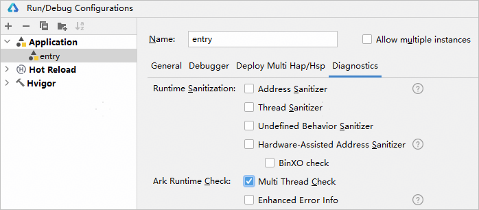
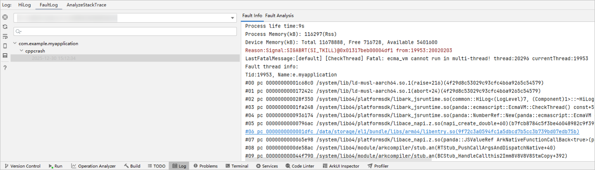
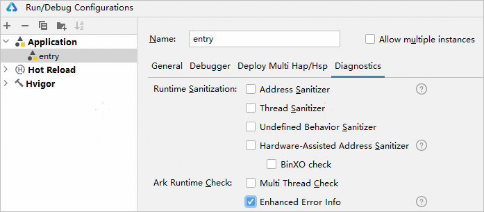
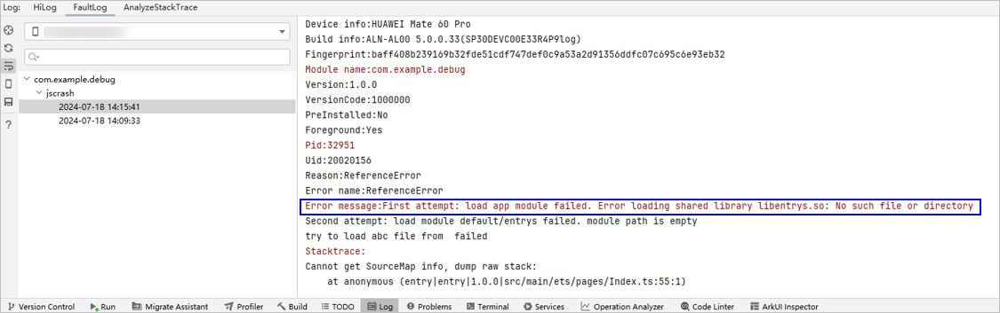

# 方舟运行时检测

更新时间：2026-04-20 06:32:02

来源：https://developer.huawei.com/consumer/cn/doc/harmonyos-guides/ide-multi-thread-check

## 方舟多线程检测

在JS运行时环境中，多线程的安全问题是一个重要的考虑因素。由于JavaScript主线程是单线程的，在主线程中创建的JS对象（尤其是DOM相关对象）只能在主线程上进行操作。如果违反了这一规则，就会导致多线程安全问题。针对该场景，DevEco Studio集成多线程检测能力，并通过FaultLog展示错误的堆栈详情及导致错误的代码行。关于多线程检测的原理请参考[原理介绍](https://developer.huawei.com/consumer/cn/doc/best-practices/bpta-stability-ark-runtime-detection#section18515155816101)。 开启多线程检测会有较大性能损耗，请开发者按需开启。

## 开启方舟多线程检测

可通过以下方式开启方舟多线程检测。 **方式一**点击**Run > Edit Configurations >** **Diagnostics**，勾选**Multi Thread Check**。

**方式二**通过命令行开启。
```text
hdc shell aa start -a {abilityName} -b {bundleName} -R
```

**方式三**通过调用[setMultithreadingDetectionEnabled接口](https://developer.huawei.com/consumer/cn/doc/harmonyos-references/js-apis-util#setmultithreadingdetectionenabled23)开启。

## 使用方舟多线程检测

运行或调试当前应用。当程序出现多线程安全问题时，会弹出Crash log信息，点击信息中的链接即可跳转至引起多线程安全问题的代码处。关于多线程安全问题的分析方法请参考[使用Node-API接口产生的异常日志/崩溃分析](https://developer.huawei.com/consumer/cn/doc/harmonyos-guides/use-napi-about-crash)。


## 方舟native模块加载异常信息增强

在进行ArkTS项目开发中可能存在需要加载native模块的场景，开启方舟native模块加载异常信息增强功能后，可以丰富ArkTS项目中因加载native模块导致的报错信息，以便更准确地进行native问题定位。

## 开启方舟native模块加载异常信息增强

可以通过以下两种方式开启方舟native模块加载异常信息增强。 方式一点击**Run > Edit Configurations >** **Diagnostics**，勾选**Enhanced Error Info**。

方式二通过命令行开启。
```text
hdc shell aa start {abilityName} {bundleName} -E
```


## 使用方舟native模块加载异常信息增强

运行或调试当前应用。当程序出现因native模块加载导致的报错信息时，会显示更详细准确的错误信息。

