# 日志分析

更新时间：2026-04-30 02:42:31

来源：https://developer.huawei.com/consumer/cn/doc/harmonyos-guides/ide-setup-hilog

**   

> [!NOTE]
> 打印日志请查看 使用HiLog打印日志 。

 
DevEco Studio提供了“Log > HiLog”窗口查看设备当前所有应用实时打印的日志信息。HiLog默认显示的日志为以下6个部分。
  
| 第一列 | 第二列 | 第三列 | 第四列 | 第五列 | 第六列 |
| --- | --- | --- | --- | --- | --- |
| 时间戳 | 进程ID和线程ID | 日志标签 | 应用包名 | 日志级别 | 日志内容 |
 
 
开发者可通过设置包名、日志级别和搜索关键词来筛选日志信息，还可以使用自定义日志显示格式、日志导出、显示最新日志等功能。
 
HiLog窗口左侧各个按钮的作用为：
 

：单击该按钮可以向上翻页，日志窗口取消自动滚动。
 

：单击该按钮可以向下翻页，日志窗口取消自动滚动。如果翻页已到底部，日志窗口自动滚动。
 

：当该按钮处于选中状态时，日志自动换行显示，否则日志按行显示。
 

：当该按钮处于选中状态时，日志自动滚动到窗口底部，否则停留在当前日志显示处。
 

：单击该按钮可以重新开启日志接收，会重新加载设备缓存日志。
 

：单击该按钮可以清空窗口日志和设备缓存。
 

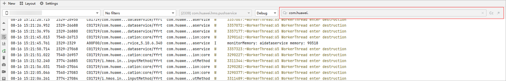
:  单击该按钮可以对当前选择的设备屏幕进行截屏，并保存在本地。
 

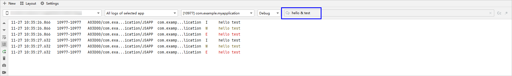
:  单击该按钮可以对当前选择的设备进行录屏，并保存在本地。
 

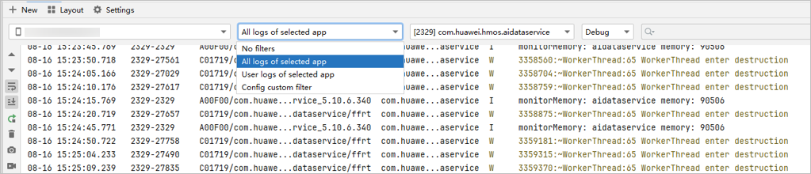
：单击该按钮可以保存日志缓存到指定文件（在线日志）或保存离线日志文件（离线日志）。
 

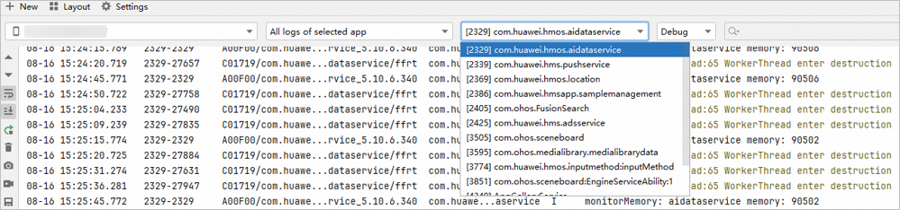
：单击该按钮可以自动选择和切换已连接的设备。
 

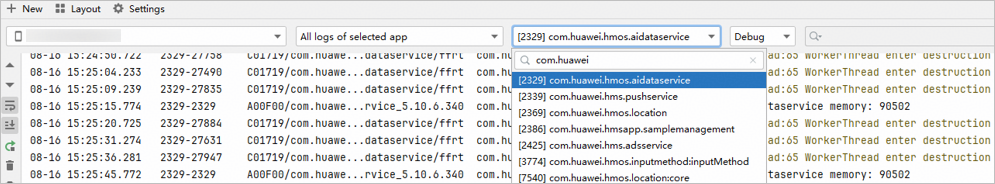
：单击该按钮可以切换日志视图以及自定义日志格式。
 

：单击该按钮可以关闭当前日志窗口。
 

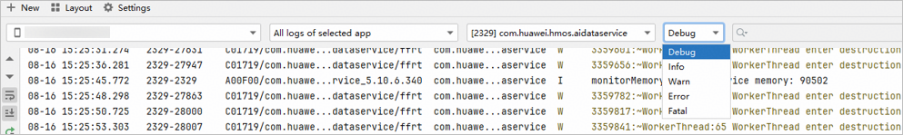
：单击该按钮可以跳转到HiLog日志相关的在线帮助文档。
 

#### 过滤日志

 

#### 按关键字过滤日志

在HiLog搜索框中输入希望过滤的信息，即可过滤显示所有包含此信息的日志。
 

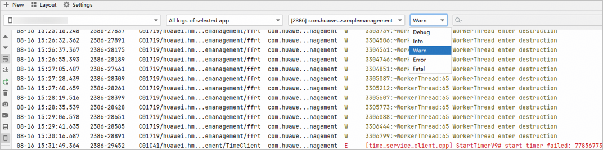
按钮表示过滤是否区分大小写，
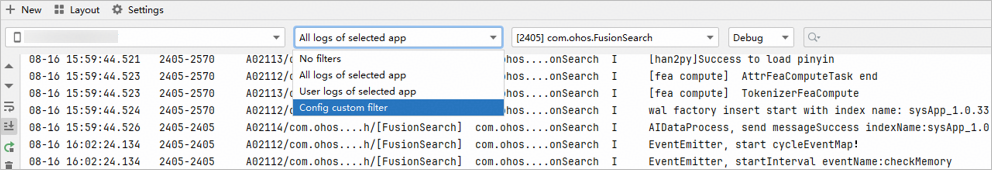
按钮表示是否按照正则表达式匹配过滤。
 

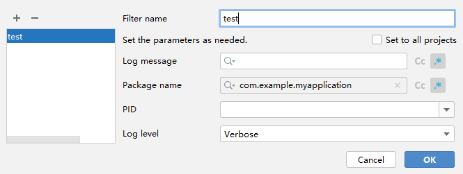

 
从DevEco Studio 6.0.2 Beta1版本开始，支持使用逻辑运算符&拼接多个关键字，精准搜索日志，&字符前后要有空格。
 

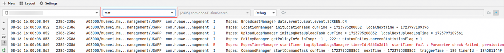

 
 

#### 使用默认提供的过滤配置

HiLog提供多种默认的过滤模式，开发者不需要反复输入关键字过滤日志信息，只需要切换相应的过滤项，即可快速过滤所需的日志。
 

 
- All logs of selected app：按照应用进程过滤日志。
- User logs of selected app：按照应用进程过滤用户输出的日志。

 
当选择All logs of selected app或User logs of selected app时，进程过滤下拉框处于可选状态，可选择相应的选项过滤想查看的进程日志。
 
> [!NOTE]
> 由于设备启动时，USB调试开关没有开启，部分系统应用没注册上，HiLog进程列表无法显示未注册上的系统应用，如需查看此部分的日志，可以 按关键字过滤 查看，或者保持USB调试开关打开的状态，重启设备。

 

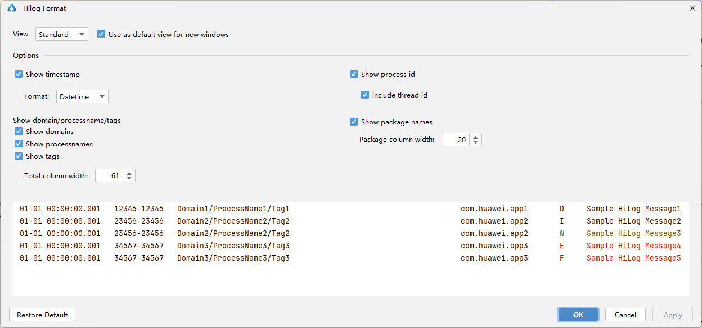

 
进程选择窗口可输入PID或应用名的关键字搜索要过滤的进程。
 

 
 

#### 按日志级别过滤日志

HiLog提供日志级别过滤以过滤某一级别及以上的日志。日志级别分为Debug、Info、Warn、Error、Fatal五个级别。
 

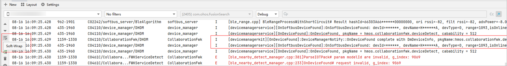

 
如选择Warn级别，则过滤展示Warn级别与Warn级别以上的日志信息，即展示Warn、Error、Fatal3个级别。
 

 
 

#### 按自定义过滤项过滤日志

除默认过滤项外，HiLog还提供配置自定义过滤项的途径以供开发者按照实际需求过滤日志，并保存此过滤配置以供重复使用。
 
点击**Config custom filter**时将弹出自定义过滤配置窗口。
 

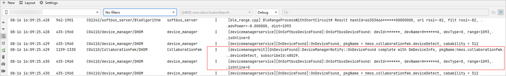

 
先前介绍的过滤选项此处均可配置，同时增加了Package name和Set to all projects配置项。
 
- Set to all projects：此配置当前工程及其他所有工程均可用。
- Package name：按应用包名过滤日志。

 

 
当配置完后将自动切换至此过滤配置。
 

 
切换至此自定义配置时，日志级别过滤窗口和关键字过滤窗口将在此自定义配置过滤出的日志的基础上再进行过滤。
 

 
 

#### 自定义日志显示格式

开发者可以通过配置自定义格式，限制每条日志只显示用户关注的信息。
 
点击左侧

图标，将弹出自定义格式窗口。
 
- Standard Views：默认显示所有信息。
- Compact Views：默认显示日志级别与日志信息。
- Modify Views：进入“Hilog Format”窗口后，可以按照需要自定义日志格式。

 

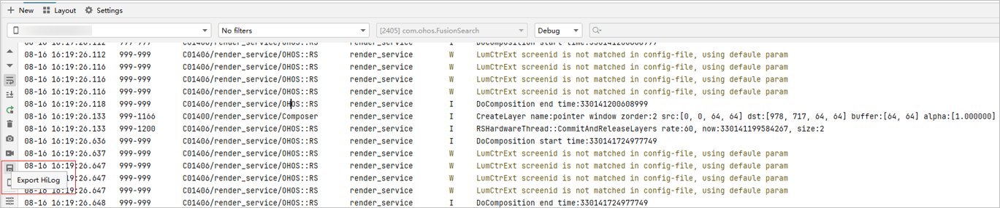

 
在“Hilog Format”中自定义日志格式：
 
- Use as default view for new windows：新建的HiLog窗口以Standard模式显示还是以Compact模式显示，新建后开发者可再自行切换其显示模式。
- Show timestamp：是否显示日期时间 。Format：Datetime/Time 显示日期时间/只显示时间。
- Show process id：是否显示PID-TID 。Include thread id：是否显示TID。
- Show domain/processname/tags：可以勾选以下三个选项决定是否显示domain、processname、tag。Show domains：是否显示domain。

  Show processnames：是否显示processname。

  Show tags：是否显示tag。

  Total column width：domain/processname/tags列的最大宽度，超长信息将会缩略显示并以ToolTip形式显示以上勾选内容的完整信息。
- Show package names：是否显示应用包名。Package column width：包名列的最大宽度，超长信息将会缩略显示并以ToolTip形式显示完整信息。

 

 
 

#### 超长日志自动换行

当日志的消息过长时，日志窗口可能不能完整显示日志消息，需要拖动滚动条查看信息。此时开发者可以点击**Soft-Wrap**按钮
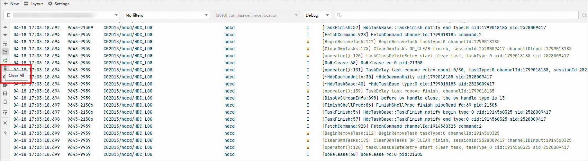
控制日志消息自动换行。
 
图1 **未开启自动换行**
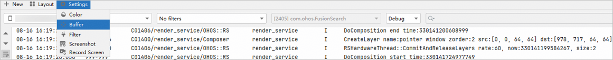

 
图2 **开启自动换行

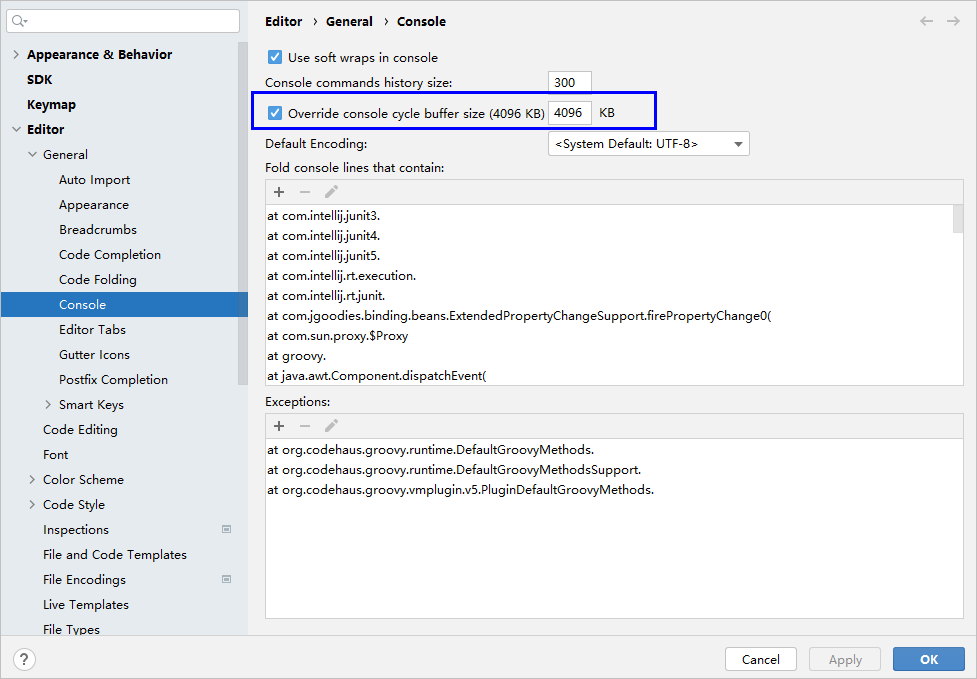

 
 

#### 显示最新日志

设备输出的日志信息会实时刷新到HiLog窗口底部，用户可点击**Scroll to End**按钮

使HiLog一直显示底部的最新日志信息。当观察到需要的日志时，点击HiLog窗口，即可停止滚动，停留在当前行，以便查看日志信息。
 

 
 

#### 导出日志信息

用户可将经上述步骤过滤后的关键日志信息保存到本地，以便后续的进一步分析。
 
点击**Export HiLog**按钮

，在弹出的Export HiLog To窗口中选择保存路径。
 

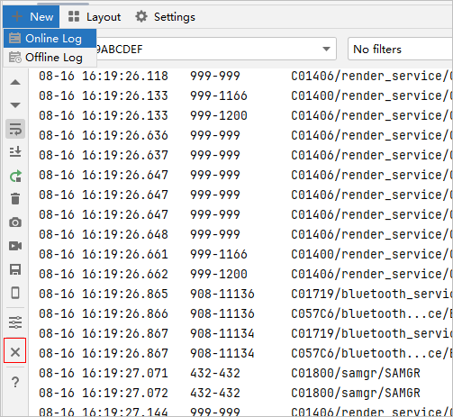

 
 

#### 清除日志缓存

与日志相关的缓存有两个：设备端日志缓存、HiLog窗口缓存。
 
HiLog显示日志信息的流程为：
 1. 应用输出日志信息至设备端日志缓存；
2. Log组件将设备端日志缓存取出，保存在HiLog窗口缓存中；
3. HiLog窗口根据过滤条件，将HiLog窗口缓存中的消息显示窗口在界面中。
 
点击**Clear All**按钮
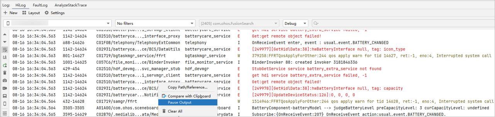
，将同时清除设备日志缓存和HiLog窗口日志缓存，以及当前已经打印的日志。HiLog窗口将显示执行清除操作后，新输出至设备端缓存的日志信息。
 

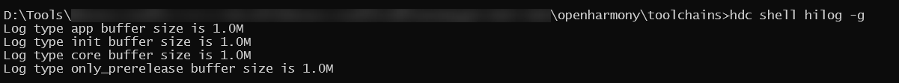

 
 

#### 设置HiLog窗口缓存

HiLog窗口显示的日志信息保存在此窗口的缓存中，缓存的大小决定了当前窗口能显示的日志信息的最大数量，当日志超出缓存上限时，窗口中最早的日志将会被清除，新日志在窗口底部输出。开发者可以自行设置窗口的缓存大小。
 
点击Settings > Buffer，进入缓存设置窗口。
 

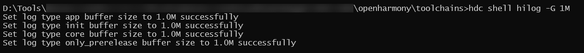

 
默认缓存大小为4096K，变更缓存大小需重启HiLog窗口后生效。
 

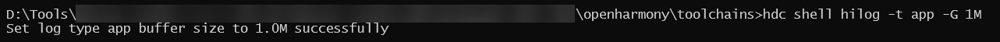

 
重启HiLog窗口操作：先点击下方的
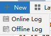
按钮，再点击上方的
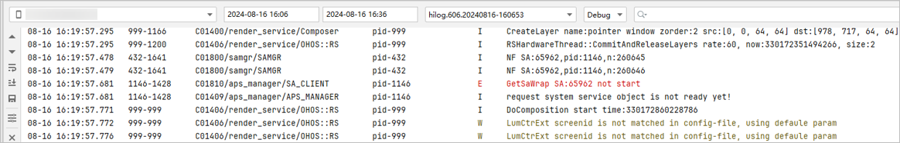
按钮中的Online Log即可。
 

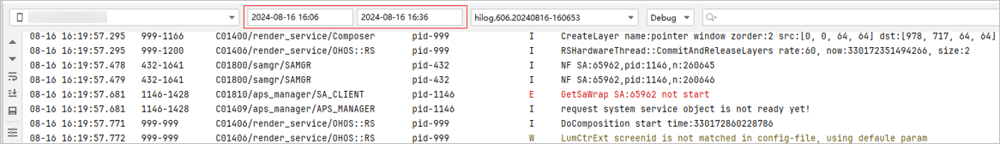

 

 
当日志量超出缓存时，顶部的旧日志不断被清除，因而顶部日志信息处于不停滚动的状态。此时若想查看此处的日志信息，可在日志滚动时，点击右键，勾选**Pause Output**暂停窗口打印，查看完后再取消勾选，重新开始打印日志。
 

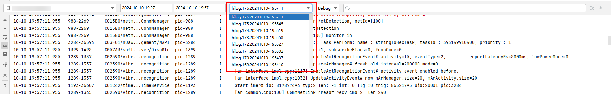

 
 

#### 设置设备端日志缓存

使用hdc shell hilog -g命令可查看当前设备端设置的日志缓存，默认为256K。
 

 
使用hdc shell hilog -G命令可更改设备端日志缓存大小。
 

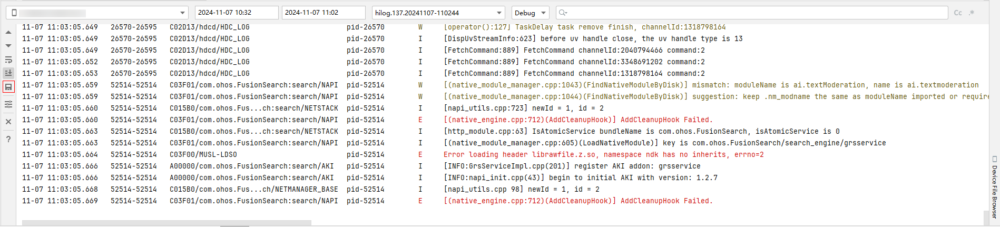

 
配合-t参数可单独设置某一类型的日志缓存大小。
 

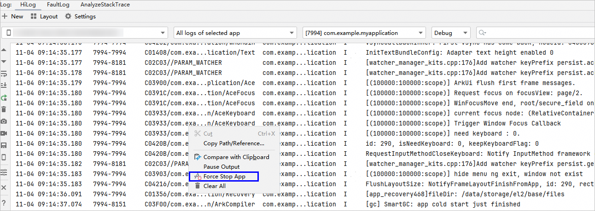

 
超出设备端缓存日志将被落盘于设备data/log/hilog路径下，开发者可在此目录下载历史hilog日志并查看。
 

 
 

#### 查看/导出设备离线日志

DevEco Studio提供查看设备离线日志的功能，支持查看设备中/data/log/hilog路径中的日志，离线日志窗口中展示的是经过[解析](https://developer.huawei.com/consumer/cn/doc/harmonyos-guides/hilog-tool)和DevEco Studio格式化之后的日志。
 
点击HiLog窗口左上角New，随后点击Offline Log即可打开离线日志窗口。
 

 
离线日志窗口左边工具栏中的按钮、日志级别下拉框和搜索框和在线日志的功能一致，设备下拉框仅支持选择真机和模拟器。
 

 
离线日志支持通过时间筛选设备上的日志文件，默认时间范围为打开窗口时的前三十分钟，除显示格式外，也支持通过键入yyyyMMddHHmm后回车进行时间输入。
 

 
在输入时间之后，日志文件下拉框会进行刷新，点击文件会从设备端下载并自动解析后输出到离线日志窗口。
 
由于最新的日志文件内容还在更新中，在达到设定的大小前，内容会不断增多。如果重新打开离线日志窗口或者修改时间，日志文件列表都会刷新，会从设备端重新下载最新的日志文件，解析的内容会更多。
 

离线日志窗口能输出的文本量可参考[设置HiLog窗口缓存](#section106741332995)进行设置，设置较小可能无法显示选择文件的所有日志，推荐设置6M(6144K)。
 
通过设置窗口的缓存大小可能无法展示完整的日志，可点击左侧工具栏的保存按钮导出离线日志，支持导出解析后未经DevEco Studio格式化的原始日志文件，导出的文件可以看到完整日志。
 

 
 

#### 终止应用

从DevEco Studio 6.0.0 Beta5版本开始，在日志窗口点击**右键 > Force Stop App**，可以终止该日志所属进程的应用，不支持系统应用和release签名的应用。
 

