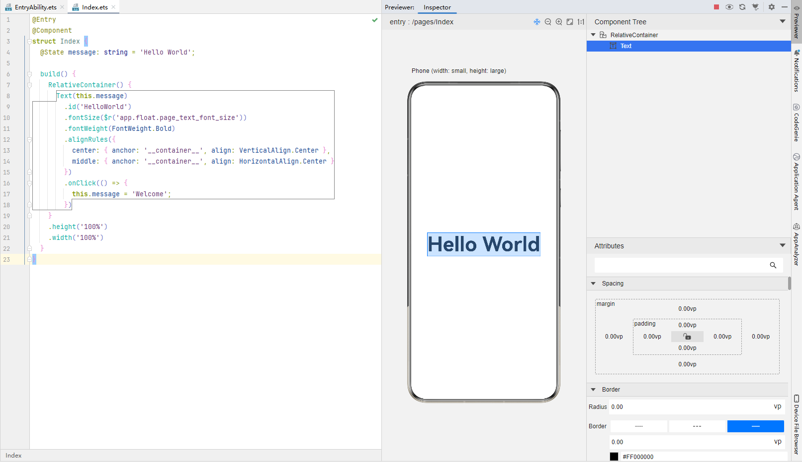

# Inspector双向预览

更新时间：2026-03-24 06:03:01

来源：https://developer.huawei.com/consumer/cn/doc/harmonyos-guides/ide-previewer-inspector

DevEco Studio提供HarmonyOS应用/元服务的UI预览界面与源代码文件间的双向预览功能，支持ets文件与预览器界面的双向预览。使用双向预览功能时，需要在预览器界面单击

图标打开双向预览功能。
 
> [!NOTE]
> 不支持服务卡片的双向预览功能。

 

 
开启双向预览功能后，支持代码编辑器、UI界面和Component Tree组件树三者之间的联动：
- 选中预览器UI界面中的组件，则组件树上对应的组件将被选中，同时代码编辑器中的布局文件中对应的代码块高亮显示。
- 选中布局文件中的代码块，则在UI界面会高亮显示，组件树上的组件节点也会呈现被选中的状态。
- 选中组件树中的组件，则对应的代码块和UI界面也会高亮显示。

 
 

 

 
在预览界面还可以通过组件的属性面板修改可修改的属性或样式，在预览界面修改后，预览器会自动同步到代码编辑器中修改源码，并实时的刷新UI界面；同样的，如果在代码编辑器中修改源码，也会实时刷新UI界面，并更新组件树信息及组件属性。
> [!NOTE]
> 如果组件有做数据绑定，则其属性不支持在属性面板修改。 如果界面有使用动画效果或者带动画效果组件，则其属性不支持在属性面板修改。 多设备预览时，不支持双向预览。
