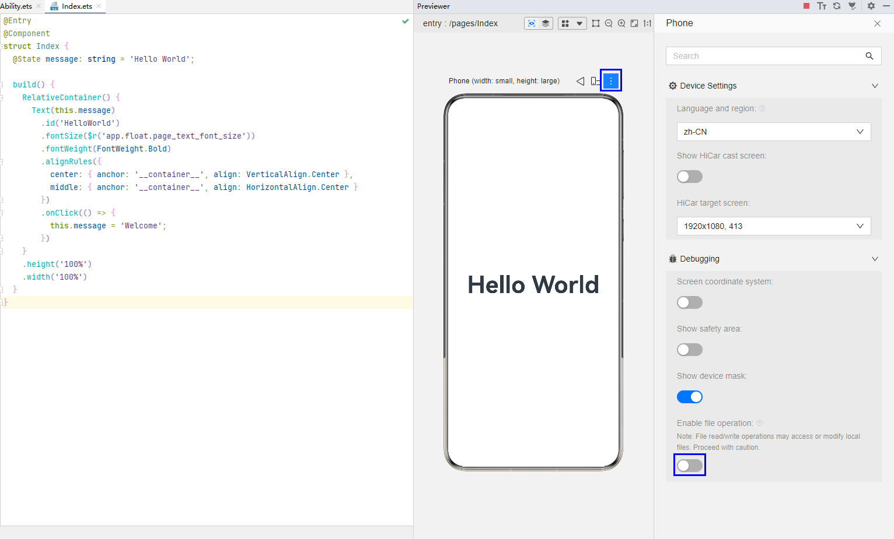

# 支持使用预览器的API清单

更新时间：2026-01-15 06:51:04

来源：https://developer.huawei.com/consumer/cn/doc/harmonyos-guides/ide-previewer-api-list

#### 组件

 

#### ArkTS组件
 
| 组件 | API |
| --- | --- |
| 基础组件 | AlphabetIndexer |
| 基础组件 | Blank |
| 基础组件 | Button |
| 基础组件 | Checkbox |
| 基础组件 | CheckboxGroup |
| 基础组件 | DataPanel |
| 基础组件 | DatePicker |
| 基础组件 | Divider |
| 基础组件 | Gauge |
| 基础组件 | Image |
| 基础组件 | ImageAnimator |
| 基础组件 | ImageSpan |
| 基础组件 | LoadingProgress |
| 基础组件 | Marquee |
| 基础组件 | Menu |
| 基础组件 | MenuItem |
| 基础组件 | MenuItemGroup |
| 基础组件 | Navigation |
| 基础组件 | NavRouter |
| 基础组件 | NavDestination |
| 基础组件 | PatternLock |
| 基础组件 | Progress |
| 基础组件 | QRCode |
| 基础组件 | Radio |
| 基础组件 | Rating |
| 基础组件 | ScrollBar |
| 基础组件 | Search |
| 基础组件 | Select |
| 基础组件 | Slider |
| 基础组件 | Span |
| 基础组件 | Stepper |
| 基础组件 | StepperItem |
| 基础组件 | Text |
| 基础组件 | TextArea |
| 基础组件 | TextClock |
| 基础组件 | TextInput |
| 基础组件 | TextPicker |
| 基础组件 | TextTimer |
| 基础组件 | Toggle |
| 容器组件 | Badge |
| 容器组件 | Column |
| 容器组件 | ColumnSplit |
| 容器组件 | Counter |
| 容器组件 | Flex |
| 容器组件 | FlowItem |
| 容器组件 | GridCol |
| 容器组件 | GridRow |
| 容器组件 | List |
| 容器组件 | ListItem |
| 容器组件 | ListItemGroup |
| 容器组件 | Navigator |
| 容器组件 | Panel |
| 容器组件 | Refresh |
| 容器组件 | RelativeContainer |
| 容器组件 | Row |
| 容器组件 | RowSplit |
| 容器组件 | Scroll |
| 容器组件 | SideBarContainer |
| 容器组件 | Stack |
| 容器组件 | Swiper |
| 容器组件 | Tabs |
| 容器组件 | TabContent |
| 容器组件 | WaterFlow |
| 绘制组件 | Circle |
| 绘制组件 | Ellipse |
| 绘制组件 | Line |
| 绘制组件 | Polyline |
| 绘制组件 | Path |
| 绘制组件 | Rect |
| 绘制组件 | Shape |
| 画布组件 | Canvas |
| 画布组件 | CanvasGradient |
| 画布组件 | CanvasPattern |
| 画布组件 | CanvasRenderingContext2D |
| 画布组件 | ImageBitmap |
| 画布组件 | ImageData |
| 画布组件 | Matrix2D |
| 画布组件 | OffscreenCanvasRenderingContext2D |
| 画布组件 | Path2D |
 
 
 

#### JS组件
 
| 组件 | API |
| --- | --- |
| 基础组件 | button |
| 基础组件 | chart |
| 基础组件 | divider |
| 基础组件 | image |
| 基础组件 | image-animator |
| 基础组件 | input |
| 基础组件 | label |
| 基础组件 | marquee |
| 基础组件 | menu |
| 基础组件 | option |
| 基础组件 | picker |
| 基础组件 | picker-view |
| 基础组件 | piece |
| 基础组件 | progress |
| 基础组件 | qrcode |
| 基础组件 | rating |
| 基础组件 | search |
| 基础组件 | select |
| 基础组件 | slider |
| 基础组件 | span |
| 基础组件 | switch |
| 基础组件 | text |
| 基础组件 | textarea |
| 基础组件 | toolbar |
| 基础组件 | toolbar-item |
| 基础组件 | toggle |
| 容器组件 | badge |
| 容器组件 | dialog |
| 容器组件 | div |
| 容器组件 | form |
| 容器组件 | list |
| 容器组件 | list-item |
| 容器组件 | list-item-group |
| 容器组件 | panel |
| 容器组件 | popup |
| 容器组件 | refresh |
| 容器组件 | stack |
| 容器组件 | stepper |
| 容器组件 | stepper-item |
| 容器组件 | swiper |
| 容器组件 | tabs |
| 容器组件 | tab-bar |
| 容器组件 | tab-content |
| 画布组件 | canvas |
| 画布组件 | CanvasRenderingContext2D |
| 画布组件 | Image |
| 画布组件 | CanvasGradient |
| 画布组件 | ImageData |
| 画布组件 | Path2D |
| 画布组件 | ImageBitmap |
| 画布组件 | OffscreenCanvas |
| 画布组件 | OffscreenCanvasRenderingContext2D |
| 栅格组件 | grid-container |
| 栅格组件 | grid-row |
| 栅格组件 | grid-col |
| svg组件 | svg |
| svg组件 | rect |
| svg组件 | circle |
| svg组件 | ellipse |
| svg组件 | path |
| svg组件 | line |
| svg组件 | polyline |
| svg组件 | polygon |
| svg组件 | text |
| svg组件 | tspan |
| svg组件 | textPath |
| svg组件 | animate |
| svg组件 | animateMotion |
| svg组件 | animateTransform |
 
 
 

#### 接口

 

#### UI界面
 
| 模块 | API |
| --- | --- |
| @ohos.animator (动画) | Animator |
| @ohos.animator (动画) | AnimatorResult |
| @ohos.animator (动画) | AnimatorOptions |
| @ohos.mediaquery (媒体查询) | matchMediaSync |
| @ohos.mediaquery (媒体查询) | MediaQueryResult |
| @ohos.mediaquery (媒体查询) | MediaQueryListener |
| @ohos.promptAction (弹窗) | showToast |
| @ohos.promptAction (弹窗) | showDialog |
| @ohos.promptAction (弹窗) | showActionMenu |
| @ohos.promptAction (弹窗) | ShowToastOptions |
| @ohos.promptAction (弹窗) | Button |
| @ohos.promptAction (弹窗) | ShowDialogSuccessResponse |
| @ohos.promptAction (弹窗) | ShowDialogOptions |
| @ohos.promptAction (弹窗) | ActionMenuSuccessResponse |
| @ohos.promptAction (弹窗) | ActionMenuOptions |
| @ohos.router (页面路由) | pushUrl |
| @ohos.router (页面路由) | replaceUrl |
| @ohos.router (页面路由) | back |
| @ohos.router (页面路由) | clear |
| @ohos.router (页面路由) | getLength |
| @ohos.router (页面路由) | getState |
| @ohos.router (页面路由) | enableAlertBeforeBackPage |
| @ohos.router (页面路由) | disableAlertBeforeBackPage |
| @ohos.router (页面路由) | getParams |
| @ohos.router (页面路由) | RouterMode |
| @ohos.router (页面路由) | RouterOptions |
| @ohos.router (页面路由) | RouterState |
| @ohos.router (页面路由) | EnableAlertOptions |
 
 
 

#### 网络管理
 
| 模块 | API |
| --- | --- |
| @ohos.net.http (数据请求) | http.createHttp 如果Http请求需要配置代理才能访问，API 12及以上的预览器支持使用系统的http_proxy/https_proxy/no_proxy环境变量。 |
 
 
 

#### 数据管理
 
| 模块 | API |
| --- | --- |
| @ohos.data.preferences (用户首选项) | data_preferences.getPreferences |
| @ohos.data.preferences (用户首选项) | data_preferences.deletePreferences |
| @ohos.data.preferences (用户首选项) | data_preferences.removePreferencesFromCache |
| @ohos.data.preferences (用户首选项) | Preferences |
| @ohos.data.preferences (用户首选项) | ValueType |
 
 
 

#### 文件管理

从DevEco Studio 6.0.0 Beta5版本开始，仅支持在预览/预览调试Stage模型的HAP/HSP时，使用文件管理的相关API，并且需要先打开**Enable file operation**开关。
 

  
| 模块 | API |
| --- | --- |
| @ohos.file.fs (文件管理) | fs.open |
| @ohos.file.fs (文件管理) | fs.close |
| @ohos.file.fs (文件管理) | fs.fdatasync |
| @ohos.file.fs (文件管理) | fs.fsync |
| @ohos.file.fs (文件管理) | fs.read |
| @ohos.file.fs (文件管理) | fs.write |
| @ohos.file.fs (文件管理) | fs.mkdir |
| @ohos.file.fs (文件管理) | fs.mkdtemp |
| @ohos.file.fs (文件管理) | fs.rename |
| @ohos.file.fs (文件管理) | fs.rmdir |
| @ohos.file.fs (文件管理) | fs.unlink |
| @ohos.file.fs (文件管理) | fs.stat |
| @ohos.file.fs (文件管理) | fs.truncate |
