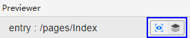
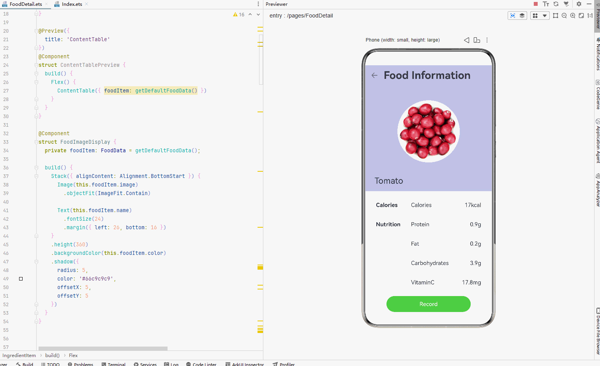
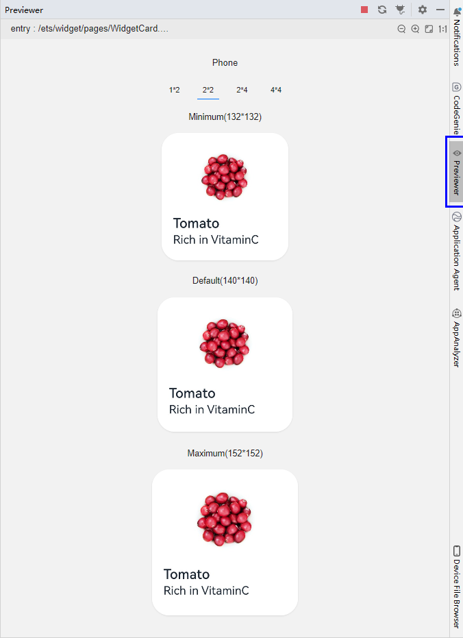

# 查看ArkUI预览效果

更新时间：2026-06-12 06:54:33

来源：https://developer.huawei.com/consumer/cn/doc/harmonyos-guides/ide-previewer-arkui

ArkUI预览支持页面预览、组件预览、多断点预览和卡片预览，下图中左侧图标

为页面预览，中间图标

为组件预览，右侧图标

为多断点预览，卡片预览在创建卡片文件后可直接预览。
 



 

#### 页面预览

ArkTS应用/元服务支持页面预览。页面预览通过在工程的ets文件头部添加@Entry实现。
 
@Entry的使用参考如下示例：
 
```text
@Entry
@Component
struct Index {
  @State message: string = 'Hello World'

  build() {
    Row() {
      Column() {
        Text(this.message)
          .fontSize(50)
          .fontWeight(FontWeight.Bold)
      }
      .width('100%')
    }
    .height('100%')
  }
}
```
 
 

#### 组件预览

ArkTS应用/元服务支持组件预览。组件预览支持实时预览，不支持动态图和动态预览。组件预览通过在组件前添加注解@Preview实现，在单个源文件中，最多可以使用10个@Preview装饰自定义组件。
 
@Preview的使用参考如下示例：
```text
@Preview({
  title: 'ContentTable'
})
@Component
struct ContentTablePreview {
  build() {
    Flex() {
      ContentTable({ foodItem: getDefaultFoodData() })
    }
  }
}
```
 
 
以上示例的组件预览效果如下图所示：
 



 
组件预览默认的预览设备为Phone，若您想查看不同的设备，或者不同的屏幕形状，或者不同设备语言等情况下的组件预览效果，可以通过设置@Preview的参数，指定预览设备的相关属性。若不设置@Preview的参数，默认的设备属性如下所示：
```text
@Preview({
  title: 'Component1',  //预览组件的名称
  deviceType: 'phone',  //指定当前组件预览渲染的设备类型，默认为Phone
  width: 1080,  //预览设备的宽度，单位：px
  height: 2340,  //预览设备的长度，单位：px
  colorMode: 'light',  //显示的亮暗模式，当前支持取值为light
  dpi: 480,  //预览设备的屏幕DPI值
  locale: 'zh_CN',  //预览设备的语言，如zh_CN、en_US等
  orientation: 'portrait',  //预览设备的横竖屏状态，取值为portrait或landscape
  roundScreen: false  //设备的屏幕形状是否为圆形
})
```
 
 
请注意，如果被预览的组件是依赖参数注入的组件，建议的预览方式是：定义一个组件片段，在该片段中声明将要预览的组件，以及该组件依赖的入参，并在组件片段上标注@Preview注解，以表明将预览该片段中的内容。例如，要预览如下组件：
 
```text
@Component
struct Title {
  @Prop context: string; 
  build() {
    Text(this.context)
  }
}
```
 
建议按如下方式预览：
 
```text
@Preview
@Component    //定义组件片段TitlePreview
struct TitlePreview {
  build() {
    Title({ context: 'MyTitle' })    //在该片段中声明将要预览的组件Title，以及该组件依赖的入参 {context: 'MyTitle'}
  }
}
```
 
 

#### 多断点预览

从26.0.0 Beta1版本开始，ArkTS应用/元服务支持多断点预览，可以同时展示8个典型档位[断点](https://developer.huawei.com/consumer/cn/doc/best-practices/bpta-multi-device-responsive-layout#section1532120147301)的预览画面。在多断点预览模式下，不支持实时预览和极速预览；如果图片太大或图片太多，预览时可能无法显示。
 
多断点预览通过在工程的ets文件头部添加@Entry实现，示例如下：
 
```text
@Entry
@Component
struct Index {
  @State message: string = 'Hello World'

  build() {
    Row() {
      Column() {
        Text(this.message)
          .fontSize(50)
          .fontWeight(FontWeight.Bold)
      }
      .width('100%')
    }
    .height('100%')
  }
}
```
 
以上示例的多断点预览效果如下图所示，会展示8个典型档位断点下的预览效果：
 


 
每个断点预览画面上均可点击

查看该断点档位下的组件树。
 
支持代码编辑器、UI界面和组件树三者之间的联动：
- 选中预览器UI界面中的组件，则组件树上对应的组件将被选中，同时代码编辑器中的布局文件中对应的代码块高亮显示。
- 选中布局文件中的代码块，则在UI界面会高亮显示，组件树上的组件节点也会呈现被选中的状态。
- 选中组件树中的组件，则对应的代码块和UI界面也会高亮显示。
- 不支持修改属性面板上的组件属性。

 
 


 
 

#### 卡片预览

创建卡片并选中卡片文件后，点击右侧边栏**Previewer**按钮即可预览卡片。
 


