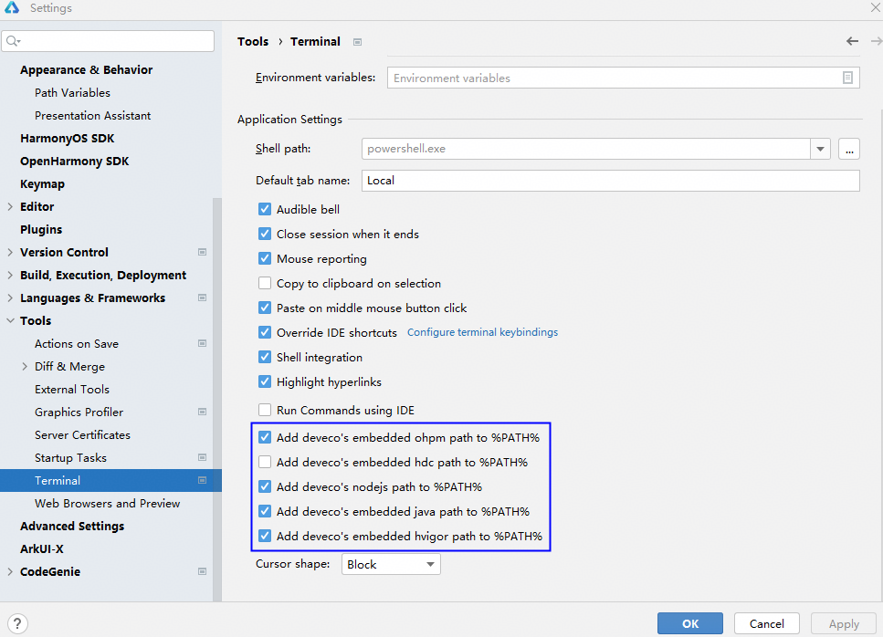

# Terminal环境变量说明

更新时间：2026-03-31 08:13:00

来源：https://developer.huawei.com/consumer/cn/doc/harmonyos-guides/ide-environment-variable

在DevEco Studio的Terminal中执行hvigor、ohpm等命令时，默认使用内置的环境变量，无需额外配置。
 
DevEco Studio内置环境变量的设置方式如下：
 
点击菜单栏**File > Settings**（macOS为**DevEco Studio > Preferences/Settings **）** > Tools > Terminal**，勾选以下选项表示开启内置环境变量。
 

 
除了内置的环境变量外，开发者也可以在本地系统中配置PATH环境变量。如果同时配置了内置环境变量和本地系统环境变量，两者存在优先级关系，实际生效的环境变量如下。
 
- DevEco Studio 6.0.2 Release（6.0.2.650）及以上版本：内置环境变量生效。
- DevEco Studio 6.0.2 Release（6.0.2.650）之前的版本：
Windows：内置环境变量生效。
- macOS：本地系统环境变量生效。
