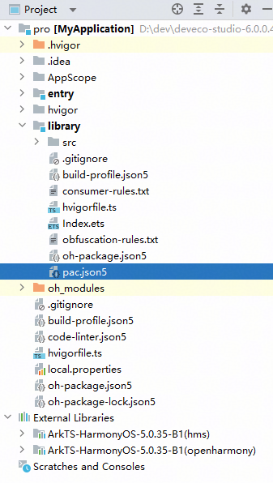

# pac.json5隐私清单文件

更新时间：2026-04-20 06:32:02

来源：https://developer.huawei.com/consumer/cn/doc/harmonyos-guides/agc-pac

##### 概述

若您开发App，您在AppGallery Connect上架应用时需要提供应用的隐私标签，建议您在项目工程中创建pac.json5配置文件，在文件中声明处理的个人数据类型、使用目的等信息。编译构建时，如您集成的HSP/HAR中的pac.json5同步声明了隐私保护信息，信息将自动汇总至此文件并随软件打包，上架时AppGallery Connect可基于此文件内容自动生成隐私标签。
 
若您开发HSP或HAR，为了下游集成使用软件的开发者快速、准确地了解HSP或HAR处理个人数据的情况，建议您在项目工程中创建pac.json5配置文件，在文件中声明处理的个人数据类型、使用目的等信息。文件在编译构建时会合入软件包，隐私保护信息将随软件包同步传递给下游的开发者。
 
> [!NOTE]
> 支持版本：DevEco Studio 6.0.0 Beta2及以上版本。

 
 

##### 创建pac.json5文件

- 开发App情况下，选中AppScope目录新建pac.json5文件。



 
- 开发HSP或HAR情况下，选中HSP或HAR模块目录新建pac.json5文件。


 
 

##### 配置文件结构

pac.json5隐私清单文件整体的结构如下。
```text
dataProcess
└── dataType
└── dataLabels
    └── label
    └── purposes
    └── userLinked
    └── tracking
specialAPIs
└── apiType
└── reasons
```
 
 

 
 

##### 配置文件字段说明

pac.json5隐私清单配置文件包括以下字段。
  
| 字段名称 | 可选/必选 | 类型 | 含义 |
| --- | --- | --- | --- |
| dataProcess | 可选 | 数组 | 声明应用收集的个人数据。 |
| specialAPIs | 可选 | 数组 | 声明应用调用的可用于生成设备指纹的API信息。 |
 
 
> [!NOTE]
> dataProcess和specialAPIs不能同时为空。

 
 

##### dataProcess

dataProcess是声明应用收集的个人数据，包括数据类型、数据项和使用目的。
  
| 字段名称 | 可选/必选 | 类型 | 含义 |
| --- | --- | --- | --- |
| dataType | 必选 | 字符串 | 应用收集个人数据的类型。 |
| dataLabels | 必选 | 数组 | 应用收集的个人数据项和目的。 |
 
 
  
| 数据类型 | 含义 |
| --- | --- |
| Identifiers | 标识符 |
| Financial information | 财务信息 |
| Basic information | 基本资料 |
| Transaction information | 交易信息 |
| Contact information | 联系人信息 |
| Special category data | 敏感信息 |
| Device information | 设备信息 |
| Location information | 位置信息 |
| App information | 应用信息 |
| User content | 用户内容 |
| Fitness and health information | 运动健康信息 |
| Other personal data | 其他个人数据 |
 
 

##### dataLabels

dataLabels是声明应用收集的个人数据项和目的。
  
| 字段名称 | 可选/必选 | 类型 | 含义 |
| --- | --- | --- | --- |
| label | 必选 | 字符串 | 应用收集的个人数据项。 |
| purposes | 必选 | 数组 | 应用收集个人数据的目的。 |
| userLinked | 可选 | 布尔 | 应用收集的个人数据是否用于用户关联。 |
| tracking | 可选 | 布尔 | 应用收集的个人数据是否用于用户追踪。 |
 
 
  
| 个人数据项 | 含义 | 数据类型 |
| --- | --- | --- |
| ICCID | ICCID | Identifiers |
| IMEI | IMEI | Identifiers |
| IMSI | IMSI | Identifiers |
| MAC | MAC | Identifiers |
| MEID | MEID | Identifiers |
| OAID | OAID | Identifiers |
| SN | SN | Identifiers |
| Chip ID | Chip ID | Identifiers |
| ODID | ODID | Identifiers |
| SSID | SSID | Identifiers |
| BSSID | BSSID | Identifiers |
| Other device identifiers | 其他设备标识符 | Identifiers |
| ID card | 身份证 | Identifiers |
| Other identity information | 其他身份信息 | Identifiers |
| User identifiers | 用户标识符 | Identifiers |
| Bank account information | 银行账户信息 | Financial information |
| Other financial account information | 其他金融账户信息 | Financial information |
| Asset information | 资产信息 | Financial information |
| Other financial information | 其他账务信息 | Financial information |
| Name | 姓名 | Basic information |
| Gender | 性别 | Basic information |
| Age | 年龄 | Basic information |
| Date of birth | 出生日期 | Basic information |
| Account information | 账号信息 | Basic information |
| Education information | 教育信息 | Basic information |
| Work information | 工作信息 | Basic information |
| Home information | 家庭信息 | Basic information |
| Address | 地址 | Basic information |
| Phone number | 电话号码 | Basic information |
| Email address | 电子邮件地址 | Basic information |
| Calendar and schedule | 日历 | Basic information |
| Other personal information | 其他个人资料 | Basic information |
| Order information | 订单信息 | Transaction information |
| Transaction records | 交易记录 | Transaction information |
| Package delivery information | 快递信息 | Transaction information |
| Other transaction information | 其他交易信息 | Transaction information |
| Contact list | 联系人列表 | Contact information |
| Social media accounts | 社交帐号 | Contact information |
| Other contact information | 其他联系人信息 | Contact information |
| Facial recognition features | 面部识别特征 | Special category data |
| Voiceprint information | 声纹 | Special category data |
| Other biometric features | 其他生物特征 | Special category data |
| Other special category data | 其他敏感信息 | Special category data |
| Magnetometer | 磁力计信息 | Device information |
| Light sensor | 光照传感器 | Device information |
| Acceleration sensor | 加速器数据 | Device information |
| Screen orientation sensor | 屏幕方向传感器 | Device information |
| Barometer | 气压计 | Device information |
| Gyroscope | 陀螺仪数据 | Device information |
| Rotation vector sensor | 旋转矢量传感器信息 | Device information |
| Gravity sensor | 重力传感器信息 | Device information |
| OS information | 操作系统信息 | Device information |
| Other hardware and software parameters/System settings | 其他软硬件参数/系统设置 | Device information |
| Device status | 设备状态 | Device information |
| IP address | IP地址 | Device information |
| Wi-Fi parameters | WiFi参数 | Device information |
| Wi-Fi status | WiFi状态 | Device information |
| Network type | 网络类型 | Device information |
| Carrier | 运营商 | Device information |
| Other device information | 其他设备信息 | Device information |
| Network location | 网络位置 | Location information |
| Other approximate location information | 其他大致位置信息 | Location information |
| GPS location | GPS位置 | Location information |
| Other precise location information | 其他精确位置信息 | Location information |
| Browsing history | 浏览记录 | App information |
| Favorites | 收藏记录 | App information |
| Basic app information | 应用基本信息 | App information |
| App settings | 应用设置信息 | App information |
| App running status | 应用运行状态 | App information |
| App run logs | 应用运行日志 | App information |
| App usage information | 其他使用应用的信息 | App information |
| SMS messages | 短信 | User content |
| Call logs | 通话记录 | User content |
| Other communication content | 其他通讯内容 | User content |
| Image or video | 图片或视频 | User content |
| Audio recording | 录音 | User content |
| Audio | 音频 | User content |
| Text information | 文字信息 | User content |
| Search keywords | 搜索词 | User content |
| Social interactions | 社交互动 | User content |
| Game statistics | 游戏数据 | User content |
| Customer service records | 客户支持 | User content |
| Pasteboard | 剪切板 | User content |
| Software installation list | 软件安装列表 | User content |
| Other user content | 其他用户内容 | User content |
| Heart rate | 心率 | Fitness and health information |
| Blood pressure | 血压 | Fitness and health information |
| Other health information | 其他健康信息 | Fitness and health information |
| Fitness information | 运动信息 | Fitness and health information |
| Other personal data | 其他个人数据 | Other personal data |
 
  
| 个人数据收集的目的 | 目的详细描述 |
| --- | --- |
| App functionality | 应用提供基本功能、安全防护功能、确保应用正常运营以及客户支持。 |
| Product personalization | 按照不同用户差异化呈现应用内容。 |
| Analytics | 评估用户行为，了解现有产品功能的效果、进行服务改进。 |
| Advertising and marketing | 用于在应用中显示广告或营销信息的数据。 |
| Disclosure to third parties | 将数据共享至第三方运营主体，目的包括但不限于：共享至物流公司用于物品邮件、共享至第三方用于广告投放效果评估、共享至第三方进行数据展示、评测/评估、研究、合作双方对账、由第三方提供运营、运维服务、论坛、社交等服务中公开披露。 |
| Cross-border transfer | 数据跨境传输。 |
| Others | 用于未列出的其他用途。 |
 
 

##### specialAPIs

specialAPIs是声明应用调用的可用于生成设备指纹的API信息，包含API类型和调用原因。
  
| 字段名称 | 可选/必选 | 类型 | 含义 |
| --- | --- | --- | --- |
| apiType | 必选 | 字符串 | API类型 |
| reasons | 必选 | 数组 | API调用原因 |
 
 
  
| API类型 | API介绍 | API列表 |
| --- | --- | --- |
| File timestamp APIs | 用于获取文件的创建、修改或访问时间戳，有助于管理文件和数据同步。 | ctime mtime fs.getxattr fs.getxattrSync fs.stat file.get fs.lstat cloudStorage.bucket().getMetadata |
| System boot time APIs | 提供系统启动时间信息，常用于计算系统运行时长或在系统重启后保持应用状态。 | systemDateTime.getUptime |
| Disk space APIs | 用于检测磁盘空间，有助于管理存储资源，例如在空间不足时提醒用户或优化数据存储。 | statvfs.getFreeSize statvfs.getTotalSize |
| Active keyboard APIs | 用于检测当前激活的键盘，常用于提供上下文相关的输入体验或支持多语言输入。 | inputDevice.getKeyboardType |
| User preferences APIs | 用于存储和检索用户首选项，如应用配置或最近使用的项目，有助于提高用户体验和应用的个性化。 | preferences.getPreferences sendablePreferences.getPreferences |
 
  
| API调用原因 | 目的详细描述 | API类型 |
| --- | --- | --- |
| Display to user on-device | 用于向用户显示文件的时间戳，如文件的创建、修改和访问时间。 | File timestamp APIs |
| Access file metadata in-app | 用于访问应用容器内或云存储（Cloud Foundation Kit）中文件的时间戳、大小或其他元数据。 | File timestamp APIs |
| Files provided to app by user | 用于访问用户授权文件或目录的时间戳、大小或其他元数据。 | File timestamp APIs |
| 3rd-party SDK wrapper on-device | 用于应用调用第三方SDK提供的文件时间戳封装函数。 | File timestamp APIs |
| Measure time on-device | 用于计算应用内事件之间经过的时间，或通过时间计算实现定时器。 | System boot time APIs |
| Calculate timestamp for in-app event | 用于计算应用内事件的绝对时间戳。 | System boot time APIs |
| User-initiated bug report | 用于在用户主动提交的诊断报告中记录系统启动时间。 | System boot time APIs |
| Display to user on-device | 用于向用户显示磁盘空间信息。 | Disk space APIs |
| Write or delete file on-device | 用于写文件前检查磁盘空间是否充足，或检查到磁盘空间不足时触发垃圾文件清理。 | Disk space APIs |
| User-initiated bug report | 用于在用户主动提交的诊断报告中记录磁盘空间信息。 | Disk space APIs |
| Health research app | 用于检测是否有足够的磁盘空间存储应用收集的健康数据。 | Disk space APIs |
| Custom keyboard app on-device | 用于自定义键盘类应用检查当前设备激活的键盘。 | Active keyboard APIs |
| Customized UI on-device | 用于根据激活键盘状态向用户呈现正确的定制化UI界面。 | Active keyboard APIs |
| Access preferences data in-app | 用于访问仅限本应用读写的用户首选项配置信息。 | User preferences APIs |
| 3rd-party SDK wrapper on-device | 用于应用调用第三方SDK提供的用户首选项（Preference API）封装函数。 | User preferences APIs |
 
 

##### pac.json5文件示例

```text
{
  <span style="color: rgb(132,63,161);">"dataProcess"</span><span style="color: rgb(181,106,1);">: </span>[
    {
      <span style="color: rgb(132,63,161);">"dataType"</span><span style="color: rgb(181,106,1);">: </span><span style="color: rgb(80,160,79);">"Identifiers"</span><span style="color: rgb(181,106,1);">,</span>
      <span style="color: rgb(132,63,161);">"dataLabels"</span><span style="color: rgb(181,106,1);">: </span>[
        {
        <span style="color: rgb(132,63,161);">  "label"</span><span style="color: rgb(181,106,1);">: </span><span style="color: rgb(80,160,79);">"MAC"</span><span style="color: rgb(181,106,1);">,</span>
        <span style="color: rgb(132,63,161);">  "purposes"</span><span style="color: rgb(181,106,1);">: </span>[<span style="color: rgb(80,160,79);">"App functionality"</span>]<span style="color: rgb(181,106,1);">,</span>
          "userLinked": true<span style="color: rgb(181,106,1);">,</span>
          "tracking": true
        }
      ]
    }
  ]<span style="color: rgb(181,106,1);">,</span>
  <span style="color: rgb(132,63,161);">"specialAPIs"</span><span style="color: rgb(181,106,1);">: </span>[
    {
      <span style="color: rgb(132,63,161);">"apiType"</span><span style="color: rgb(181,106,1);">: </span><span style="color: rgb(80,160,79);">"File timestamp APIs"</span><span style="color: rgb(181,106,1);">,</span>
      <span style="color: rgb(132,63,161);">"reasons"</span><span style="color: rgb(181,106,1);">: </span>[<span style="color: rgb(80,160,79);">"Display to user on-device"</span><span style="color: rgb(181,106,1);">,</span><span style="color: rgb(80,160,79);">"Access file metadata in-app"</span>]
    }
  ]
}
```
