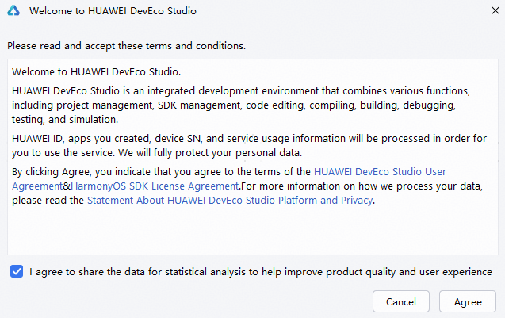

# 关闭数据采集

更新时间：2026-01-15 06:51:04

来源：https://developer.huawei.com/consumer/cn/doc/harmonyos-guides/ide-close-send-usage-statistics

DevEco Studio在首次启动时，弹窗出现提示开启数据采集功能。该功能用于帮助DevEco Studio改进使用体验，收集的数据将按照[关于HUAWEI DevEco Studio 平台与隐私的声明](https://legal.cloud.huawei.com/terms/scope/huawei/deveco-studio-hmos/privacy-statement.htm?code=CN&branchid=0&language=zh-cn)处理。
 

 
若开发者后续需要关闭数据采集功能，请在**File > Settings **（macOS为**DevEco Studio > Preferences****/Settings**）**> Appearance & Behavior > System Settings > Data Sharing**设置界面，取消勾选**Send usage statistics**关闭数据采集开关。
 

