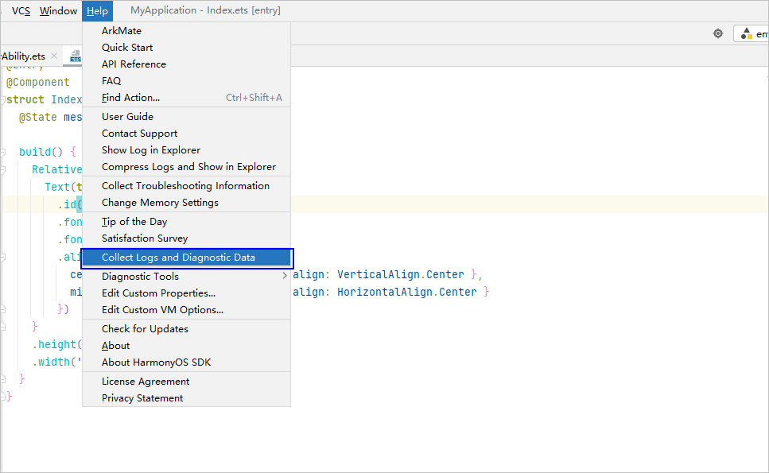
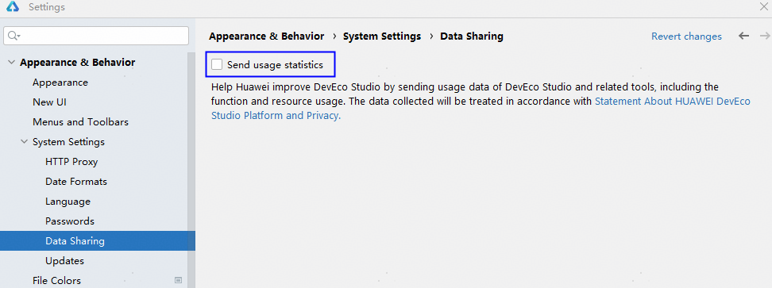

# 日志上传

更新时间：2026-01-15 06:51:04

来源：https://developer.huawei.com/consumer/cn/doc/harmonyos-guides/ide-log-postback

> [!NOTE]
> 该功能仅支持中国境内（香港特别行政区、澳门特别行政区、中国台湾除外）。

 
若开发过程中遇到DevEco Studio卡顿、卡死或其他故障时，可点击IDE Error问题弹窗中Send Report，点击OK后向DevEco Studio回传日志信息。
 

 
或通过菜单栏**Help > Collect Logs and Diagnostic Data**，选择并上传相关日志，帮助DevEco Studio提升稳定性体验。
 

 
若开发者后续需要关闭数据采集功能，请在**File > Settings**（macOS为**DevEco Studio > Preferences/Settings**）**> Appearance & Behavior > System Settings > Data Sharing**设置界面，取消勾选**Send usage statistics**关闭数据采集开关。
 

