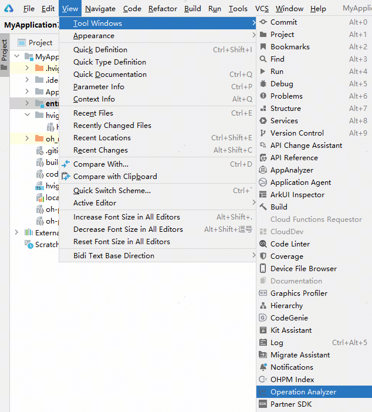
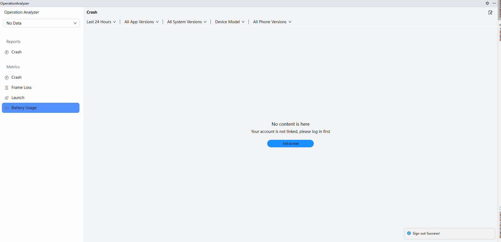
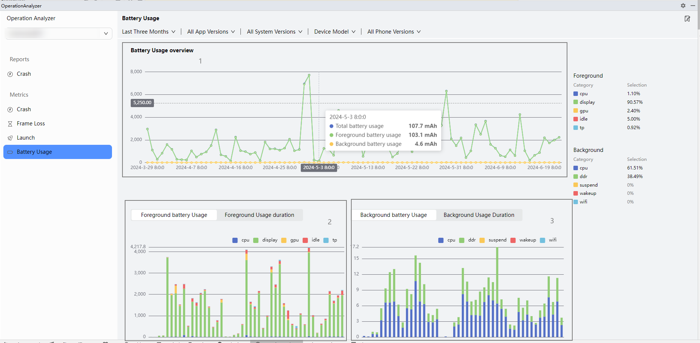
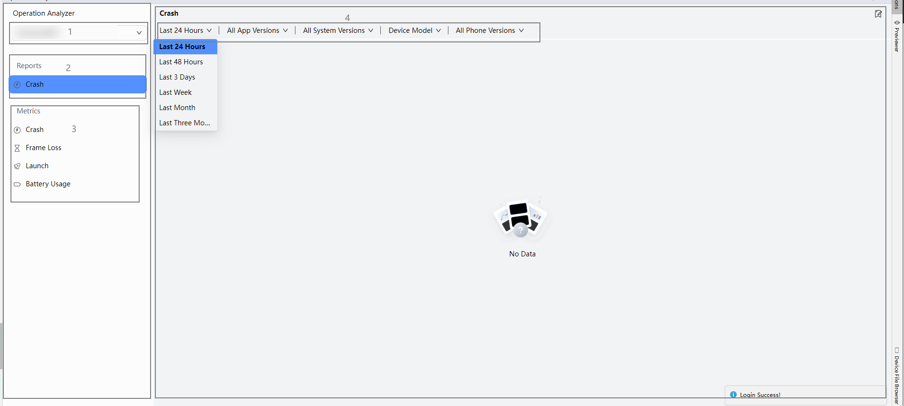
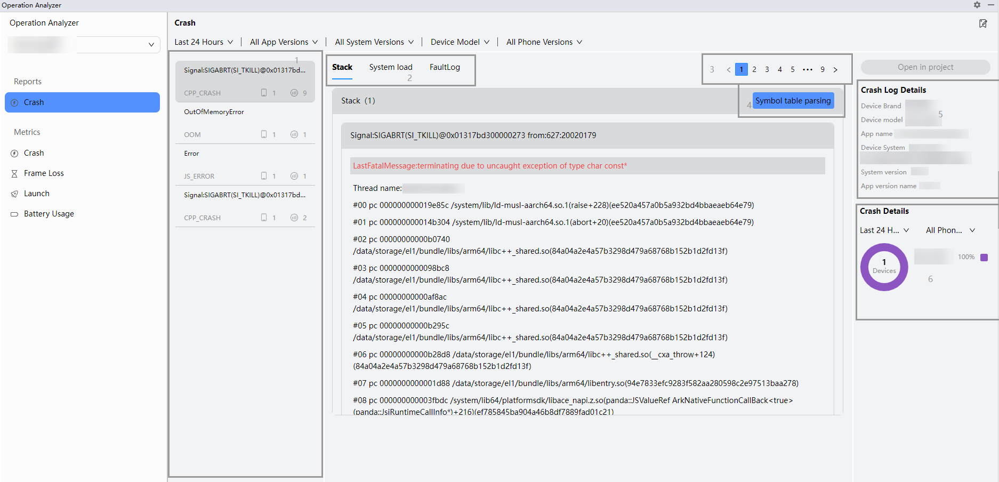
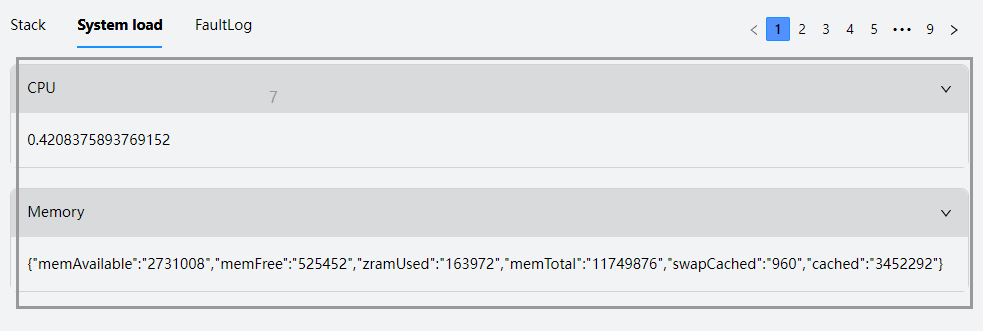
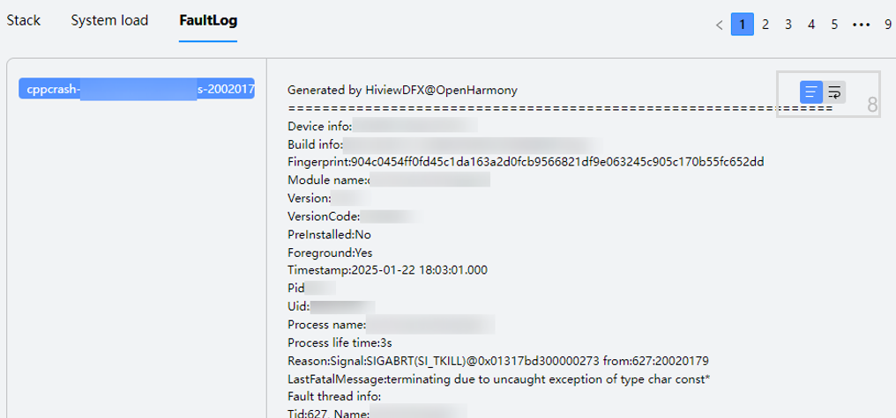
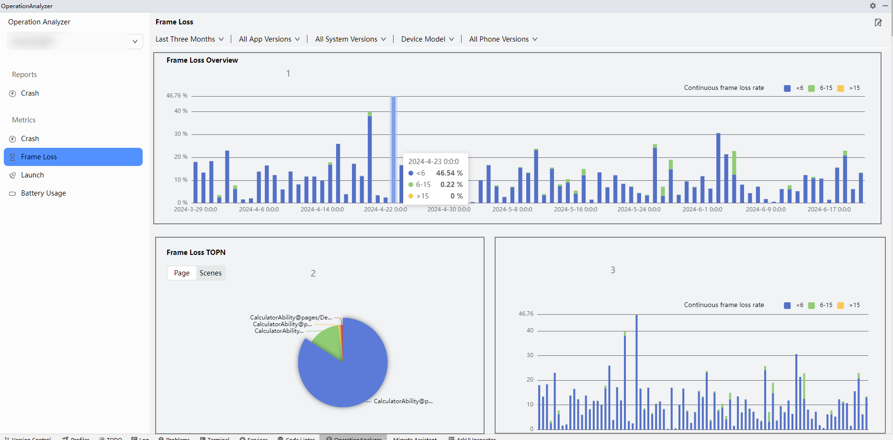
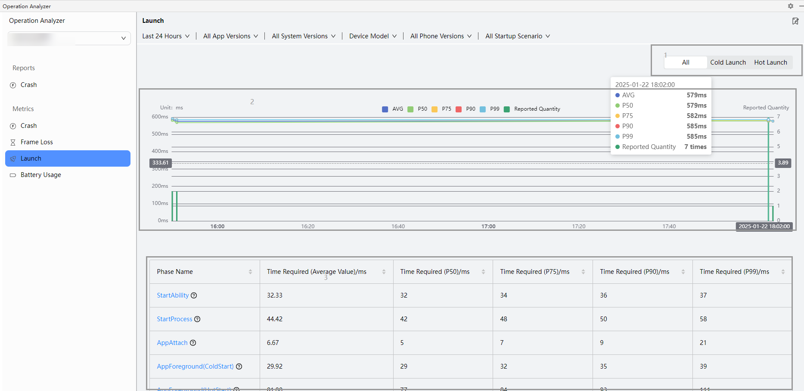
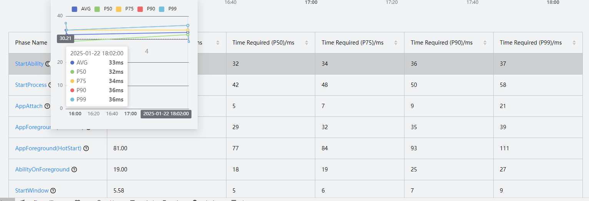

# 运维服务

更新时间：2026-01-15 06:51:04

来源：https://developer.huawei.com/consumer/cn/doc/harmonyos-guides/ide-operation-and-services

DevEco Studio支持对崩溃问题进行定位以及对崩溃，卡顿，丢帧，能耗等异常进行数据分析。
 

##### 使用约束

该功能仅支持中国境内（香港特别行政区、澳门特别行政区、中国台湾除外）。
 
 

##### 页面布局

在DevEco Studio菜单栏点击**View > Tool Windows > Operation Analyzer**，进入运维服务页面。
 

 
点击**Add account**按钮，登录华为账号并授权后，可以查看当前账号下应用异常情况。
 

 
当前页面共分为两个部分。页面左侧为菜单栏，右侧为数据内容展示区：
 1. 菜单栏：
- 1号区域：可选择当前账号下存在的应用。

2. 2号区域：Reports展示数据详情，用于定位具体问题。

3. 3号区域：Metrics区域展示Crash，Frame Loss，Launch， Battery Usage异常数据的变化趋势**。**
- 内容展示区顶部可选择配置项包含：1. 时间：通过时间维度过滤当天到最近三个月的异常情况和数据。

2. 应用版本：当前存在异常数据的应用版本。

3. 系统版本：当前存在异常数据的系统版本。

4. 设备类型：展示当前应用支持的设备类型。

5. 手机型号：当前存在异常数据的手机型号。

 

 
 

##### Reports

展示具体的崩溃详情。Stack页签支持混淆的代码还原，并可跳转到具体的代码行查找问题。System load页签展示崩溃的CPU和内存信息。FaultLog页签展示崩溃的故障日志信息，添加符号表后支持还原日志的堆栈。
 
- 1号区域：展示崩溃问题列表。
- 2号区域：通过tab切换展示堆栈、系统内存的具体信息、故障日志信息。
- 3号区域：当前选中的问题有多个不同的异常点，通过分页切换具体定位**。**
- 4号区域：符号表配置按钮。点击按钮将当前选中的堆栈还原为原始代码，选中带有路径的代码行，然后可以点击最右侧的**Open in project**按钮跳转到应用中问题所在位置。
- 5号区域：展示当前设备信息。
- 6号区域：可以切换不同设备型号及时间段查看崩溃发生的分布情况。
- 7号区域：展示崩溃日志的CPU以及内存信息。该功能从DevEco Studio 5.1.0 Release版本开始支持。
- 8号区域：展示故障日志的所有信息。支持[上传符号表](https://developer.huawei.com/consumer/cn/doc/harmonyos-guides/ide-publish-app#section97874500234)后将现有堆栈信息还原为源码的堆栈。该功能从DevEco Studio 5.1.0 Release版本开始支持。

 
 

 

 

 

 

##### Metrics

 

##### Crash分析

展示应用崩溃次数和崩溃率情况。
 
1号区域：通过tab页签可切换All，JsError（JavaScript崩溃错误），CppCrash（C++崩溃错误），OOM（内存导致的崩溃），ProcessKill（系统被强制终止），查看不同维度的崩溃次数、崩溃率进行分析。
 
2号区域：通过柱状图展示不同维度在所有的崩溃异常中的占比。
 

 
> [!NOTE]
> ProcessKill将通过柱状图和饼图联动，点击柱状图，通过饼图展示具体某个时间段的ProcessKill的类型分布。

 
 

##### Frame Loss分析

对连续丢帧情况进行多维度统计，便于迅速的定位问题所在位置。
 
1号区域：丢帧总览是统计最大维度的连续丢帧率。
 
- <6：连续低于6帧的丢帧率。
- 6-15：连续大于6帧，小于15帧的丢帧率。
- >15：连续大于15帧的连续丢帧率。

 
2号区域：按照Page，Scenes两个维度展示丢帧异常率TOP N的页面或者场景。点击饼图上的某个区域，将展示具体页面或者场景的连续丢帧率情况。
 

 
 

##### Launch分析

统计设备启动在不同维度的情况，帮助分析异常问题的分布情况。
 
1号区域：通过页签可切换查看启动整体耗时（All）、冷启动（Cold Launch）耗时、热启动（Hot Launch）耗时。
 
2号区域：通过折线图形式展示整体耗时趋势。以下图为例：
 
- AVG表示当前时间节点下各启动阶段的平均耗时。
- P50表示当前时间节点下，50%的启动阶段耗时低于纵坐标显示的579ms。
- P75表示当前时间节点下，75%的启动阶段耗时低于纵坐标显示的582ms。
- P90表示当前时间节点下，90%的启动阶段耗时低于纵坐标显示的585ms。
- P99表示当前时间节点下，99%的启动阶段耗时低于纵坐标显示的585ms。

 
柱状图展示耗时异常的上报量（Reported Quantity）。
 
3号区域：展示各启动阶段的耗时，通过点击阶段名可查看各时间段具体耗时情况。
 
4号区域：展示启动当前阶段在不同时间段的耗时趋势。
 

 

 
 

##### Battery Usage分析

用于统计设备的总能耗以及前后台的能耗和耗电时长。
 
1号区域：能耗概览。通过折线图展示总能耗，前台能耗，后台能耗。
 
2号区域：展示前台能耗和耗电时长随Top 5设备器件分布情况。
 
3号区域：展示后台能耗和耗电时长随Top 5设备器件分布情况。
 

