# 运维服务

更新时间：2026-06-15 08:14:01

来源：https://developer.huawei.com/consumer/cn/doc/harmonyos-guides/ide-operation-and-services

DevEco Studio支持对应用崩溃、内存溢出、应用冻屏、资源泄漏等问题进行定位，以及对崩溃、卡顿、丢帧、能耗等异常进行数据分析。
 

#### 使用约束

该功能仅支持中国境内（香港特别行政区、澳门特别行政区、中国台湾除外）。
 
 

#### 页面布局

在DevEco Studio菜单栏点击**View > Tool Windows > Operation Analyzer**，进入运维服务页面。
 

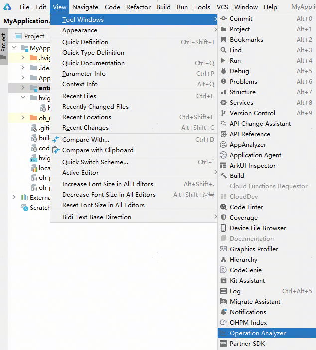

 
点击**Add account**按钮，登录华为账号并授权后，可以查看当前账号下应用异常情况。
 

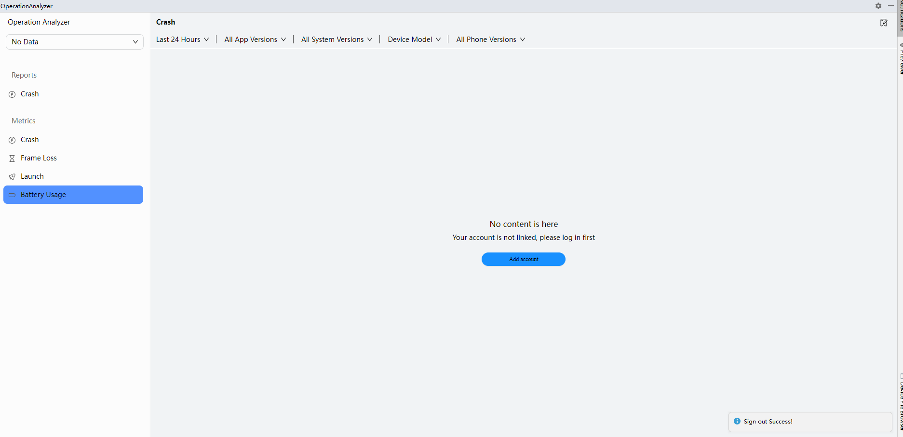

 
当前页面共分为两个部分。页面左侧为菜单栏，右侧为数据内容展示区：
 1. 菜单栏：
- 1号区域：可选择当前账号下存在的应用。

2. 2号区域：Reports区域展示Crash，OOM，APP Freeze，Resource Leak数据详情，用于定位具体问题。

3. 3号区域：Metrics区域展示Crash，Frame Loss，Launch， Battery Usage异常数据的变化趋势**。**
- 内容展示区顶部可选择配置项包含：1. 时间：通过时间维度过滤当天到最近一个月的异常情况和数据。

2. 应用版本：当前存在异常数据的应用版本。

3. 系统版本：当前存在异常数据的系统版本。

4. 设备类型：展示当前应用支持的设备类型。

5. 手机型号：当前存在异常数据的手机型号。

6. 发布类型：当前系统的发布类型。

 

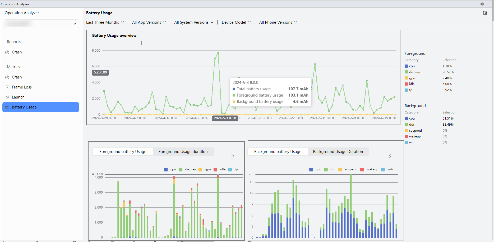

 
 

#### Reports

 

#### Crash分析

**26.0.0 Beta1及以上版本**
 
展示具体的崩溃详情。Stack Info页签展示崩溃的堆栈日志信息，支持堆栈还原，并可跳转到具体的代码行查找问题。Context Data页签展示崩溃的现场数据。Symbol Table页签支持上传符号表到云端和关联本地符号表。
 
- 1号区域：展示崩溃问题列表。
- 2号区域：从上到下，从左到右依次显示问题特征id、故障指纹、设备型号、系统版本、事件发生时间、应用版本号、构建号。
- 3号区域：可以通过故障指纹搜索具体的某个崩溃事件。
- 4号区域：点击可以关闭该问题，关闭后按钮置灰，但是该问题不会删除。
- 5号区域：当前选中的问题有多个不同的异常点，通过分页切换具体定位**。**
- 6号区域：上半部分可以通过切换应用版本/设备型号/系统版本来查看崩溃发生的分布情况，下半部分显示该崩溃事件的可能原因和最佳实践链接。
- 7号区域：展示具体的崩溃事件详情页，具体请查看下文说明。

 

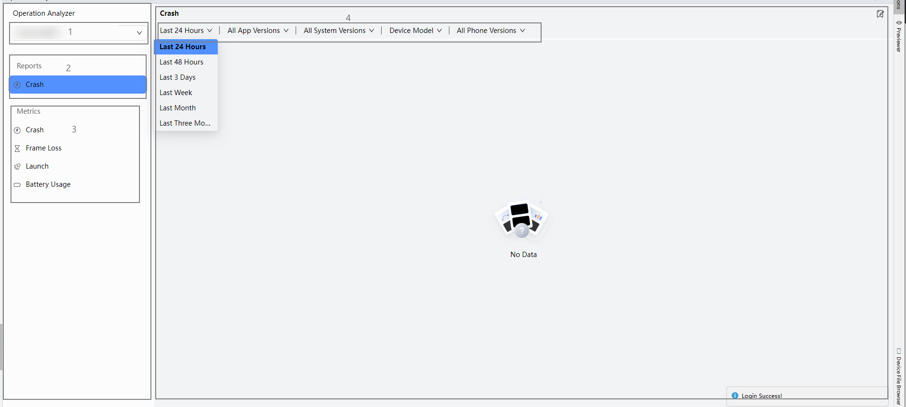

 
- **Stack Info**：展示崩溃的堆栈日志信息，支持堆栈还原，并可跳转到具体的代码行查找问题。
**Raw Stack**：展示崩溃的原始堆栈信息，其中蓝色圆点代表系统栈，绿色圆点代表应用栈。
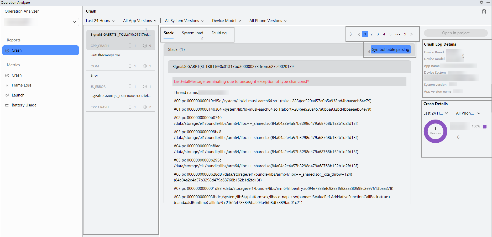

- **Symbolicated Stack**：展示还原后的堆栈信息，堆栈还原需要先关联本地符号表或将符号表上传到云端进行解析，上传后符号表信息会在**Symbol Table**页签中显示。关联本地符号表或上传到云端成功解析还原后，如下图所示：
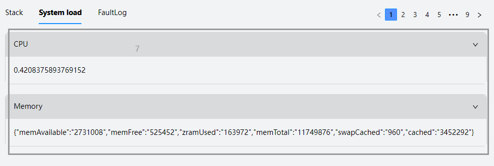

  堆栈还原后，点击右上角的**Select related project**，关联堆栈对应的工程，即可通过堆栈中的超链接跳转到对应的源码。

  
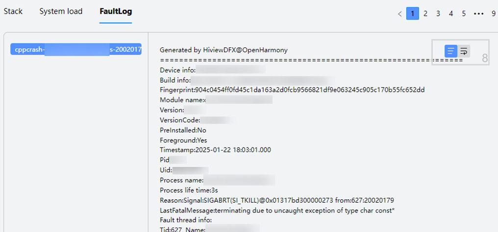

 - **Context Data**：崩溃的现场数据，展示栈地址空间、寄存器信息、FD信息、页面跟踪信息。
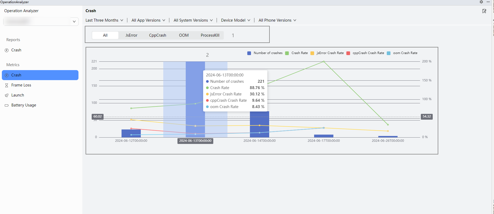

- **Symbol Table**：展示云端的符号表和本地关联的符号表信息，此处也支持上传符号表到云端和关联本地符号表。
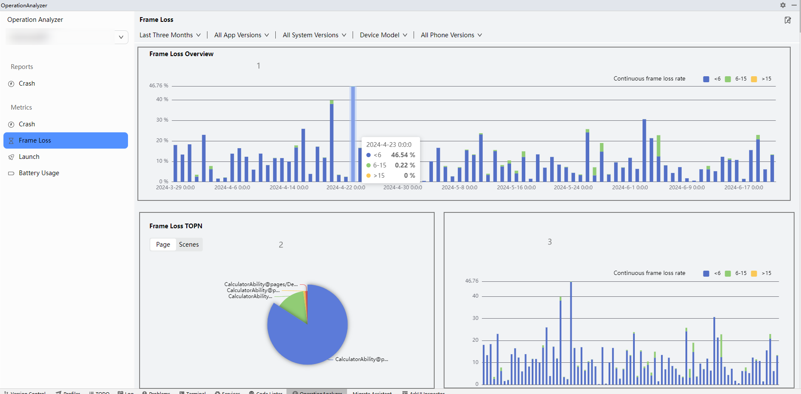

 
**26.0.0 Beta1以下版本**
 
展示具体的崩溃详情。Stack页签支持混淆的代码还原，并可跳转到具体的代码行查找问题。System load页签展示崩溃的CPU和内存信息。FaultLog页签展示崩溃的故障日志信息，添加符号表后支持还原日志的堆栈。
 
- 1号区域：展示崩溃问题列表。
- 2号区域：通过tab切换展示堆栈、系统内存的具体信息、故障日志信息。
- 3号区域：当前选中的问题有多个不同的异常点，通过分页切换具体定位**。**
- 4号区域：符号表配置按钮。点击按钮将当前选中的堆栈还原为原始代码，选中带有路径的代码行，然后可以点击最右侧的**Open in project**按钮跳转到应用中问题所在位置。
- 5号区域：展示当前设备信息。
- 6号区域：可以切换不同设备型号及时间段查看崩溃发生的分布情况。
- 7号区域：展示崩溃日志的CPU以及内存信息。该功能从DevEco Studio 5.1.0 Release版本开始支持。
- 8号区域：展示故障日志的所有信息。支持[上传符号表](https://developer.huawei.com/consumer/cn/doc/harmonyos-guides/ide-publish-app#section4486164416341)后将现有堆栈信息还原为源码的堆栈。该功能从DevEco Studio 5.1.0 Release版本开始支持。

 

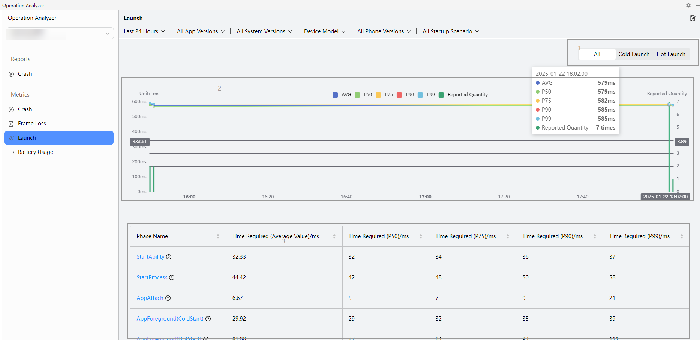

 

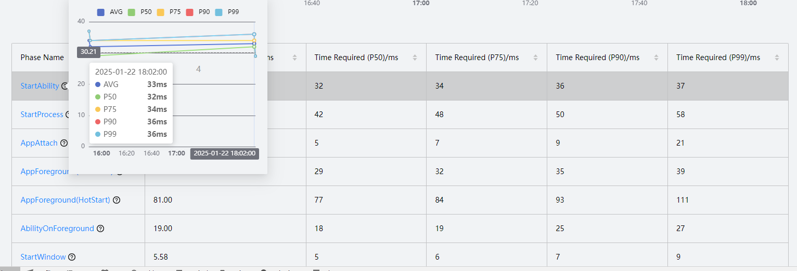

 

 
 

#### OOM分析

从26.0.0 Beta1版本开始新增OOM，展示具体的内存溢出详情。Stack Info页签展示内存溢出的堆栈日志信息，支持堆栈还原，并可跳转到具体的代码行查找问题。Context Data页签展示内存溢出的现场数据。Symbol Table页签支持上传符号表到云端和关联本地符号表。
 
- 1号区域：展示内存泄漏问题列表。
- 2号区域：从上到下，从左到右依次显示问题特征id、故障指纹、设备型号、系统版本、事件发生时间、应用版本号、构建号。
- 3号区域：可以通过故障指纹搜索具体的某个内存泄漏事件。
- 4号区域：点击可以关闭该问题，关闭后按钮置灰，但是该问题不会删除。
- 5号区域：当前选中的问题有多个不同的异常点，通过分页切换具体定位**。**
- 6号区域：上半部分可以通过切换应用版本/设备型号/系统版本来查看内存溢出发生的分布情况，下半部分显示该内存溢出事件的可能原因。
- 7号区域：展示具体的内存泄漏事件详情页，具体请查看下文说明。

 

 
- **Stack Info**：展示内存泄漏事件的堆栈信息，其中蓝色圆点代表系统栈，绿色圆点代表应用栈。支持堆栈还原，并可跳转到具体的代码行查找问题，具体操作方式请参考[Crash堆栈还原](#li37692225178)。

 
- **Context Data**：内存溢出的现场数据，展示页面跟踪信息。

- **Symbol Table**：展示云端的符号表和本地关联的符号表信息，此处也支持上传符号表到云端和关联本地符号表。

 
 

#### APP Freeze分析

从26.0.0 Beta1版本开始新增APP Freeze，展示具体的应用冻屏详情。Evidence Chain页签展示应用冻屏的证据链信息，包括3s和6s的主线程堆栈信息。Context Data页签展示应用冻屏的现场数据。Sampled Stack Logs页签展示采样栈的原始和还原堆栈。Symbol Table页签支持上传符号表到云端和关联本地符号表。
 
- 1号区域：展示应用冻屏问题列表，支持按功能列表和耗时函数筛选排序。
- 2号区域：从上到下，从左到右依次显示问题特征id、故障指纹、设备型号、系统版本、事件发生时间、应用版本号、构建号。
- 3号区域：可以通过故障指纹搜索具体的某个应用冻屏事件。
- 4号区域：点击可以关闭该问题，关闭后按钮置灰，但是该问题不会删除。
- 5号区域：当前选中的问题有多个不同的异常点，通过分页切换具体定位**。**
- 6号区域：上半部分可以通过切换应用版本/设备型号/系统版本来查看应用冻屏发生的分布情况，下半部分显示该应用冻屏事件的可能原因。
- 7号区域：展示具体的应用冻屏事件详情页，具体请查看下文说明。

 

 
- **Evidence Chain**：展示该应用冻屏事件的证据链信息，包括3s和6s的主线程堆栈信息，其中蓝色圆点代表系统栈，绿色圆点代表应用栈。

- **Context Data**：展示该应用冻屏事件的现场数据信息，包括堆栈信息（原始堆栈和还原堆栈，堆栈还原方法请参考[Crash堆栈还原](#li37692225178)）、CPU信息、内存信息、热档位信息、页面跟踪信息。

- **Sampled Stack Logs**：展示该应用冻屏事件的采样栈日志信息，包括原始堆栈和还原堆栈。

- **Symbol Table**：展示云端的符号表和本地关联的符号表信息，此处也支持上传符号表到云端和关联本地符号表。

 
 

#### Resource Leak分析

从26.0.0 Beta1版本开始新增Resource Leak，展示具体的资源泄漏详情。Evidence Chain页签展示资源泄漏的证据链信息，包括主泄漏堆块和次泄漏堆块，每个泄漏堆块下又包含主泄漏方法和次泄漏方法。Context Data页签展示资源泄漏的现场数据。Symbol Table页签支持上传符号表到云端和关联本地符号表。
 
- 1号区域：展示资源泄漏问题列表，支持按Top问题和ArkTS泄漏对象聚合筛选排序。
- 2号区域：从上到下，从左到右依次显示问题特征id、灰度任务id、设备型号、系统版本、事件发生时间、应用版本号、构建号。
- 3号区域：可以通过灰度任务id搜索具体的某个资源泄漏事件。
- 4号区域：点击可以关闭该问题，关闭后按钮置灰，但是该问题不会删除。
- 5号区域：当前选中的问题有多个不同的异常点，通过分页切换具体定位**。**
- 6号区域：上半部分可以通过切换应用版本/设备型号/系统版本来查看资源泄漏发生的分布情况，下半部分显示该资源泄漏事件的可能原因。
- 7号区域：展示具体的资源泄漏事件详情页，具体请查看下文说明。

 

 
- **Evidence Chain**：展示该资源泄漏事件的证据链信息，包括主泄漏堆块和次泄漏堆块，每个泄漏堆块下又包含主泄漏方法和次泄漏方法。每个泄漏方法下会显示堆栈分配详情、堆栈树分配、火焰树、原始/还原堆栈。堆栈分配详情：

  

  堆栈树分配：

  

  火焰树：

  

  原始/还原堆栈（堆栈还原方法请参考[Crash堆栈还原](#li37692225178)）：

  

- **Context Data**：展示该资源泄漏事件的现场数据信息。

- **Symbol Table**：展示云端的符号表和本地关联的符号表信息，此处也支持上传符号表到云端和关联本地符号表。

 
 

#### Metrics

 

#### Crash分析

展示应用崩溃次数和崩溃率情况。
 
1号区域：通过tab页签可切换All，JsError（JavaScript崩溃错误），CppCrash（C++崩溃错误），OOM（内存导致的崩溃），ProcessKill（系统被强制终止），查看不同维度的崩溃次数、崩溃率进行分析。
 
2号区域：通过柱状图展示不同维度在所有的崩溃异常中的占比。
 

 
> [!NOTE]
> ProcessKill将通过柱状图和饼图联动，点击柱状图，通过饼图展示具体某个时间段的ProcessKill的类型分布。

 
 

#### Frame Loss分析

对连续丢帧情况进行多维度统计，便于迅速的定位问题所在位置。
 
1号区域：丢帧总览是统计最大维度的连续丢帧率。
 
- <6：连续低于6帧的丢帧率。
- 6-15：连续大于6帧，小于15帧的丢帧率。
- >15：连续大于15帧的连续丢帧率。

 
2号区域：按照Page，Scenes两个维度展示丢帧异常率TOP N的页面或者场景。点击饼图上的某个区域，将展示具体页面或者场景的连续丢帧率情况。
 

 
 

#### Launch分析

统计设备启动在不同维度的情况，帮助分析异常问题的分布情况。
 
1号区域：通过页签可切换查看启动整体耗时（All）、冷启动（Cold Launch）耗时、热启动（Hot Launch）耗时。
 
2号区域：通过折线图形式展示整体耗时趋势。以下图为例：
 
- AVG表示当前时间节点下各启动阶段的平均耗时。
- P50表示当前时间节点下，50%的启动阶段耗时低于纵坐标显示的579ms。
- P75表示当前时间节点下，75%的启动阶段耗时低于纵坐标显示的582ms。
- P90表示当前时间节点下，90%的启动阶段耗时低于纵坐标显示的585ms。
- P99表示当前时间节点下，99%的启动阶段耗时低于纵坐标显示的585ms。

 
柱状图展示耗时异常的上报量（Reported Quantity）。
 
3号区域：展示各启动阶段的耗时，通过点击阶段名可查看各时间段具体耗时情况。
 
4号区域：展示启动当前阶段在不同时间段的耗时趋势。
 

 

 
 

#### Battery Usage分析

用于统计设备的总能耗以及前后台的能耗和耗电时长。
 
1号区域：能耗概览。通过折线图展示总能耗，前台能耗，后台能耗。
 
2号区域：展示前台能耗和耗电时长随Top 5设备器件分布情况。
 
3号区域：展示后台能耗和耗电时长随Top 5设备器件分布情况。
 

