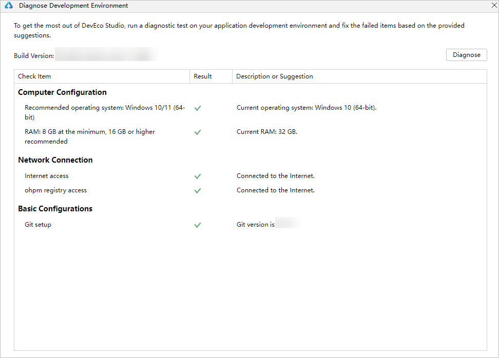
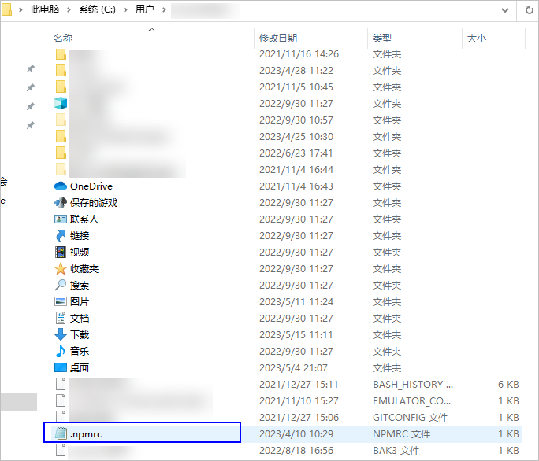
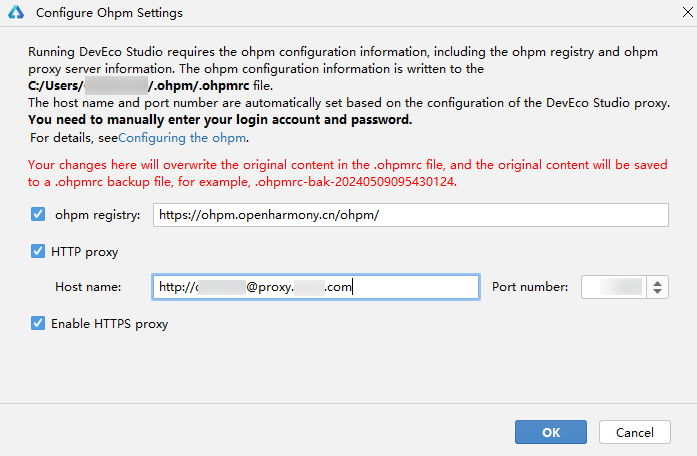
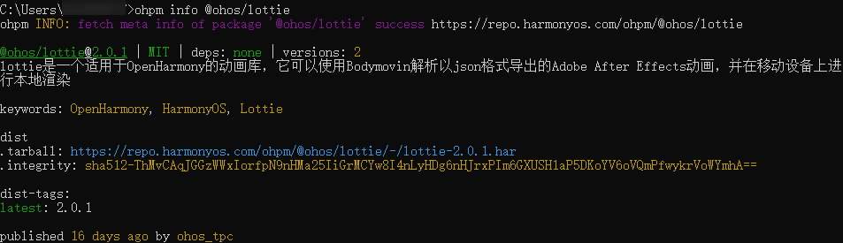

# 配置代理

更新时间：2026-01-15 06:51:04

来源：https://developer.huawei.com/consumer/cn/doc/harmonyos-guides/ide-environment-config

DevEco Studio开发环境依赖于网络环境，需要连接上网络才能确保工具的正常使用。
 
一般来说，如果使用的是个人或家庭网络，是不需要配置代理信息的，部分企业网络受限的情况下，才需要配置代理信息。
 

##### 诊断开发环境

为了您开发应用/元服务的良好体验，DevEco Studio提供了开发环境诊断的功能，帮助您识别开发环境是否完备。您可以在欢迎页面单击**Diagnose**进行诊断。如果您已经打开了工程开发界面，也可以在菜单栏单击**Help > Diagnostic Tools > Diagnose Development Environment**进行诊断。
 



 
DevEco Studio开发环境诊断项包括电脑的配置、网络的连通情况等。如果检测结果为未通过，请根据检查项的描述和修复建议进行处理。
 
 

##### 配置Proxy代理
1. 在欢迎页单击**Customize > All settings… > Appearance & Behavior > System Settings > HTTP Proxy**进入HTTP Proxy设置界面。如果已经打开了工程，可以单击**File > Settings**（macOS为**DevEco Studio > Preferences/Settings**）** > Appearance & Behavior > System Settings > HTTP Proxy**进入HTTP Proxy设置界面。

  
- **HTTP**配置项，配置代理服务器信息。**如果不清楚代理服务器信息，请咨询您的网络管理人员**。
**Host name**：代理服务器主机名或IP地址。

2. **Port number**：代理服务器对应的端口号。

3. **No proxy for**：不需要通过代理服务器访问的URL或者IP地址（地址之间用英文逗号分隔）。

4. **Proxy authentication**配置项，如果代理服务器需要通过认证鉴权才能访问，则需要配置。否则，请跳过该配置项。
**Login**：访问代理服务器的用户名。

5. **Password**：访问代理服务器的密码。

6. **Remember**：勾选，记住密码。

7. 配置完成后，单击**Check connection**，输入网络地址（如：https://developer.huawei.com），检查网络连通性。提示“Connection successful”表示代理设置成功。

  

  ##### 配置NPM代理

  Hvigor、ohpm在初始化时需要从npm仓库下载依赖，如果需要代理才能访问网络，请配置npm的代理。

1. 进入C:\Users\用户名目录，打开**.npmrc**文件。如果该目录下没有**.npmrc**文件，请新建一个。

  



2. 修改npm仓库信息，示例如下所示：

  
```text
registry=https://repo.huaweicloud.com/repository/npm/
@ohos:registry=https://repo.harmonyos.com/npm/
```


3. 修改代理信息，在proxy和https-proxy中，将user、password、proxyserver和port按照实际代理服务器进行修改。**如果不清楚代理服务器信息，请咨询您的网络管理人员**。示例如下所示：

  
```text
proxy=http://<em>user</em>:<em>password</em><strong>@</strong>proxy.<em>proxyserver</em>.com:<em>port</em>
https-proxy=http://<em>user</em>:<em>password</em><strong>@</strong>proxy.<em>proxyserver</em>.com:<em>port</em>
```
 
> [!NOTE]
> 如果password中存在特殊字符，如@、#、*等符号，可能导致配置不生效，建议将特殊字符替换为ASCII码，并在ASCII码前加百分号%。常用符号替换为ASCII码对照表如下： !：%21 @：%40 #：%23 $：%24 &：%26 *：%2A


4. 将Node.js配置到环境变量中。

  
Windows环境变量设置方法：在系统或者用户的PATH变量中，添加Node.js安装位置的路径（默认路径为$DevEco Studio安装目录\tools\node下）。

5. macOS环境变量设置方法：

  打开终端工具，执行以下命令。
```text
export NODE_HOME=/home/xx/Downloads/node-vxx.xx.x-linux-x64  #本处路径请替换为Node.js的安装路径（默认路径为$DevEco Studio安装目录\tools\node下）
export PATH=$NODE_HOME/bin:$PATH
```


6. 代理配置完成后，打开命令行工具，执行如下命令验证网络是否正常。

  
```text
npm info express
```
 执行结果如下图所示，则说明代理设置成功。

  



  

  ##### 配置OHPM代理

  若您需要配置OHPM代理信息，可通过如下步骤进入代理配置界面：
在欢迎页单击**Customize > All settings… > Build, Execution, Deployment > Ohpm ****> Optimize config，**进入OHPM代理设置界面。
- 在打开了工程的情况下，可以单击**File > Settings**（macOS为**DevEco Studio > Preferences/Settings**）** > Build, Execution, Deployment > Ohpm > Optimize config**，进入OHPM代理设置界面。

 
 
具体配置如下：
 
- **ohpm registry**：配置ohpm仓的地址信息。
```text
https://ohpm.openharmony.cn/ohpm/
```


 
- **HTTP proxy**：代理服务器信息，默认会与DevEco Studio的HTTP proxy设置项保持一致。**如果不清楚代理服务器信息，请咨询您的网络管理人员**。如果需要配置账号密码，请使用如下格式进行配置：
```text
http://<em>u</em><em>se</em><em>r</em>:<em>password</em>@proxy.<em>proxyserver</em>.com
```

- **Enable Https Proxy**：同步配置HTTPS Proxy信息。

 
**填写**并**勾选**以上信息后，点击**OK**。
 



 
说明：ohpm默认校验registry仓库地址证书。如果环境检查中ohpm registry access出现'SELF_SIGNED_CERT_IN_CHAIN'或'UNABLE_TO_VERIFY_LEAF_SIGNATURE'等证书校验错误时，请查看[FAQ-问题现象2](https://developer.huawei.com/consumer/cn/doc/harmonyos-faqs/faqs-development-environment-10)解决证书校验错误问题。
 
在此界面配置的代理信息将写入“users/用户名/.ohpm”目录下的**.ohpmrc**文件。因此也可直接修改“users/用户名/.ohpm”目录下的**.ohpmrc**文件进行配置。
 1. 进入C:/Users/用户名目录/.ohpm，打开**.ohpmrc**文件。如果该目录下没有**.ohpmrc**文件，请新建一个。
2. 修改ohpm仓库信息，示例如下所示：

  
```text
registry=https://ohpm.openharmony.cn/ohpm/
```

3. 修改ohpm代理信息，在http_proxy和https_proxy中，将user、password、proxyserver和port按照实际代理服务器进行修改。示例如下所示：

  
```text
http_proxy=http://<em>user</em>:<em>password</em>@proxy.<em>proxyserver</em>.com:<em>port</em>
https_proxy=http://<em>user</em>:<em>password</em>@proxy.<em>proxyserver</em>.com:<em>port</em>
```
 
> [!NOTE]
> 如果password中存在特殊字符，如@、#、*等符号，可能导致配置不生效，建议将特殊字符替换为ASCII码，并在ASCII码前加百分号%。常用符号替换为ASCII码对照表如下： !：%21 @：%40 #：%23 $：%24 &：%26 *：%2A

4. 将ohpm配置到环境变量中。

  
Windows环境变量设置方法：在**此电脑 > 属性 > 高级系统设置 > 高级 > 环境变量**中，在系统或者用户的PATH变量中，添加ohpm安装位置下bin文件夹的路径。默认路径为：DevEco Studio安装目录\tools\ohpm。
5. macOS环境变量设置方法：

  打开终端工具，执行以下命令。
```text
export OHPM_HOME=/home/xx/Downloads/ohpm  #本处路径请替换为ohpm的安装路径。默认路径为:/home/xx/Downloads/DevEco Studio安装目录\tools\ohpm
export PATH=$OHPM_HOME/bin:$PATH
```

6. 代理配置完成后，执行如下命令验证网络是否正常。

  
```text
ohpm info @ohos/lottie
```
 执行结果如下图所示，则说明代理设置成功。

  

