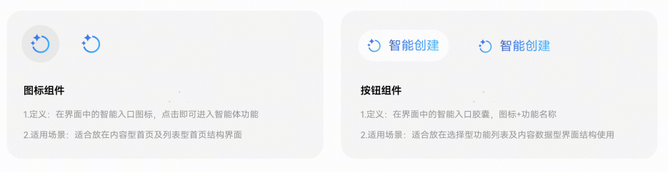
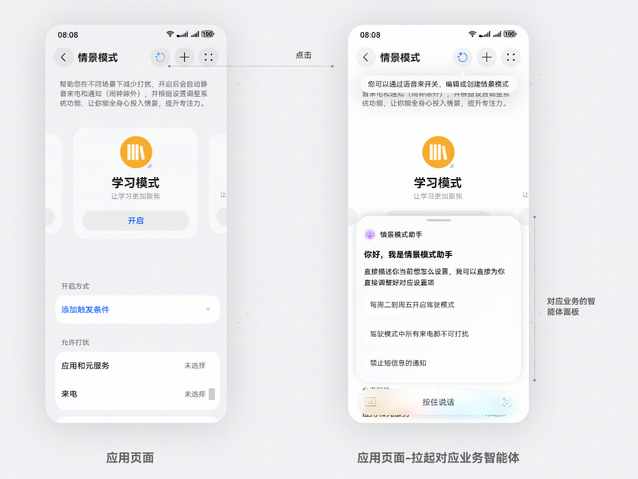
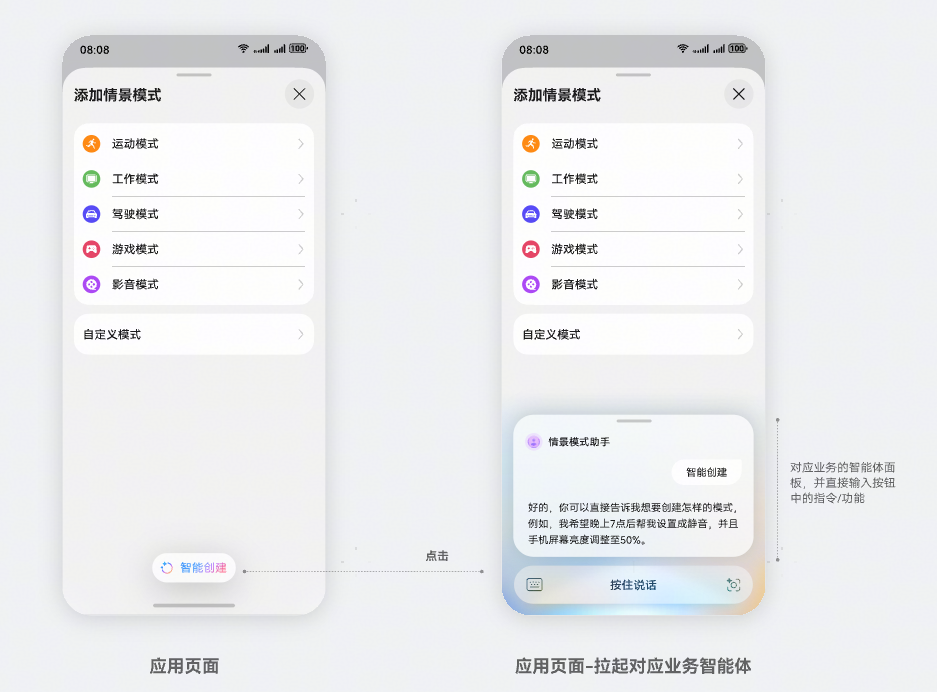

# 通过Function组件拉起智能体

更新时间：2026-04-28 03:31:56

来源：https://developer.huawei.com/consumer/cn/doc/harmonyos-guides/hmaf-function

#### 场景介绍

 - Function组件分为图标组件和按钮组件，无标题时默认显示图标组件，有标题时默认显示按钮组件。

  


 - Function图标组件效果：综合型入口。不带用户意图，可作为应用内智能体主入口。

  


 - Function按钮组件：允许应用自定义功能描述的组件。

  



#### 开发前准备

 - 创建智能体，具体请参见[快速创建智能体](https://developer.huawei.com/consumer/cn/doc/service/quick-start-0000002469548009)。
 - 关联应用，具体请参见[关联应用](https://developer.huawei.com/consumer/cn/doc/service/related-applications-0000002437785706)。
 - 确保已在终端设备上登录华为账号，并且处于联网状态。


#### 开发步骤
1. 从项目根目录进入/src/main/ets/pages/Index.ets文件，将FunctionComponent及相关其它类引入到工程。

  
```text
import { FunctionComponent, FunctionController } from '@kit.AgentFrameworkKit';
import { BusinessError } from '@kit.BasicServicesKit';
import { hilog } from '@kit.PerformanceAnalysisKit';
import { common } from '@kit.AbilityKit';
```

2. （可选）可以在组件加载前通过[isAgentSupport](https://developer.huawei.com/consumer/cn/doc/harmonyos-references/hmaf-function-component#isagentsupport)来判断当前的agentId是否可用，若agentId有效且Agent功能支持时再加载组件。

  
```json
@State isAgentSupport: boolean = false;
  
  aboutToAppear() {
     this.checkAgentSupport()
  }
  async checkAgentSupport() {
    try {
      let context = this.getUIContext()?.getHostContext() as common.UIAbilityContext;
      this.isAgentSupport = await this.controller.isAgentSupport(context, this.agentId)
    } catch (err) {
      hilog.error(0x0001, 'AgentExample', `err code: ${err.code}, message: ${err.message}`)
    }
  }

  build() {
    Column() {
      if (this.isAgentSupport) {
        FunctionComponent({
          agentId: this.agentId,
          onError: (err: BusinessError) => {
            hilog.error(0x0001, 'AgentExample', `err: ${JSON.stringify(err)}, message: ${err.message}`);
          },
          options: {
              title: '智能创建',
              queryText: '创建一个新的模式'
          }
        })
      }
    }
  }
```

3. 构建一个简单配置的页面，在页面中引入FunctionComponent组件，并传入对应的参数。其中agentId、onError是必填参数。其他可选参数可参见[FunctionComponent（功能组件）](https://developer.huawei.com/consumer/cn/doc/harmonyos-references/hmaf-function-component)。Function组件布局可参考[组件布局](https://developer.huawei.com/consumer/cn/doc/harmonyos-guides/arkts-layout-development)。

  
```json
@Entry
@Component
export struct AgentExample {
  private controller: FunctionController = new FunctionController();
  private agentId: string = 'agentproxy65481da1fa2293a8482d45'; // 智能体对应的agentid，由小艺智能体平台在创建智能体时指定
  build() {
    Column() {
      FunctionComponent({
        agentId: this.agentId,
        onError: (err: BusinessError) => {
          hilog.error(0x0001, 'AgentExample', `err: ${JSON.stringify(err)}, message: ${err.message}`);
        },
        options: {
          title: '',
          queryText: ''
        },
        controller: this.controller
      })
    }
  }
}
```

4. 添加订阅事件。

  
```json
aboutToAppear() {
     this.initListeners();
  }
  initListeners() {
    this.controller?.on('agentDialogOpened', this.onAgentOpenedCallback);
    this.controller?.on('agentDialogClosed', this.onAgentClosedCallback);
  }
  onAgentOpenedCallback = () => {
    hilog.info(0x0001, 'AgentExample', 'agent dialog opened callback');
  };
  onAgentClosedCallback = () => {
    hilog.info(0x0001, 'AgentExample', 'agent dialog closed callback');
  };
  aboutToDisappear() {
    this.controller?.off('agentDialogOpened');
    this.controller?.off('agentDialogClosed');
  }
  
  build() {
    Column() {
      FunctionComponent({
        agentId: this.agentId,
        onError: (err: BusinessError) => {
          hilog.error(0x0001, 'AgentExample', `err: ${JSON.stringify(err)}, message: ${err.message}`);
        },
        controller: this.controller
      })
    }
  }
```


#### 开发实例

点击按钮，打开智能体对话框。

```json
import { BusinessError } from '@kit.BasicServicesKit';
import { hilog } from '@kit.PerformanceAnalysisKit';

import {
  FunctionComponent,
  FunctionController
} from '@kit.AgentFrameworkKit';

@Entry
@Component
export struct AgentExample {
  private controller: FunctionController = new FunctionController();
  private agentId: string = 'agentproxy65481da1fa2293a8482d45';

  aboutToAppear() {
    this.initListeners();
  }
  initListeners() {
    this.controller?.on('agentDialogOpened', this.onAgentOpenedCallback);
    this.controller?.on('agentDialogClosed', this.onAgentClosedCallback);
  }
  onAgentOpenedCallback = () => {
    hilog.info(0x0001, 'AgentExample', 'agent dialog opened callback');
  };
  onAgentClosedCallback = () => {
    hilog.info(0x0001, 'AgentExample', 'agent dialog closed callback');
  };
  aboutToDisappear() {
    this.controller?.off('agentDialogOpened');
    this.controller?.off('agentDialogClosed');
  }
  
  build() {
    Column() {
      FunctionComponent({
        agentId: this.agentId,
        onError: (err: BusinessError) => {
          hilog.error(0x0001, 'AgentExample', `err: ${JSON.stringify(err)}, message: ${err.message}`);
        },
        options: {
          title: '智能创建',
          queryText: '创建一个新的情景',
          isShowShadow: true
        },
        controller: this.controller
      })
    }
  }
}
```
