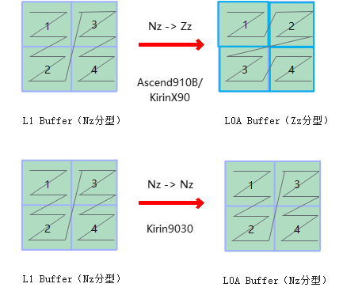

# 矩阵计算

更新时间：2026-04-20 06:34:33

来源：https://developer.huawei.com/consumer/cn/doc/harmonyos-guides/cannkit-basic-matrix-computation

KirinX90/Kirin9030处理器不支持结构化稀疏功能，并且Mmad左矩阵分形结构在Kirin9030有差异。

 **表1** 矩阵计算兼容说明


| 基础API | 兼容说明 |
| --- | --- |
| MmadWithSparse | 不支持。不支持结构化稀疏功能，因此算子需要采用正常稠密的矩阵计算。 |
| Mmad | Kirin9030芯片平台，L0A Buffer分形改变，从ZZ(Ascend910B/Ascend910C/KirinX90)转换为ZN格式。算子做LoadData时，需要做LoadData参数修改适配，详见下图。 |

Mmad左矩阵分形格式变换修改适配方案：

 


```text
// 示例代码
__aicore__ inline void SplitA()
{
    int srcOffset = 0;
    int dstOffset = 0;
    AscendC::LocalTensor a1Local = inQueueA1.DeQue();
    AscendC::LocalTensor a2Local = inQueueA2.AllocTensor();
#if defined(__NPU_ARCH__) && (__NPU_ARCH__ == 2201 || __NPU_ARCH__ == 3003)
    // Ascend910B、Ascend910C和KirinX90，LoadData时做Nz2Zz的分形转换
    for (int i = 0; i (a2Local);
    inQueueA1.FreeTensor(a1Local);
#endif
}
```
