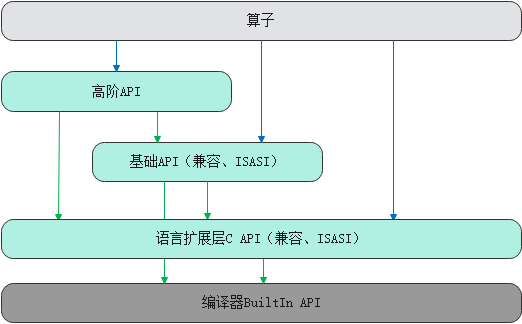

# 兼容性说明

更新时间：2026-04-20 06:34:33

来源：https://developer.huawei.com/consumer/cn/doc/harmonyos-guides/cannkit-compatibility-rule

总体兼容性策略见表1 Ascend C API兼容策略，兼容性范围不包含编译器BuiltIn API、Ascend C内部实现接口等。若开发者希望在新平台运行其它平台开发的Ascend C程序，需要在新平台重新编译并运行，并可能需要根据迁移指导进行代码调整。

 **图1** Ascend C API层次结构

 

 **表1** Ascend C API兼容策略

| API层级 | 兼容策略 |
| --- | --- |
| 高阶API | 高阶API在所有架构上均具备兼容性，但在涉及领域特性的部分存在不兼容情况。 |
| 基础API | 基础API分为可兼容的基础API和ISASI基础API；兼容的API在所有架构上均能兼容；ISASI API为体系架构相关的API，不保证跨架构版本的兼容性，例如CUBE侧的计算接口LoadData、Mmad等。 |
| 框架API | 框架API为软件实现API，跨架构版本兼容。 |
| 语言扩展C API | 不保证兼容。 |
| 编译器BuiltIn API | 不保证兼容。 |

**简要说明**
