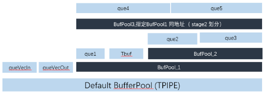

# 简介

更新时间：2026-04-20 06:34:33

来源：https://developer.huawei.com/consumer/cn/doc/harmonyos-guides/cannkit-tbufpool-overview

TPipe可以管理全局内存资源，而TBufPool可以手动管理或复用Unified Buffer/L1 Buffer物理内存，主要用于多个stage计算中Unified Buffer/L1 Buffer物理内存不足的场景。
  

#### 功能图示

下图展示了资源池划分的过程：
 
- 通过TPipe::InitBuffer接口可以申请Buffer内存并使用队列进行管理。
- 通过TPipe::InitBufPool可以划分出资源池BufPool1。
- 通过TPipe::InitBufPool可以指定BufPool1与BufPool3地址和长度复用。
- 通过TBufPool::InitBuffer及TBufPool::InitBufPool接口继续将BufPool1及BufPool3划分成Buffer或TBufPool资源池。

 
**图1** BufPool资源池划分
 

 
如图示的嵌套关系，最外层TBufPool(BufPool1与BufPool3)需要通过TPipe::InitBufPool申请并初始化，内层TBufPool(BufPool2)可以通过TBufPool::InitBufPool申请并初始化。
 
  

#### 注意事项

- TBufPool必须通过TPipe::InitBufPool或TBufPool::InitBufPool接口进行划分和初始化。资源池只能整体划分成部分，无法部分拼接为整体。
- 不同TBufPool资源池切换进行计算时，需要调用TBufPool::Reset()接口清空已完成计算的TBufPool，清空后的TBufPool资源池及分配的Buffer和数据默认无效。
- 不同资源池间分配的Buffer无法混用避免数据踩踏。
- Alloc/Free、EnQue/DeQue在切分TBufPool资源池时必须成对匹配使用，自动确保同步。
- 切换资源池的时候，若手写同步，AscendC不保证地址读写复用同步。因此不推荐手写同步。
